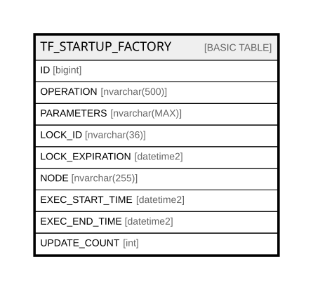

# TF_STARTUP_FACTORY

## Columns

| Name | Type | Default | Nullable | Comment |
| ---- | ---- | ------- | -------- | ------- |
| ID | bigint |  | false |  |
| OPERATION | nvarchar(500) |  | false |  |
| PARAMETERS | nvarchar(MAX) |  | true |  |
| LOCK_ID | nvarchar(36) |  | true |  |
| LOCK_EXPIRATION | datetime2 |  | true |  |
| NODE | nvarchar(255) |  | true |  |
| EXEC_START_TIME | datetime2 |  | true |  |
| EXEC_END_TIME | datetime2 |  | true |  |
| UPDATE_COUNT | int |  | false |  |

## Constraints

| Name | Type | Definition |
| ---- | ---- | ---------- |
| PK_STARTUPFACTORY | PRIMARY KEY | CLUSTERED, unique, part of a PRIMARY KEY constraint, [ ID ] |
| UQ_STARTUP_FACTORY | UNIQUE | NONCLUSTERED, unique, part of a UNIQUE constraint, [ OPERATION ] |

## Indexes

| Name | Definition |
| ---- | ---------- |
| PK_STARTUPFACTORY | CLUSTERED, unique, part of a PRIMARY KEY constraint, [ ID ] |
| UQ_STARTUP_FACTORY | NONCLUSTERED, unique, part of a UNIQUE constraint, [ OPERATION ] |

## Relations

---

> Generated by [tbls](https://github.com/k1LoW/tbls)
