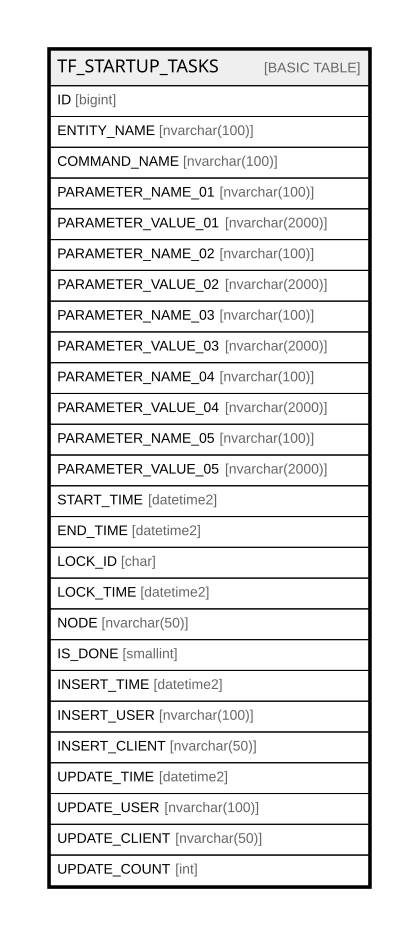

# TF_STARTUP_TASKS

## Columns

| Name | Type | Default | Nullable | Comment |
| ---- | ---- | ------- | -------- | ------- |
| ID | bigint |  | false |  |
| ENTITY_NAME | nvarchar(100) |  | false |  |
| COMMAND_NAME | nvarchar(100) |  | false |  |
| PARAMETER_NAME_01 | nvarchar(100) |  | true |  |
| PARAMETER_VALUE_01 | nvarchar(2000) |  | true |  |
| PARAMETER_NAME_02 | nvarchar(100) |  | true |  |
| PARAMETER_VALUE_02 | nvarchar(2000) |  | true |  |
| PARAMETER_NAME_03 | nvarchar(100) |  | true |  |
| PARAMETER_VALUE_03 | nvarchar(2000) |  | true |  |
| PARAMETER_NAME_04 | nvarchar(100) |  | true |  |
| PARAMETER_VALUE_04 | nvarchar(2000) |  | true |  |
| PARAMETER_NAME_05 | nvarchar(100) |  | true |  |
| PARAMETER_VALUE_05 | nvarchar(2000) |  | true |  |
| START_TIME | datetime2 |  | true |  |
| END_TIME | datetime2 |  | true |  |
| LOCK_ID | char |  | true |  |
| LOCK_TIME | datetime2 |  | true |  |
| NODE | nvarchar(50) |  | true |  |
| IS_DONE | smallint | ((0)) | false |  |
| INSERT_TIME | datetime2 | (sysutcdatetime()) | false |  |
| INSERT_USER | nvarchar(100) | (N'MAIN') | false |  |
| INSERT_CLIENT | nvarchar(50) | (N'localhost') | false |  |
| UPDATE_TIME | datetime2 | (sysutcdatetime()) | false |  |
| UPDATE_USER | nvarchar(100) | (N'MAIN') | false |  |
| UPDATE_CLIENT | nvarchar(50) | (N'localhost') | false |  |
| UPDATE_COUNT | int | ((0)) | false |  |

## Constraints

| Name | Type | Definition |
| ---- | ---- | ---------- |
| PK_STARTUP_TASK | PRIMARY KEY | CLUSTERED, unique, part of a PRIMARY KEY constraint, [ ID ] |

## Indexes

| Name | Definition |
| ---- | ---------- |
| PK_STARTUP_TASK | CLUSTERED, unique, part of a PRIMARY KEY constraint, [ ID ] |

## Relations

---

> Generated by [tbls](https://github.com/k1LoW/tbls)
