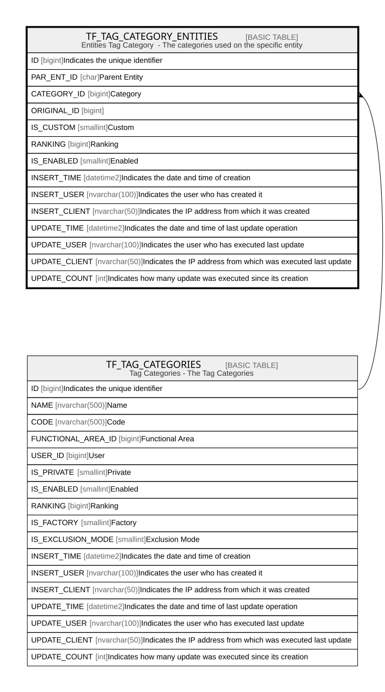

# TF_TAG_CATEGORY_ENTITIES

## Description

Entities Tag Category  - The categories used on the specific entity  

## Columns

| Name | Type | Default | Nullable | Parents | Comment |
| ---- | ---- | ------- | -------- | ------- | ------- |
| ID | bigint |  | false |  | Indicates the unique identifier |
| PAR_ENT_ID | char |  | false |  | Parent Entity |
| CATEGORY_ID | bigint |  | false | [TF_TAG_CATEGORIES](TF_TAG_CATEGORIES.md) | Category |
| ORIGINAL_ID | bigint |  | true |  |  |
| IS_CUSTOM | smallint | ((1)) | false |  | Custom |
| RANKING | bigint | ((0)) | false |  | Ranking |
| IS_ENABLED | smallint | ((1)) | false |  | Enabled |
| INSERT_TIME | datetime2 | (sysutcdatetime()) | false |  | Indicates the date and time of creation |
| INSERT_USER | nvarchar(100) | (N'MAIN') | false |  | Indicates the user who has created it |
| INSERT_CLIENT | nvarchar(50) | (N'localhost') | false |  | Indicates the IP address from which it was created |
| UPDATE_TIME | datetime2 | (sysutcdatetime()) | false |  | Indicates the date and time of last update operation |
| UPDATE_USER | nvarchar(100) | (N'MAIN') | false |  | Indicates the user who has executed last update |
| UPDATE_CLIENT | nvarchar(50) | (N'localhost') | false |  | Indicates the IP address from which was executed last update |
| UPDATE_COUNT | int | ((0)) | false |  | Indicates how many update was executed since its creation |

## Constraints

| Name | Type | Definition |
| ---- | ---- | ---------- |
| PK_TAG_CAT_ENT | PRIMARY KEY | CLUSTERED, unique, part of a PRIMARY KEY constraint, [ ID ] |
| UQ_TAG_CAT_ENT | UNIQUE | NONCLUSTERED, unique, part of a UNIQUE constraint, [ PAR_ENT_ID, CATEGORY_ID, IS_CUSTOM ] |
| FK_TAGCATENT_CATEGORY | FOREIGN KEY | FOREIGN KEY(CATEGORY_ID) REFERENCES TF_TAG_CATEGORIES(ID) ON UPDATE NO_ACTION ON DELETE CASCADE |

## Indexes

| Name | Definition |
| ---- | ---------- |
| PK_TAG_CAT_ENT | CLUSTERED, unique, part of a PRIMARY KEY constraint, [ ID ] |
| UQ_TAG_CAT_ENT | NONCLUSTERED, unique, part of a UNIQUE constraint, [ PAR_ENT_ID, CATEGORY_ID, IS_CUSTOM ] |
| IDX_TAGCAT_CUSTOM_FACTORY | NONCLUSTERED, [ ORIGINAL_ID, IS_CUSTOM ] |

## Relations

---

> Generated by [tbls](https://github.com/k1LoW/tbls)
