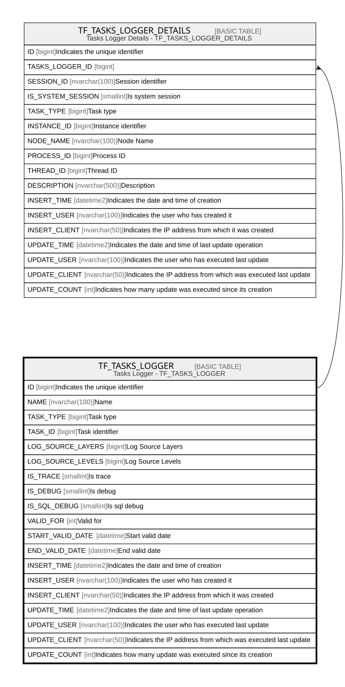

# TF_TASKS_LOGGER

## Description

Tasks Logger - TF_TASKS_LOGGER  

## Columns

| Name | Type | Default | Nullable | Children | Comment |
| ---- | ---- | ------- | -------- | -------- | ------- |
| ID | bigint |  | false | [TF_TASKS_LOGGER_DETAILS](TF_TASKS_LOGGER_DETAILS.md) | Indicates the unique identifier |
| NAME | nvarchar(100) |  | false |  | Name |
| TASK_TYPE | bigint |  | false |  | Task type |
| TASK_ID | bigint |  | false |  | Task identifier |
| LOG_SOURCE_LAYERS | bigint | ((196607)) | false |  | Log Source Layers |
| LOG_SOURCE_LEVELS | bigint | ((7)) | false |  | Log Source Levels |
| IS_TRACE | smallint | ((0)) | false |  | Is trace |
| IS_DEBUG | smallint | ((0)) | false |  | Is debug |
| IS_SQL_DEBUG | smallint | ((0)) | false |  | Is sql debug |
| VALID_FOR | int | ((10)) | false |  | Valid for |
| START_VALID_DATE | datetime |  | true |  | Start valid date |
| END_VALID_DATE | datetime |  | true |  | End valid date |
| INSERT_TIME | datetime2 | (sysutcdatetime()) | false |  | Indicates the date and time of creation |
| INSERT_USER | nvarchar(100) | (N'MAIN') | false |  | Indicates the user who has created it |
| INSERT_CLIENT | nvarchar(50) | (N'localhost') | false |  | Indicates the IP address from which it was created |
| UPDATE_TIME | datetime2 | (sysutcdatetime()) | false |  | Indicates the date and time of last update operation |
| UPDATE_USER | nvarchar(100) | (N'MAIN') | false |  | Indicates the user who has executed last update |
| UPDATE_CLIENT | nvarchar(50) | (N'localhost') | false |  | Indicates the IP address from which was executed last update |
| UPDATE_COUNT | int | ((0)) | false |  | Indicates how many update was executed since its creation |

## Constraints

| Name | Type | Definition |
| ---- | ---- | ---------- |
| PK_TF_TASKS_LOGGER | PRIMARY KEY | CLUSTERED, unique, part of a PRIMARY KEY constraint, [ ID ] |
| UQ_TASK_TYPE_ID | UNIQUE | NONCLUSTERED, unique, part of a UNIQUE constraint, [ TASK_TYPE, TASK_ID ] |

## Indexes

| Name | Definition |
| ---- | ---------- |
| PK_TF_TASKS_LOGGER | CLUSTERED, unique, part of a PRIMARY KEY constraint, [ ID ] |
| UQ_TASK_TYPE_ID | NONCLUSTERED, unique, part of a UNIQUE constraint, [ TASK_TYPE, TASK_ID ] |

## Relations

---

> Generated by [tbls](https://github.com/k1LoW/tbls)
