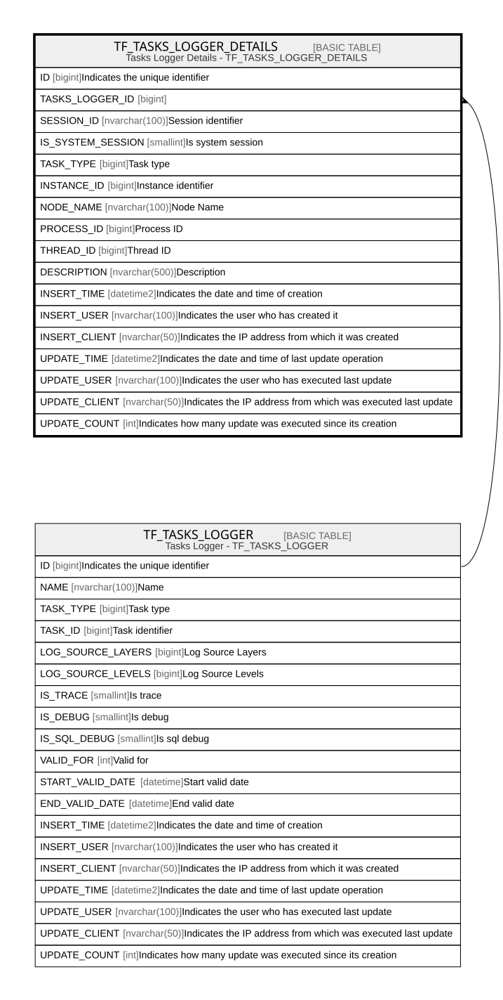

# TF_TASKS_LOGGER_DETAILS

## Description

Tasks Logger Details - TF_TASKS_LOGGER_DETAILS  

## Columns

| Name | Type | Default | Nullable | Parents | Comment |
| ---- | ---- | ------- | -------- | ------- | ------- |
| ID | bigint |  | false |  | Indicates the unique identifier |
| TASKS_LOGGER_ID | bigint |  | false | [TF_TASKS_LOGGER](TF_TASKS_LOGGER.md) |  |
| SESSION_ID | nvarchar(100) |  | false |  | Session identifier |
| IS_SYSTEM_SESSION | smallint |  | false |  | Is system session |
| TASK_TYPE | bigint |  | false |  | Task type |
| INSTANCE_ID | bigint |  | false |  | Instance identifier |
| NODE_NAME | nvarchar(100) |  | true |  | Node Name |
| PROCESS_ID | bigint |  | true |  | Process ID |
| THREAD_ID | bigint |  | true |  | Thread ID |
| DESCRIPTION | nvarchar(500) |  | true |  | Description |
| INSERT_TIME | datetime2 | (sysutcdatetime()) | false |  | Indicates the date and time of creation |
| INSERT_USER | nvarchar(100) | (N'MAIN') | false |  | Indicates the user who has created it |
| INSERT_CLIENT | nvarchar(50) | (N'localhost') | false |  | Indicates the IP address from which it was created |
| UPDATE_TIME | datetime2 | (sysutcdatetime()) | false |  | Indicates the date and time of last update operation |
| UPDATE_USER | nvarchar(100) | (N'MAIN') | false |  | Indicates the user who has executed last update |
| UPDATE_CLIENT | nvarchar(50) | (N'localhost') | false |  | Indicates the IP address from which was executed last update |
| UPDATE_COUNT | int | ((0)) | false |  | Indicates how many update was executed since its creation |

## Constraints

| Name | Type | Definition |
| ---- | ---- | ---------- |
| PK_TF_TASKS_LOGGER_DETAILS | PRIMARY KEY | CLUSTERED, unique, part of a PRIMARY KEY constraint, [ ID ] |
| FK_TASKS_LOGGER | FOREIGN KEY | FOREIGN KEY(TASKS_LOGGER_ID) REFERENCES TF_TASKS_LOGGER(ID) ON UPDATE NO_ACTION ON DELETE CASCADE |

## Indexes

| Name | Definition |
| ---- | ---------- |
| PK_TF_TASKS_LOGGER_DETAILS | CLUSTERED, unique, part of a PRIMARY KEY constraint, [ ID ] |

## Relations

---

> Generated by [tbls](https://github.com/k1LoW/tbls)
