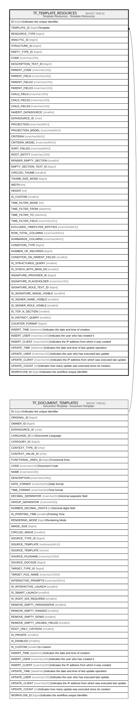

# TF_TEMPLATE_RESOURCES

## Description

Template Resources - Template Resources  

## Columns

| Name | Type | Default | Nullable | Parents | Comment |
| ---- | ---- | ------- | -------- | ------- | ------- |
| ID | bigint |  | false |  | Indicates the unique identifier |
| TEMPLATE_ID | bigint |  | true | [TF_DOCUMENT_TEMPLATES](TF_DOCUMENT_TEMPLATES.md) | Template |
| RESOURCE_TYPE | bigint | ((0)) | false |  |  |
| ANALYTIC_ID | bigint |  | true |  |  |
| STRUCTURE_ID | bigint |  | true |  |  |
| PARTY_TYPE_ID | bigint |  | true |  |  |
| CODE | nvarchar(100) |  | false |  |  |
| DESCRIPTION_TEXT_ID | bigint |  | true |  |  |
| PARENT_CODE | nvarchar(100) |  | true |  |  |
| PARENT_FIELD | nvarchar(100) |  | true |  |  |
| PARENT_FIELD2 | nvarchar(100) |  | true |  |  |
| PARENT_FIELD3 | nvarchar(100) |  | true |  |  |
| CHILD_FIELD | nvarchar(100) |  | true |  |  |
| CHILD_FIELD2 | nvarchar(100) |  | true |  |  |
| CHILD_FIELD3 | nvarchar(100) |  | true |  |  |
| INHERIT_DATASOURCE | smallint | ((1)) | false |  |  |
| DATASOURCE_ID | char |  | true |  |  |
| PROJECTION | nvarchar(MAX) |  | true |  |  |
| PROJECTION_MODEL | nvarchar(MAX) |  | true |  |  |
| CRITERIA | nvarchar(MAX) |  | true |  |  |
| CRITERIA_MODEL | nvarchar(MAX) |  | true |  |  |
| SORT_FIELDS | nvarchar(MAX) |  | true |  |  |
| ROOT_ENTITY | nvarchar(100) |  | true |  |  |
| RENDER_EMPTY_SECTION | smallint | ((0)) | false |  |  |
| EMPTY_SECTION_TEXT_ID | bigint |  | true |  |  |
| CIRCLED_THUMB | smallint | ((0)) | false |  |  |
| THUMB_SIZE_MODE | bigint |  | true |  |  |
| WIDTH | int |  | true |  |  |
| HEIGHT | int |  | true |  |  |
| IS_CUSTOM | smallint |  | false |  |  |
| TIME_FILTER_MODE | int |  | true |  |  |
| TIME_FILTER_FROM | datetime |  | true |  |  |
| TIME_FILTER_TO | datetime |  | true |  |  |
| TIME_FILTER_FIELD | nvarchar(201) |  | true |  |  |
| EXCLUDED_TIMEFILTER_ENTITIES | nvarchar(MAX) |  | true |  |  |
| ROW_TOTAL_COLUMNS | nvarchar(MAX) |  | true |  |  |
| SUMMARIZE_COLUMNS | nvarchar(MAX) |  | true |  |  |
| CONDITION_TYPE | bigint |  | true |  |  |
| NUMBER_OF_RECORDS | bigint |  | true |  |  |
| CONDITION_ON_PARENT_FIELDS | smallint | ((1)) | false |  |  |
| IS_STRUCTURED_QUERY | smallint | ((0)) | false |  |  |
| IS_SYNCH_WITH_MAIN_DS | smallint | ((0)) | false |  |  |
| SIGNATURE_PROVIDER_ID | bigint |  | true |  |  |
| SIGNATURE_PLACEHOLDER | nvarchar(100) |  | true |  |  |
| SIGNATURE_ROLE_TEXT_ID | bigint |  | true |  |  |
| IS_SIGNATURE_IMAGE_VISIBLE | smallint |  | true |  |  |
| IS_SIGNER_NAME_VISIBLE | smallint |  | true |  |  |
| IS_SIGNER_ROLE_VISIBLE | smallint |  | true |  |  |
| IS_TOP_N_SECTION | smallint |  | true |  |  |
| IS_DISTINCT_QUERY | smallint |  | true |  |  |
| COUNTER_FORMAT | bigint |  | true |  |  |
| INSERT_TIME | datetime2 | (sysutcdatetime()) | false |  | Indicates the date and time of creation |
| INSERT_USER | nvarchar(100) | (N'MAIN') | false |  | Indicates the user who has created it |
| INSERT_CLIENT | nvarchar(50) | (N'localhost') | false |  | Indicates the IP address from which it was created |
| UPDATE_TIME | datetime2 | (sysutcdatetime()) | false |  | Indicates the date and time of last update operation |
| UPDATE_USER | nvarchar(100) | (N'MAIN') | false |  | Indicates the user who has executed last update |
| UPDATE_CLIENT | nvarchar(50) | (N'localhost') | false |  | Indicates the IP address from which was executed last update |
| UPDATE_COUNT | int | ((0)) | false |  | Indicates how many update was executed since its creation |
| WORKFLOW_ID | bigint |  | true |  | Indicates the workflow unique identifier |

## Constraints

| Name | Type | Definition |
| ---- | ---- | ---------- |
| PK_TEMPLATE_RESOURCES | PRIMARY KEY | CLUSTERED, unique, part of a PRIMARY KEY constraint, [ ID ] |
| UQ_TEMPLATE_RESOURCES | UNIQUE | NONCLUSTERED, unique, part of a UNIQUE constraint, [ TEMPLATE_ID, CODE ] |
| FK_RESOURCE_DOCTEMPLATE | FOREIGN KEY | FOREIGN KEY(TEMPLATE_ID) REFERENCES TF_DOCUMENT_TEMPLATES(ID) ON UPDATE NO_ACTION ON DELETE NO_ACTION |

## Indexes

| Name | Definition |
| ---- | ---------- |
| PK_TEMPLATE_RESOURCES | CLUSTERED, unique, part of a PRIMARY KEY constraint, [ ID ] |
| UQ_TEMPLATE_RESOURCES | NONCLUSTERED, unique, part of a UNIQUE constraint, [ TEMPLATE_ID, CODE ] |

## Relations

---

> Generated by [tbls](https://github.com/k1LoW/tbls)
