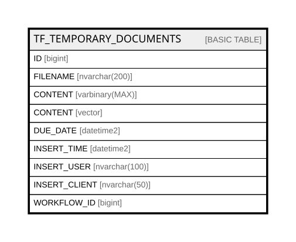

# TF_TEMPORARY_DOCUMENTS

## Columns

| Name | Type | Default | Nullable | Comment |
| ---- | ---- | ------- | -------- | ------- |
| ID | bigint |  | false |  |
| FILENAME | nvarchar(200) |  | true |  |
| CONTENT | varbinary(MAX) |  | false |  |
| CONTENT | vector |  | false |  |
| DUE_DATE | datetime2 | (sysutcdatetime()) | false |  |
| INSERT_TIME | datetime2 | (sysutcdatetime()) | false |  |
| INSERT_USER | nvarchar(100) | (N'MAIN') | false |  |
| INSERT_CLIENT | nvarchar(50) | (N'localhost') | false |  |
| WORKFLOW_ID | bigint |  | true |  |

## Constraints

| Name | Type | Definition |
| ---- | ---- | ---------- |
| PK_TEMPORARY_DOCUMENTS | PRIMARY KEY | CLUSTERED, unique, part of a PRIMARY KEY constraint, [ ID ] |

## Indexes

| Name | Definition |
| ---- | ---------- |
| PK_TEMPORARY_DOCUMENTS | CLUSTERED, unique, part of a PRIMARY KEY constraint, [ ID ] |
| IDX_TEMPORARY_DOCUMENTS | NONCLUSTERED, [ DUE_DATE ] |

## Relations

---

> Generated by [tbls](https://github.com/k1LoW/tbls)
