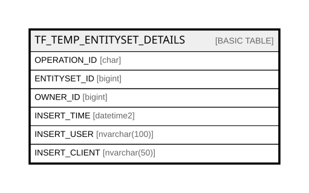

# TF_TEMP_ENTITYSET_DETAILS

## Columns

| Name | Type | Default | Nullable | Comment |
| ---- | ---- | ------- | -------- | ------- |
| OPERATION_ID | char |  | false |  |
| ENTITYSET_ID | bigint |  | false |  |
| OWNER_ID | bigint |  | false |  |
| INSERT_TIME | datetime2 | (sysutcdatetime()) | false |  |
| INSERT_USER | nvarchar(100) | (N'MAIN') | false |  |
| INSERT_CLIENT | nvarchar(50) | (N'localhost') | false |  |

## Constraints

| Name | Type | Definition |
| ---- | ---- | ---------- |
| PK_TEMP_ENTITYSET_DETAILS | PRIMARY KEY | CLUSTERED, unique, part of a PRIMARY KEY constraint, [ OPERATION_ID, ENTITYSET_ID, OWNER_ID ] |

## Indexes

| Name | Definition |
| ---- | ---------- |
| PK_TEMP_ENTITYSET_DETAILS | CLUSTERED, unique, part of a PRIMARY KEY constraint, [ OPERATION_ID, ENTITYSET_ID, OWNER_ID ] |
| IDX_TF_TEMP_ESD_INSERTTIME | NONCLUSTERED, [ INSERT_TIME ] |
| IDX_TF_TEMP_ESD_OPERATION | NONCLUSTERED, [ OPERATION_ID ] |

## Relations

---

> Generated by [tbls](https://github.com/k1LoW/tbls)
