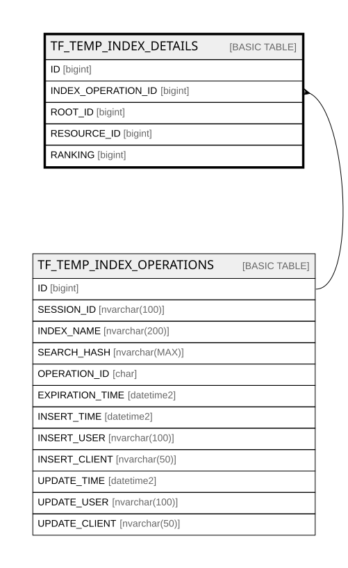

# TF_TEMP_INDEX_DETAILS

## Columns

| Name | Type | Default | Nullable | Parents | Comment |
| ---- | ---- | ------- | -------- | ------- | ------- |
| ID | bigint |  | false |  |  |
| INDEX_OPERATION_ID | bigint |  | false | [TF_TEMP_INDEX_OPERATIONS](TF_TEMP_INDEX_OPERATIONS.md) |  |
| ROOT_ID | bigint |  | false |  |  |
| RESOURCE_ID | bigint |  | false |  |  |
| RANKING | bigint |  | false |  |  |

## Constraints

| Name | Type | Definition |
| ---- | ---- | ---------- |
| PK_TEMP_INDEX_DETAILS | PRIMARY KEY | CLUSTERED, unique, part of a PRIMARY KEY constraint, [ ID ] |
| FK_INDEX_OP_DETAILS | FOREIGN KEY | FOREIGN KEY(INDEX_OPERATION_ID) REFERENCES TF_TEMP_INDEX_OPERATIONS(ID) ON UPDATE NO_ACTION ON DELETE CASCADE |

## Indexes

| Name | Definition |
| ---- | ---------- |
| PK_TEMP_INDEX_DETAILS | CLUSTERED, unique, part of a PRIMARY KEY constraint, [ ID ] |
| IDX_TF_TEMP_IDX_DET_OPERATION | NONCLUSTERED, [ INDEX_OPERATION_ID, ROOT_ID ] |

## Relations

---

> Generated by [tbls](https://github.com/k1LoW/tbls)
