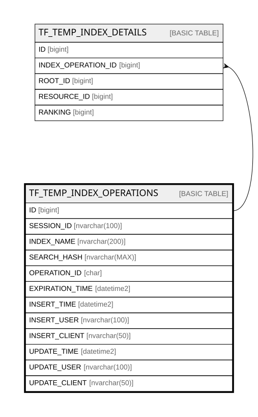

# TF_TEMP_INDEX_OPERATIONS

## Columns

| Name | Type | Default | Nullable | Children | Comment |
| ---- | ---- | ------- | -------- | -------- | ------- |
| ID | bigint |  | false | [TF_TEMP_INDEX_DETAILS](TF_TEMP_INDEX_DETAILS.md) |  |
| SESSION_ID | nvarchar(100) |  | false |  |  |
| INDEX_NAME | nvarchar(200) |  | false |  |  |
| SEARCH_HASH | nvarchar(MAX) |  | false |  |  |
| OPERATION_ID | char |  | false |  |  |
| EXPIRATION_TIME | datetime2 | (getutcdate()) | false |  |  |
| INSERT_TIME | datetime2 | (sysutcdatetime()) | false |  |  |
| INSERT_USER | nvarchar(100) | (N'MAIN') | false |  |  |
| INSERT_CLIENT | nvarchar(50) | (N'localhost') | false |  |  |
| UPDATE_TIME | datetime2 | (sysutcdatetime()) | false |  |  |
| UPDATE_USER | nvarchar(100) | (N'MAIN') | false |  |  |
| UPDATE_CLIENT | nvarchar(50) | (N'localhost') | false |  |  |

## Constraints

| Name | Type | Definition |
| ---- | ---- | ---------- |
| PK_TEMP_FULLTEXT_SEARCHES | PRIMARY KEY | CLUSTERED, unique, part of a PRIMARY KEY constraint, [ ID ] |

## Indexes

| Name | Definition |
| ---- | ---------- |
| PK_TEMP_FULLTEXT_SEARCHES | CLUSTERED, unique, part of a PRIMARY KEY constraint, [ ID ] |
| IDX_TEMP_IDX_EXPIRATIONTIME | NONCLUSTERED, [ EXPIRATION_TIME ] |
| IDX_TF_TEMP_IDX_OPERATION | NONCLUSTERED, [ SESSION_ID, OPERATION_ID ] |

## Relations

---

> Generated by [tbls](https://github.com/k1LoW/tbls)
