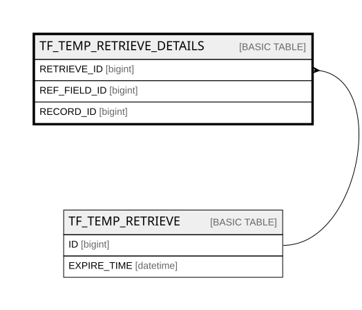

# TF_TEMP_RETRIEVE_DETAILS

## Columns

| Name | Type | Default | Nullable | Parents | Comment |
| ---- | ---- | ------- | -------- | ------- | ------- |
| RETRIEVE_ID | bigint |  | false | [TF_TEMP_RETRIEVE](TF_TEMP_RETRIEVE.md) |  |
| REF_FIELD_ID | bigint |  | false |  |  |
| RECORD_ID | bigint |  | false |  |  |

## Constraints

| Name | Type | Definition |
| ---- | ---- | ---------- |
| PK_TEMP_RETRIEVE_DETAILS | PRIMARY KEY | CLUSTERED, unique, part of a PRIMARY KEY constraint, [ RETRIEVE_ID, REF_FIELD_ID, RECORD_ID ] |
| FK_TEMP_RETRIEVE_DETAILS | FOREIGN KEY | FOREIGN KEY(RETRIEVE_ID) REFERENCES TF_TEMP_RETRIEVE(ID) ON UPDATE NO_ACTION ON DELETE CASCADE |

## Indexes

| Name | Definition |
| ---- | ---------- |
| PK_TEMP_RETRIEVE_DETAILS | CLUSTERED, unique, part of a PRIMARY KEY constraint, [ RETRIEVE_ID, REF_FIELD_ID, RECORD_ID ] |

## Relations

---

> Generated by [tbls](https://github.com/k1LoW/tbls)
