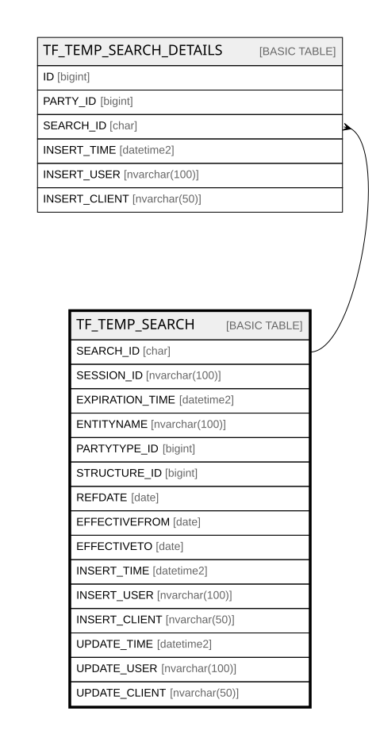

# TF_TEMP_SEARCH

## Columns

| Name | Type | Default | Nullable | Children | Comment |
| ---- | ---- | ------- | -------- | -------- | ------- |
| SEARCH_ID | char |  | false | [TF_TEMP_SEARCH_DETAILS](TF_TEMP_SEARCH_DETAILS.md) |  |
| SESSION_ID | nvarchar(100) |  | false |  |  |
| EXPIRATION_TIME | datetime2 | (getutcdate()) | false |  |  |
| ENTITYNAME | nvarchar(100) |  | false |  |  |
| PARTYTYPE_ID | bigint |  | false |  |  |
| STRUCTURE_ID | bigint |  | false |  |  |
| REFDATE | date |  | false |  |  |
| EFFECTIVEFROM | date |  | true |  |  |
| EFFECTIVETO | date |  | true |  |  |
| INSERT_TIME | datetime2 | (sysutcdatetime()) | false |  |  |
| INSERT_USER | nvarchar(100) | (N'MAIN') | false |  |  |
| INSERT_CLIENT | nvarchar(50) | (N'localhost') | false |  |  |
| UPDATE_TIME | datetime2 | (sysutcdatetime()) | false |  |  |
| UPDATE_USER | nvarchar(100) | (N'MAIN') | false |  |  |
| UPDATE_CLIENT | nvarchar(50) | (N'localhost') | false |  |  |

## Constraints

| Name | Type | Definition |
| ---- | ---- | ---------- |
| PK_TEMP_SEARCH | PRIMARY KEY | CLUSTERED, unique, part of a PRIMARY KEY constraint, [ SEARCH_ID ] |
| UQ_TEMP_SEARCH | UNIQUE | NONCLUSTERED, unique, part of a UNIQUE constraint, [ SEARCH_ID, SESSION_ID ] |

## Indexes

| Name | Definition |
| ---- | ---------- |
| PK_TEMP_SEARCH | CLUSTERED, unique, part of a PRIMARY KEY constraint, [ SEARCH_ID ] |
| UQ_TEMP_SEARCH | NONCLUSTERED, unique, part of a UNIQUE constraint, [ SEARCH_ID, SESSION_ID ] |
| IDX_TF_TEMPS_EXPIRATIONTIME | NONCLUSTERED, [ EXPIRATION_TIME ] |

## Relations

---

> Generated by [tbls](https://github.com/k1LoW/tbls)
