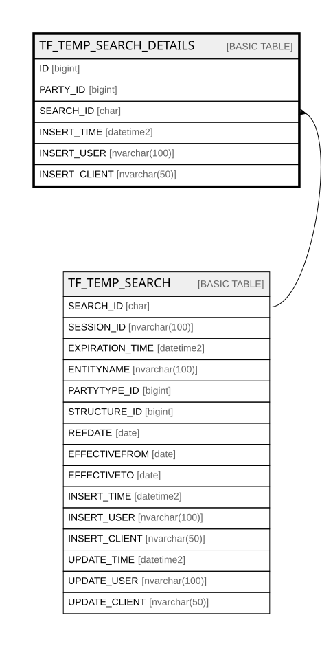

# TF_TEMP_SEARCH_DETAILS

## Columns

| Name | Type | Default | Nullable | Parents | Comment |
| ---- | ---- | ------- | -------- | ------- | ------- |
| ID | bigint |  | false |  |  |
| PARTY_ID | bigint |  | false |  |  |
| SEARCH_ID | char |  | false | [TF_TEMP_SEARCH](TF_TEMP_SEARCH.md) |  |
| INSERT_TIME | datetime2 | (sysutcdatetime()) | false |  |  |
| INSERT_USER | nvarchar(100) | (N'MAIN') | false |  |  |
| INSERT_CLIENT | nvarchar(50) | (N'localhost') | false |  |  |

## Constraints

| Name | Type | Definition |
| ---- | ---- | ---------- |
| PK_TEMP_SEARCH_DETAILS | PRIMARY KEY | CLUSTERED, unique, part of a PRIMARY KEY constraint, [ ID ] |
| FK_TEMP_S_DET_TEMP_S | FOREIGN KEY | FOREIGN KEY(SEARCH_ID) REFERENCES TF_TEMP_SEARCH(SEARCH_ID) ON UPDATE NO_ACTION ON DELETE CASCADE |

## Indexes

| Name | Definition |
| ---- | ---------- |
| PK_TEMP_SEARCH_DETAILS | CLUSTERED, unique, part of a PRIMARY KEY constraint, [ ID ] |
| IDX_TEMP_SEARCH_DETAILS | NONCLUSTERED, [ SEARCH_ID, PARTY_ID ] |

## Relations

---

> Generated by [tbls](https://github.com/k1LoW/tbls)
