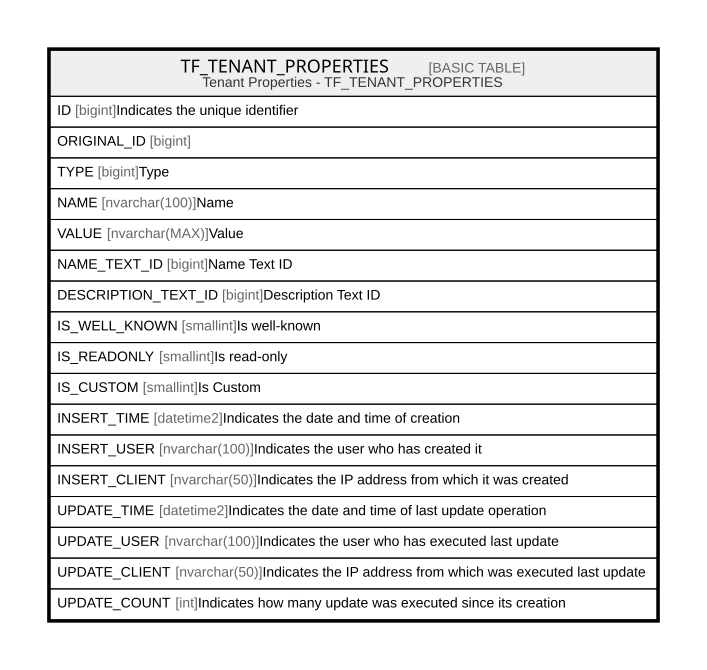

# TF_TENANT_PROPERTIES

## Description

Tenant Properties - TF_TENANT_PROPERTIES  

## Columns

| Name | Type | Default | Nullable | Comment |
| ---- | ---- | ------- | -------- | ------- |
| ID | bigint |  | false | Indicates the unique identifier |
| ORIGINAL_ID | bigint |  | true |  |
| TYPE | bigint | ((1)) | false | Type |
| NAME | nvarchar(100) |  | false | Name |
| VALUE | nvarchar(MAX) |  | true | Value |
| NAME_TEXT_ID | bigint |  | true | Name Text ID |
| DESCRIPTION_TEXT_ID | bigint |  | true | Description Text ID |
| IS_WELL_KNOWN | smallint | ((0)) | false | Is well-known |
| IS_READONLY | smallint | ((0)) | false | Is read-only |
| IS_CUSTOM | smallint | ((1)) | false | Is Custom |
| INSERT_TIME | datetime2 | (sysutcdatetime()) | false | Indicates the date and time of creation |
| INSERT_USER | nvarchar(100) | (N'MAIN') | false | Indicates the user who has created it |
| INSERT_CLIENT | nvarchar(50) | (N'localhost') | false | Indicates the IP address from which it was created |
| UPDATE_TIME | datetime2 | (sysutcdatetime()) | false | Indicates the date and time of last update operation |
| UPDATE_USER | nvarchar(100) | (N'MAIN') | false | Indicates the user who has executed last update |
| UPDATE_CLIENT | nvarchar(50) | (N'localhost') | false | Indicates the IP address from which was executed last update |
| UPDATE_COUNT | int | ((0)) | false | Indicates how many update was executed since its creation |

## Constraints

| Name | Type | Definition |
| ---- | ---- | ---------- |
| PK_TENANT_INFO | PRIMARY KEY | CLUSTERED, unique, part of a PRIMARY KEY constraint, [ ID ] |
| UQ_TENANT_INFO_NAME | UNIQUE | NONCLUSTERED, unique, part of a UNIQUE constraint, [ NAME, IS_CUSTOM ] |

## Indexes

| Name | Definition |
| ---- | ---------- |
| PK_TENANT_INFO | CLUSTERED, unique, part of a PRIMARY KEY constraint, [ ID ] |
| UQ_TENANT_INFO_NAME | NONCLUSTERED, unique, part of a UNIQUE constraint, [ NAME, IS_CUSTOM ] |
| IDX_TENANTPTS_CUSTOM_FACTORY | NONCLUSTERED, [ ORIGINAL_ID, IS_CUSTOM ] |

## Relations

---

> Generated by [tbls](https://github.com/k1LoW/tbls)
