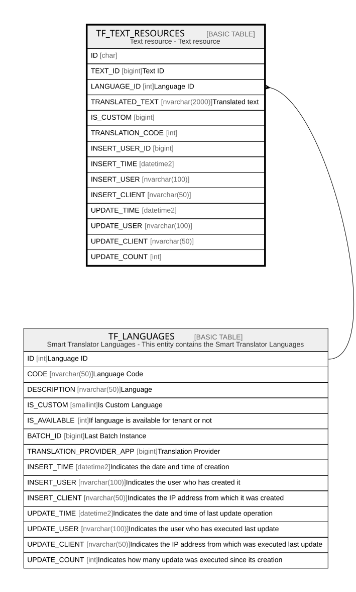

# TF_TEXT_RESOURCES

## Description

Text resource - Text resource  

## Columns

| Name | Type | Default | Nullable | Parents | Comment |
| ---- | ---- | ------- | -------- | ------- | ------- |
| ID | char |  | false |  |  |
| TEXT_ID | bigint |  | false |  | Text ID |
| LANGUAGE_ID | int |  | false | [TF_LANGUAGES](TF_LANGUAGES.md) | Language ID |
| TRANSLATED_TEXT | nvarchar(2000) |  | false |  | Translated text |
| IS_CUSTOM | bigint | ((0)) | false |  |  |
| TRANSLATION_CODE | int | ((0)) | false |  |  |
| INSERT_USER_ID | bigint |  | true |  |  |
| INSERT_TIME | datetime2 | (sysutcdatetime()) | false |  |  |
| INSERT_USER | nvarchar(100) | (N'MAIN') | false |  |  |
| INSERT_CLIENT | nvarchar(50) | (N'localhost') | false |  |  |
| UPDATE_TIME | datetime2 | (sysutcdatetime()) | false |  |  |
| UPDATE_USER | nvarchar(100) | (N'MAIN') | false |  |  |
| UPDATE_CLIENT | nvarchar(50) | (N'localhost') | false |  |  |
| UPDATE_COUNT | int | ((0)) | false |  |  |

## Constraints

| Name | Type | Definition |
| ---- | ---- | ---------- |
| PK_TEXT_RESOURCES | PRIMARY KEY | CLUSTERED, unique, part of a PRIMARY KEY constraint, [ ID ] |
| UQ_TEXT_RESOURCES | UNIQUE | NONCLUSTERED, unique, part of a UNIQUE constraint, [ LANGUAGE_ID, TEXT_ID, IS_CUSTOM ] |
| FK_TEXT_RESOURCES_LANGUAGE | FOREIGN KEY | FOREIGN KEY(LANGUAGE_ID) REFERENCES TF_LANGUAGES(ID) ON UPDATE NO_ACTION ON DELETE CASCADE |

## Indexes

| Name | Definition |
| ---- | ---------- |
| PK_TEXT_RESOURCES | CLUSTERED, unique, part of a PRIMARY KEY constraint, [ ID ] |
| UQ_TEXT_RESOURCES | NONCLUSTERED, unique, part of a UNIQUE constraint, [ LANGUAGE_ID, TEXT_ID, IS_CUSTOM ] |

## Relations

---

> Generated by [tbls](https://github.com/k1LoW/tbls)
