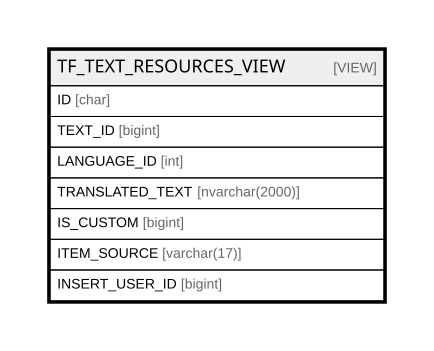

# TF_TEXT_RESOURCES_VIEW

## Description

<details>
<summary><strong>Table Definition</strong></summary>

```sql
-- Talentia Software - All right reserved
-- Type: VIEW                     Name: TF_TEXT_RESOURCES_VIEW
-- Date: 09-04-2026 07:27:59 (UTC)
-- 
-- ChangeLogId: 00000000-0000-0000-0000-000000000000
-- ChangeSetId: b8c09314-5589-495a-a5a3-0a634ad604b6
-- Original file name: C:\repos\Talentia-Software\hcm-core/DB/ProductDB/EDM\Schema\Views\TF_TEXT_RESOURCES_VIEW.xml


CREATE VIEW [TF_TEXT_RESOURCES_VIEW]
 AS 
( 
          SELECT ID, TEXT_ID, LANGUAGE_ID, TRANSLATED_TEXT, IS_CUSTOM,
          CASE WHEN (EXISTS (SELECT ID FROM TF_TEXT_RESOURCES TT WHERE TT.IS_CUSTOM = 0 AND TF_TEXT_RESOURCES.TEXT_ID = TT.TEXT_ID AND TF_TEXT_RESOURCES.LANGUAGE_ID = TT.LANGUAGE_ID))
          THEN 'CustomizedVanilla' ELSE 'CustomizedOnly' END AS ITEM_SOURCE, INSERT_USER_ID
          FROM TF_TEXT_RESOURCES
          WHERE IS_CUSTOM = 1
          UNION ALL
          SELECT ID, TEXT_ID, LANGUAGE_ID, TRANSLATED_TEXT, IS_CUSTOM, 'Vanilla' AS ITEM_SOURCE, INSERT_USER_ID
          FROM TF_TEXT_RESOURCES
          WHERE IS_CUSTOM = 0
          AND NOT EXISTS (SELECT ID FROM TF_TEXT_RESOURCES TT WHERE TT.IS_CUSTOM = 1 AND TF_TEXT_RESOURCES.TEXT_ID = TT.TEXT_ID AND TF_TEXT_RESOURCES.LANGUAGE_ID = TT.LANGUAGE_ID)
         )

```

</details>

## Columns

| Name | Type | Default | Nullable | Comment |
| ---- | ---- | ------- | -------- | ------- |
| ID | char |  | false |  |
| TEXT_ID | bigint |  | false |  |
| LANGUAGE_ID | int |  | false |  |
| TRANSLATED_TEXT | nvarchar(2000) |  | false |  |
| IS_CUSTOM | bigint |  | false |  |
| ITEM_SOURCE | varchar(17) |  | false |  |
| INSERT_USER_ID | bigint |  | true |  |

## Referenced Tables

| Name | Columns | Comment | Type |
| ---- | ------- | ------- | ---- |
| [TF_TEXT_RESOURCES](TF_TEXT_RESOURCES.md) | 14 | Text resource - Text resource<br /> | BASIC TABLE |

## Relations



---

> Generated by [tbls](https://github.com/k1LoW/tbls)
