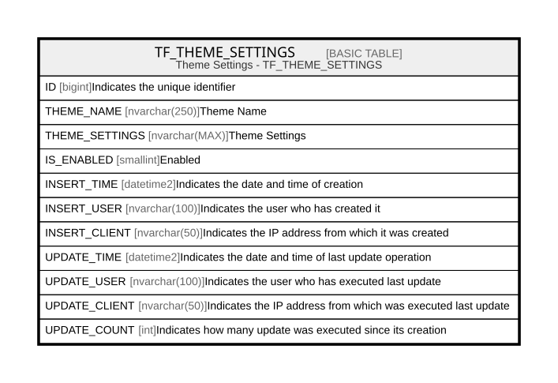

# TF_THEME_SETTINGS

## Description

Theme Settings - TF_THEME_SETTINGS  

## Columns

| Name | Type | Default | Nullable | Comment |
| ---- | ---- | ------- | -------- | ------- |
| ID | bigint |  | false | Indicates the unique identifier |
| THEME_NAME | nvarchar(250) |  | false | Theme Name |
| THEME_SETTINGS | nvarchar(MAX) |  | true | Theme Settings |
| IS_ENABLED | smallint | ((0)) | false | Enabled |
| INSERT_TIME | datetime2 | (sysutcdatetime()) | false | Indicates the date and time of creation |
| INSERT_USER | nvarchar(100) | (N'MAIN') | false | Indicates the user who has created it |
| INSERT_CLIENT | nvarchar(50) | (N'localhost') | false | Indicates the IP address from which it was created |
| UPDATE_TIME | datetime2 | (sysutcdatetime()) | false | Indicates the date and time of last update operation |
| UPDATE_USER | nvarchar(100) | (N'MAIN') | false | Indicates the user who has executed last update |
| UPDATE_CLIENT | nvarchar(50) | (N'localhost') | false | Indicates the IP address from which was executed last update |
| UPDATE_COUNT | int | ((0)) | false | Indicates how many update was executed since its creation |

## Constraints

| Name | Type | Definition |
| ---- | ---- | ---------- |
| PK_THEME_SETTINGS | PRIMARY KEY | CLUSTERED, unique, part of a PRIMARY KEY constraint, [ ID ] |
| UQ_THEME_SETTINGS_THEME_NAME | UNIQUE | NONCLUSTERED, unique, part of a UNIQUE constraint, [ THEME_NAME ] |

## Indexes

| Name | Definition |
| ---- | ---------- |
| PK_THEME_SETTINGS | CLUSTERED, unique, part of a PRIMARY KEY constraint, [ ID ] |
| UQ_THEME_SETTINGS_THEME_NAME | NONCLUSTERED, unique, part of a UNIQUE constraint, [ THEME_NAME ] |

## Relations

---

> Generated by [tbls](https://github.com/k1LoW/tbls)
