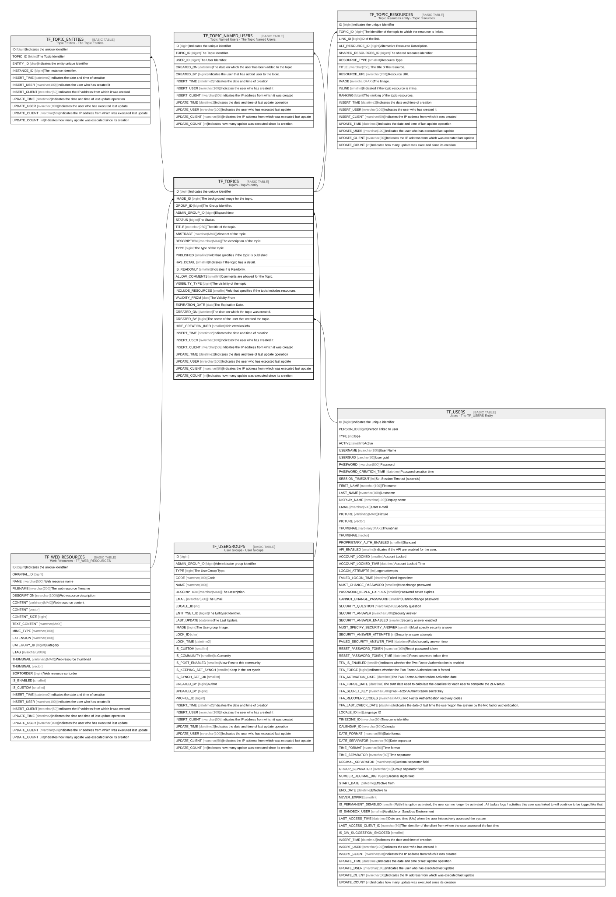

# TF_TOPICS

## Description

Topics - Topics entity  

## Columns

| Name | Type | Default | Nullable | Children | Parents | Comment |
| ---- | ---- | ------- | -------- | -------- | ------- | ------- |
| ID | bigint |  | false | [TF_TOPIC_ENTITIES](TF_TOPIC_ENTITIES.md) [TF_TOPIC_NAMED_USERS](TF_TOPIC_NAMED_USERS.md) [TF_TOPIC_RESOURCES](TF_TOPIC_RESOURCES.md) |  | Indicates the unique identifier |
| IMAGE_ID | bigint |  | true |  | [TF_WEB_RESOURCES](TF_WEB_RESOURCES.md) | The background image for the topic. |
| GROUP_ID | bigint |  | true |  |  | The Group Identifier. |
| ADMIN_GROUP_ID | bigint |  | true |  | [TF_USERGROUPS](TF_USERGROUPS.md) | Elapsed time |
| STATUS | bigint |  | true |  |  | The Status. |
| TITLE | nvarchar(250) |  | false |  |  | The title of the topic. |
| ABSTRACT | nvarchar(MAX) |  | false |  |  | Abstract of the topic. |
| DESCRIPTION | nvarchar(MAX) |  | true |  |  | The description of the topic. |
| TYPE | bigint |  | false |  |  | The type of the topic. |
| PUBLISHED | smallint | ((0)) | false |  |  | Field that specifies if the topic is published. |
| HAS_DETAIL | smallint | ((0)) | false |  |  | Indicates if the topic has a detail. |
| IS_READONLY | smallint | ((1)) | false |  |  | Indicates if is Readonly. |
| ALLOW_COMMENTS | smallint | ((0)) | false |  |  | Comments are allowed for the Topic. |
| VISIBILITY_TYPE | bigint |  | false |  |  | The visibility of the topic |
| INCLUDE_RESOURCES | smallint | ((0)) | false |  |  | Field that specifies if the topic includes resources. |
| VALIDITY_FROM | date |  | true |  |  | The Validity From |
| EXPIRATION_DATE | date |  | true |  |  | The Expiration Date. |
| CREATED_ON | datetime | (sysutcdatetime()) | false |  |  | The date on which the topic was created. |
| CREATED_BY | bigint |  | true |  | [TF_USERS](TF_USERS.md) | The name of the user that created the topic. |
| HIDE_CREATION_INFO | smallint | ((0)) | false |  |  | Hide creation info |
| INSERT_TIME | datetime2 | (sysutcdatetime()) | false |  |  | Indicates the date and time of creation |
| INSERT_USER | nvarchar(100) | (N'MAIN') | false |  |  | Indicates the user who has created it |
| INSERT_CLIENT | nvarchar(50) | (N'localhost') | false |  |  | Indicates the IP address from which it was created |
| UPDATE_TIME | datetime2 | (sysutcdatetime()) | false |  |  | Indicates the date and time of last update operation |
| UPDATE_USER | nvarchar(100) | (N'MAIN') | false |  |  | Indicates the user who has executed last update |
| UPDATE_CLIENT | nvarchar(50) | (N'localhost') | false |  |  | Indicates the IP address from which was executed last update |
| UPDATE_COUNT | int | ((0)) | false |  |  | Indicates how many update was executed since its creation |

## Constraints

| Name | Type | Definition |
| ---- | ---- | ---------- |
| PK_TOPIC | PRIMARY KEY | CLUSTERED, unique, part of a PRIMARY KEY constraint, [ ID ] |
| FK_TOPIC_USERS | FOREIGN KEY | FOREIGN KEY(CREATED_BY) REFERENCES TF_USERS(ID) ON UPDATE NO_ACTION ON DELETE SET_NULL |
| FK_TOPIC_WEBRES | FOREIGN KEY | FOREIGN KEY(IMAGE_ID) REFERENCES TF_WEB_RESOURCES(ID) ON UPDATE NO_ACTION ON DELETE NO_ACTION |
| FK_TOPICADMIN_USERGROUP | FOREIGN KEY | FOREIGN KEY(ADMIN_GROUP_ID) REFERENCES TF_USERGROUPS(ID) ON UPDATE NO_ACTION ON DELETE SET_NULL |

## Indexes

| Name | Definition |
| ---- | ---------- |
| PK_TOPIC | CLUSTERED, unique, part of a PRIMARY KEY constraint, [ ID ] |
| IDX_TOPICS_IMG | NONCLUSTERED, [ IMAGE_ID ] |
| IDX_TOPICS_VISIBILITY | NONCLUSTERED, [ VISIBILITY_TYPE ] |
| IDX_TOPICS_CREATEDBY | NONCLUSTERED, [ CREATED_BY ] |
| IDX_TOPICS_UG | NONCLUSTERED, [ GROUP_ID ] |
| IDX_TOPICS_AUG | NONCLUSTERED, [ ADMIN_GROUP_ID ] |
| IDX_TOPICS_EXPIRATIONDATE | NONCLUSTERED, [ EXPIRATION_DATE ] |

## Relations

---

> Generated by [tbls](https://github.com/k1LoW/tbls)
