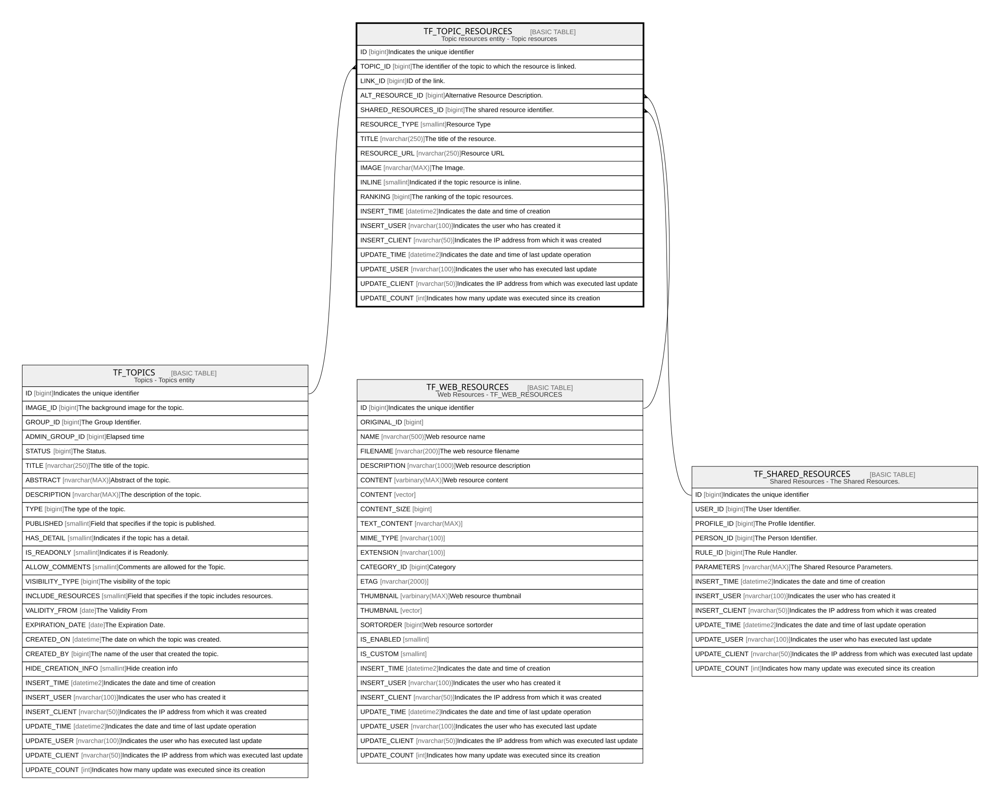

# TF_TOPIC_RESOURCES

## Description

Topic resources entity - Topic resources  

## Columns

| Name | Type | Default | Nullable | Parents | Comment |
| ---- | ---- | ------- | -------- | ------- | ------- |
| ID | bigint |  | false |  | Indicates the unique identifier |
| TOPIC_ID | bigint |  | false | [TF_TOPICS](TF_TOPICS.md) | The identifier of the topic to which the resource is linked. |
| LINK_ID | bigint |  | true |  | ID of the link. |
| ALT_RESOURCE_ID | bigint |  | true | [TF_WEB_RESOURCES](TF_WEB_RESOURCES.md) | Alternative Resource Description. |
| SHARED_RESOURCES_ID | bigint |  | true | [TF_SHARED_RESOURCES](TF_SHARED_RESOURCES.md) | The shared resource identifier. |
| RESOURCE_TYPE | smallint |  | false |  | Resource Type |
| TITLE | nvarchar(250) |  | false |  | The title of the resource. |
| RESOURCE_URL | nvarchar(250) |  | true |  | Resource URL |
| IMAGE | nvarchar(MAX) |  | true |  | The Image. |
| INLINE | smallint | ((0)) | false |  | Indicated if the topic resource is inline. |
| RANKING | bigint | ((0)) | false |  | The ranking of the topic resources. |
| INSERT_TIME | datetime2 | (sysutcdatetime()) | false |  | Indicates the date and time of creation |
| INSERT_USER | nvarchar(100) | (N'MAIN') | false |  | Indicates the user who has created it |
| INSERT_CLIENT | nvarchar(50) | (N'localhost') | false |  | Indicates the IP address from which it was created |
| UPDATE_TIME | datetime2 | (sysutcdatetime()) | false |  | Indicates the date and time of last update operation |
| UPDATE_USER | nvarchar(100) | (N'MAIN') | false |  | Indicates the user who has executed last update |
| UPDATE_CLIENT | nvarchar(50) | (N'localhost') | false |  | Indicates the IP address from which was executed last update |
| UPDATE_COUNT | int | ((0)) | false |  | Indicates how many update was executed since its creation |

## Constraints

| Name | Type | Definition |
| ---- | ---- | ---------- |
| PK_TOPICRESOURCES | PRIMARY KEY | CLUSTERED, unique, part of a PRIMARY KEY constraint, [ ID ] |
| FK_TOPICRESOURCES_SHARRES | FOREIGN KEY | FOREIGN KEY(SHARED_RESOURCES_ID) REFERENCES TF_SHARED_RESOURCES(ID) ON UPDATE NO_ACTION ON DELETE NO_ACTION |
| FK_TOPICRESOURCES_TOPIC | FOREIGN KEY | FOREIGN KEY(TOPIC_ID) REFERENCES TF_TOPICS(ID) ON UPDATE NO_ACTION ON DELETE CASCADE |
| FK_TOPICRESOURCES_WEBRES | FOREIGN KEY | FOREIGN KEY(ALT_RESOURCE_ID) REFERENCES TF_WEB_RESOURCES(ID) ON UPDATE NO_ACTION ON DELETE NO_ACTION |

## Indexes

| Name | Definition |
| ---- | ---------- |
| PK_TOPICRESOURCES | CLUSTERED, unique, part of a PRIMARY KEY constraint, [ ID ] |

## Relations

---

> Generated by [tbls](https://github.com/k1LoW/tbls)
