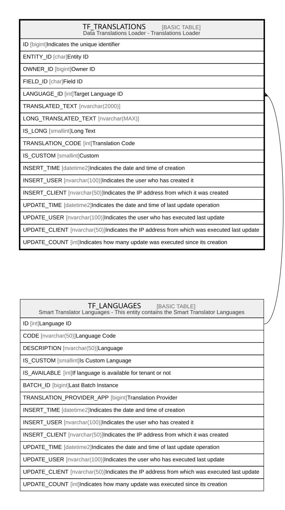

# TF_TRANSLATIONS

## Description

Data Translations Loader - Translations Loader  

## Columns

| Name | Type | Default | Nullable | Parents | Comment |
| ---- | ---- | ------- | -------- | ------- | ------- |
| ID | bigint |  | false |  | Indicates the unique identifier |
| ENTITY_ID | char |  | false |  | Entity ID |
| OWNER_ID | bigint |  | false |  | Owner ID |
| FIELD_ID | char |  | false |  | Field ID |
| LANGUAGE_ID | int |  | false | [TF_LANGUAGES](TF_LANGUAGES.md) | Target Language ID |
| TRANSLATED_TEXT | nvarchar(2000) |  | true |  |  |
| LONG_TRANSLATED_TEXT | nvarchar(MAX) |  | true |  |  |
| IS_LONG | smallint | ((0)) | false |  | Long Text |
| TRANSLATION_CODE | int | ((0)) | false |  | Translation Code |
| IS_CUSTOM | smallint | ((0)) | false |  | Custom |
| INSERT_TIME | datetime2 | (sysutcdatetime()) | false |  | Indicates the date and time of creation |
| INSERT_USER | nvarchar(100) | (N'MAIN') | false |  | Indicates the user who has created it |
| INSERT_CLIENT | nvarchar(50) | (N'localhost') | false |  | Indicates the IP address from which it was created |
| UPDATE_TIME | datetime2 | (sysutcdatetime()) | false |  | Indicates the date and time of last update operation |
| UPDATE_USER | nvarchar(100) | (N'MAIN') | false |  | Indicates the user who has executed last update |
| UPDATE_CLIENT | nvarchar(50) | (N'localhost') | false |  | Indicates the IP address from which was executed last update |
| UPDATE_COUNT | int | ((0)) | false |  | Indicates how many update was executed since its creation |

## Constraints

| Name | Type | Definition |
| ---- | ---- | ---------- |
| PK_TRANSLATIONS | PRIMARY KEY | CLUSTERED, unique, part of a PRIMARY KEY constraint, [ ID ] |
| FK_TRANS_LANGUAGES | FOREIGN KEY | FOREIGN KEY(LANGUAGE_ID) REFERENCES TF_LANGUAGES(ID) ON UPDATE NO_ACTION ON DELETE CASCADE |

## Indexes

| Name | Definition |
| ---- | ---------- |
| PK_TRANSLATIONS | CLUSTERED, unique, part of a PRIMARY KEY constraint, [ ID ] |
| UQ_TRANSLATIONS_WITHINCLUDE | NONCLUSTERED, unique, [ TRANSLATED_TEXT, LONG_TRANSLATED_TEXT, ENTITY_ID, FIELD_ID, LANGUAGE_ID, OWNER_ID ] |
| CHR_EXTRACTION | NONCLUSTERED, [ ENTITY_ID, OWNER_ID, UPDATE_USER ] |

## Triggers

| Name | Definition |
| ---- | ---------- |
| AUDIT_TF_TRANSLATIONS | -- Talentia Software - All right reserved -- Type: TRIGGER                  Name: AUDIT_TF_TRANSLATIONS -- Date: 09-04-2026 07:27:59 (UTC) --  -- ChangeLogId: 00000000-0000-0000-0000-000000000000 -- ChangeSetId: 10b0e4f6-70d2-49ac-ba06-addfe2385958 -- Original file name: C:\repos\Talentia-Software\hcm-core/DB/ProductDB/EDM\Schema\Triggers\AUDIT_TF_TRANSLATIONS.xml   CREATE TRIGGER AUDIT_TF_TRANSLATIONS    ON  TF_TRANSLATIONS    AFTER INSERT,DELETE,UPDATE AS  BEGIN 	-- SET NOCOUNT ON added to prevent extra result sets from 	-- interfering with SELECT statements. 	SET NOCOUNT ON;      -- Insert statements for trigger here  	DECLARE @TableName varchar(100) 	DECLARE @LinkedEntityID varchar(36)  	DECLARE	@DefAuditPolicyStatus bit 	DECLARE @OperationType smallint -- Insert 1, Update 2, Delete 3 	DECLARE @ColumnKey varchar(100) 	DECLARE @PrimaryKey int 	DECLARE @Fields nvarchar(max) 	DECLARE @PrimaryKeyFieldName nvarchar(100) 	DECLARE @UpdateDate varchar(23)  	DECLARE @HasEntityId bit = 0 	DECLARE @EntityIdColumn varchar(100)  	DECLARE @ColumnName nvarchar(max) 	DECLARE @EntityName nvarchar(max) 	DECLARE @EntityID char(36) 	DECLARE @ColumnID char(36) 	DECLARE @FieldID char(36) 	DECLARE @FieldName nvarchar(max) 	DECLARE @FieldType smallint  	DECLARE @ContextInfo varchar(128) 	DECLARE @ClientInfo nvarchar(max) 	DECLARE @DirectSQL bit = 0  	DECLARE @SQL nvarchar(max) 	   DECLARE @SQLWorkTable nvarchar(max) 	DECLARE @SQLWorkTable2 nvarchar(max) 	DECLARE @SQLWorkTableRef nvarchar(max) 	   DECLARE @SQLStartInsertTo nvarchar(max)    DECLARE @SQLPrimaryKeyField nvarchar(max) 	DECLARE @SQLNewValueFields nvarchar(max) 	DECLARE @SQLOldValueFields nvarchar(max) 	DECLARE @SQLInsertUser nvarchar(max) 	DECLARE @SQLInsertClient  nvarchar(max)  	DECLARE @ListNbLong BigInt = 0 	DECLARE @ListLong1 NVARCHAR(MAX)  = NULL 	DECLARE @ListLong2 NVARCHAR(MAX) = NULL 	DECLARE @ListNbDecimal BigInt = 0 	DECLARE @ListDecimal1 NVARCHAR(MAX) = NULL 	DECLARE @ListDecimal2 NVARCHAR(MAX) = NULL 	DECLARE @ListNbDateTime BigInt = 0 	DECLARE @ListDateTime1 NVARCHAR(MAX) = NULL 	DECLARE @ListDateTime2 NVARCHAR(MAX) = NULL 	DECLARE @ListNbStr BigInt = 0 	DECLARE @ListStr1 NVARCHAR(MAX) = NULL 	DECLARE @Liststr2 NVARCHAR(MAX) = NULL 	DECLARE @ListNbBinary BigInt = 0 	DECLARE @ListBinary1 NVARCHAR(MAX) = NULL 	DECLARE @ListBinary2 NVARCHAR(MAX) = NULL 	DECLARE @SQLUnion NVARCHAR(MAX) = ''  	SET @Tablename = 'TF_TRANSLATIONS'  	--IF AUDITED IS ENABLE 	SELECT @DefAuditPolicyStatus = ACTIVE FROM TF_AUDIT_SWITCH WHERE [ID]=1 	if (@DefAuditPolicyStatus=1)  	BEGIN  		DECLARE @EntityAuditedFields as int = (SELECT COUNT(*) FROM TF_AUDITED_COLUMNS WHERE ENTITY_ID IN 		( 			SELECT DISTINCT ENTITY_ID FROM inserted  			UNION 			SELECT DISTINCT ENTITY_ID FROM deleted 		) 		AND IS_UNDER_AUDIT = 1) 		 		IF (@EntityAuditedFields = 0) 		RETURN;  		--Get Operation Type 		if exists (SELECT * FROM inserted) 			if exists (SELECT * FROM deleted) 				SELECT @OperationType = 2 --Update 			else 				SELECT @OperationType = 1 --Insert 		else 			SELECT @OperationType = 3 --Delete  		--GET EntityIdColumn 		SET @EntityIdColumn = 'ENTITY_ID'  		--GET THE SAME DATE FOR ALL 		SELECT @UpdateDate = '''' + convert(varchar(8), getutcdate(), 112) + ' ' + convert(varchar(12), getutcdate(), 114) + ''''  		--Get Primary field name 		SELECT @PrimaryKeyFieldName = 'ID'  		--get Context Info 		IF CONTEXT_INFO() is null 			BEGIN 				SELECT @ContextInfo= '' 				SET @DirectSQL = 1 			END 		ELSE 			BEGIN 				-- Context Info should contain the Applicative UserName 				SELECT @ContextInfo = REPLACE(CAST(CONTEXT_INFO() as varchar(128)), NCHAR(0) COLLATE Latin1_General_100_BIN2, N''); 				SET @DirectSQL = 0 			END 	 		--Get Client Info 		SET @ClientInfo = SYSTEM_USER  		-- TEMPORARY TABLES 		SELECT * INTO #ins FROM inserted 		SELECT * INTO #del FROM deleted  		-- Start of the SQL request	 		SET @SQLStartInsertTo = 'INSERT INTO TF_AUDIT 				(  [TABLE_NAME], [ENTITY_NAME], [ENTITY_ID], [COLUMN_NAME], [FIELD_NAME], [FIELD_ID], [FIELD_TYPE] 				  ,[OWNER_ID] , [OPERATION_TYPE] 					,[LONG_VALUE],[DECIMAL_VALUE],[DATETIME_VALUE],[STRING_VALUE],[VARBINARY_VALUE] 					,[OLD_LONG_VALUE],[OLD_DECIMAL_VALUE],[OLD_DATETIME_VALUE],[OLD_STRING_VALUE],[OLD_VARBINARY_VALUE] 					,[INSERT_USER],[INSERT_CLIENT],[INSERT_TIME],[TRANSACTION_ID], [PRIMARY_KEY], [LANGUAGE_ID], [TRANSLATION_FIELD] 				)  				' 				SET @ListNbLong = 0 		SET @ListLong1 = '' --'IS_LONG, TRANSLATION_CODE, UPDATE_COUNT' 		SET @ListLong2 = '' --'CONVERT(bigint, IS_LONG) AS IS_LONG, CONVERT(bigint, TRANSLATION_CODE) AS TRANSLATION_CODE , CONVERT(bigint, UPDATE_COUNT) AS UPDATE_COUNT'  		SET @ListNbDateTime = 0 		SET @ListDateTime1 = 'INSERT_TIME, UPDATE_TIME' 		SET @ListDateTime2 = 'CONVERT(datetime2, INSERT_TIME) AS INSERT_TIME, CONVERT(datetime2, UPDATE_TIME) AS UPDATE_TIME'  		SET @ListNbStr = 2 		SET @ListStr1 = 'TRANSLATED_TEXT, LONG_TRANSLATED_TEXT' --'TRANSLATED_TEXT, LONG_TRANSLATED_TEXT, INSERT_USER, INSERT_CLIENT, UPDATE_USER, UPDATE_CLIENT' 		SET @ListStr2 = 'CONVERT(nvarchar(max), TRANSLATED_TEXT) AS TRANSLATED_TEXT, CONVERT(nvarchar(max), LONG_TRANSLATED_TEXT) AS LONG_TRANSLATED_TEXT' --'CONVERT(nvarchar(max), TRANSLATED_TEXT) AS TRANSLATED_TEXT, CONVERT(nvarchar(max), LONG_TRANSLATED_TEXT) AS LONG_TRANSLATED_TEXT, CONVERT(nvarchar(max), INSERT_USER) AS INSERT_USER, CONVERT(nvarchar(max), INSERT_CLIENT) AS INSERT_CLIENT, CONVERT(nvarchar(max), UPDATE_USER) AS UPDATE_USER, CONVERT(nvarchar(max), UPDATE_CLIENT) AS UPDATE_CLIENT'  		-- INSERTED OPERATION TYPE 		IF(@OperationType = 1) 		BEGIN 			SET @SQLWorkTable = '#ins' 			SET @SQLWorkTableRef = @SQLWOrkTable + '.' 			SET @SQLPrimaryKeyField = @SQLWorkTableRef + @PrimaryKeyFieldName 					 			SET @SQLInsertUser = '''' + Replace(@ContextInfo,'''','''''') + ''''  			SET @SQLInsertClient =  '''' + @ClientInfo + ''''              if @ListNbLong > 0 				BEGIN 					If @SQLUNION <> ''  						BEGIN 							SET @SQLUNION = @SQLUNION + ' UNION ' 						END 					SET @SQLUNION = @SQLUNION + ' 					( 							SELECT ''' + @Tablename + ''', AUDITED_COLUMNS.[ENTITY_NAME], AUDITED_COLUMNS.[ENTITY_ID], AUDITED_COLUMNS.[COLUMN_NAME], AUDITED_COLUMNS.[FIELD_NAME], AUDITED_COLUMNS.[FIELD_ID], AUDITED_COLUMNS.[FIELD_TYPE], 							A.#OWNER_ID,  1, A.#LVALUE, A.#DVALUE, A.#TVALUE, A.#SVALUE, A.#BVALUE, NULL, NULL, NULL, NULL, NULL, ' + @SQLInsertUser + ',' + @SQLInsertClient +', ' + @UpdateDate + ', CURRENT_TRANSACTION_ID(),A.#PK , A.#LANGUAGE_ID, A.#COL 			 							FROM TF_AUDITED_COLUMNS AUDITED_COLUMNS INNER JOIN  								( 								SELECT  #COL, #PK, #ENTITY_ID, #FIELD_ID, #OWNER_ID, #LANGUAGE_ID, value #LVALUE, NULL #DVALUE, NULL #TVALUE, NULL AS #SVALUE, NULL AS #BVALUE 								FROM   									( 									SELECT  ' + @PrimaryKeyFieldName + ' AS #PK, '+ @EntityIdColumn +' AS #ENTITY_ID, FIELD_ID AS #FIELD_ID, OWNER_ID AS #OWNER_ID, LANGUAGE_ID AS #LANGUAGE_ID, ' + @ListLong2 +'  FROM  ' + @SQLWorkTable +'  									)  p 									UNPIVOT (value  FOR  #COL  IN  ('+@ListLong1+'))  as  unpvt 								) A 							ON AUDITED_COLUMNS.ENTITY_ID = A.#ENTITY_ID AND AUDITED_COLUMNS.FIELD_ID = A.#FIELD_ID  					)' 				END  			if @ListNbDateTime > 0 				BEGIN 					If @SQLUNION <> ''  						BEGIN 							SET @SQLUNION = @SQLUNION + ' UNION ' 						END 					SET @SQLUNION = @SQLUNION + ' 					( 							SELECT ''' + @Tablename + ''', AUDITED_COLUMNS.[ENTITY_NAME], AUDITED_COLUMNS.[ENTITY_ID], AUDITED_COLUMNS.[COLUMN_NAME], AUDITED_COLUMNS.[FIELD_NAME], AUDITED_COLUMNS.[FIELD_ID], AUDITED_COLUMNS.[FIELD_TYPE], 							A.#PK,  1, A.#LVALUE, A.#DVALUE, A.#TVALUE, A.#SVALUE, A.#BVALUE, NULL, NULL, nULL, NULL, NULL, ' + @SQLInsertUser + ',' + @SQLInsertClient +', ' + @UpdateDate + ', CURRENT_TRANSACTION_ID(), A.#OWNER_ID, A.#LANGUAGE_ID, A.#COL 			 							FROM TF_AUDITED_COLUMNS AUDITED_COLUMNS INNER JOIN  								( 								SELECT  #COL, #PK,  #ENTITY_ID, #FIELD_ID, #OWNER_ID, #LANGUAGE_ID, NULL #LVALUE, NULL #DVALUE, value #TVALUE, NULL AS #SVALUE, NULL AS #BVALUE 								FROM   									( 									SELECT  ' + @PrimaryKeyFieldName + ' AS #PK, '+ @EntityIdColumn +' AS #ENTITY_ID, FIELD_ID AS #FIELD_ID, OWNER_ID AS #OWNER_ID, LANGUAGE_ID AS #LANGUAGE_ID, ' + @ListDateTime2 +'  FROM  ' + @SQLWorkTable + ' 									)  p 									UNPIVOT (value  FOR  #COL  IN  ('+@ListDateTime1+'))  as  unpvt 								) A  							ON AUDITED_COLUMNS.ENTITY_ID = A.#ENTITY_ID AND AUDITED_COLUMNS.FIELD_ID = A.#FIELD_ID  					)' 				END  			IF @ListNbStr > 0 				BEGIN 					If @SQLUNION <> ''  						BEGIN 							SET @SQLUNION = @SQLUNION + ' UNION ' 						END 					SET @SQLUNION = @SQLUNION + ' 					( 							SELECT ''' + @Tablename + ''', AUDITED_COLUMNS.[ENTITY_NAME], AUDITED_COLUMNS.[ENTITY_ID], AUDITED_COLUMNS.[COLUMN_NAME], AUDITED_COLUMNS.[FIELD_NAME], AUDITED_COLUMNS.[FIELD_ID], AUDITED_COLUMNS.[FIELD_TYPE], 							A.#PK,  1, A.#LVALUE, A.#DVALUE, A.#TVALUE, A.#SVALUE, A.#BVALUE, NULL, NULL, nULL, NULL, NULL, ' + @SQLInsertUser + ',' + @SQLInsertClient +', ' + @UpdateDate + ', CURRENT_TRANSACTION_ID(), A.#OWNER_ID, A.#LANGUAGE_ID, A.#COL 			 							FROM TF_AUDITED_COLUMNS AUDITED_COLUMNS INNER JOIN  								( 								SELECT  #COL, #PK, #ENTITY_ID, #FIELD_ID, #OWNER_ID, #LANGUAGE_ID, NULL #LVALUE, NULL #DVALUE, NULL #TVALUE, value AS #SVALUE, NULL AS #BVALUE 								FROM   									( 									SELECT  ' + @PrimaryKeyFieldName + ' AS #PK, '+ @EntityIdColumn +' AS #ENTITY_ID, FIELD_ID AS #FIELD_ID, OWNER_ID AS #OWNER_ID, LANGUAGE_ID AS #LANGUAGE_ID, ' + @ListStr2 +'  FROM  ' + @SQLWorkTable + ' 									)  p 									UNPIVOT (value  FOR  #COL  IN  ('+@ListStr1+'))  as  unpvt 								) A  							ON AUDITED_COLUMNS.ENTITY_ID = A.#ENTITY_ID AND AUDITED_COLUMNS.FIELD_ID = A.#FIELD_ID 					)' 				END 			 			SET @SQL = @SQLStartInsertTo + @SQLUNION --			INSERT INTO [TF_AUDIT_LOG] ([TABLE],[OperationType],[SQL],[Time]) VALUES (@TableName,@OperationType ,@SQL,getUTCDATE()) 			EXEC ( @Sql )		 			    		END 		-- UPDATED OPERATION TYPE 		IF(@OperationType = 2) 		BEGIN 			SET @SQLWorkTable = '#ins' 			SET @SQLWorkTable2 = '#del' 			SET @SQLWorkTableRef = @SQLWOrkTable + '.' 			SET @SQLPrimaryKeyField = @SQLWorkTableRef + @PrimaryKeyFieldName 					 			SET @SQLInsertUser = '''' + Replace(@ContextInfo,'''','''''') + ''''  			SET @SQLInsertClient =  '''' + @ClientInfo + ''''  			if @ListNbLong > 0		 				BEGIN 					If @SQLUNION <> ''  						BEGIN 							SET @SQLUNION = @SQLUNION + ' UNION ' 						END 					SET @SQLUNION = @SQLUNION + ' 						( 							SELECT ''' + @Tablename + ''', AUDITED_COLUMNS.[ENTITY_NAME], AUDITED_COLUMNS.[ENTITY_ID], AUDITED_COLUMNS.[COLUMN_NAME], AUDITED_COLUMNS.[FIELD_NAME], AUDITED_COLUMNS.[FIELD_ID], AUDITED_COLUMNS.[FIELD_TYPE], 							C.#OWNER_ID,  2, C.#LVALUE, C.#DVALUE, C.#TVALUE, C.#SVALUE, C.#BVALUE,  C.#OLDLVALUE, C.#OLDDVALUE, C.#OLDTVALUE, C.#OLDSVALUE, C.#OLDBVALUE, ' + @SQLInsertUser + ',' + @SQLInsertClient +', ' + @UpdateDate + ', CURRENT_TRANSACTION_ID(), C.#PK, C.#LANGUAGE_ID, C.#COL 			 							FROM TF_AUDITED_COLUMNS AUDITED_COLUMNS INNER JOIN  							( 							SELECT case WHEN A.#COL is null then B.#COL else A.#COL END #COL, 								   case WHEN A.#PK is null then B.#PK else A.#PK END #PK, 								   case WHEN A.#ENTITY_ID is null then B.#ENTITY_ID else A.#ENTITY_ID END #ENTITY_ID, 								   case WHEN A.#FIELD_ID is null then B.#FIELD_ID else A.#FIELD_ID END #FIELD_ID, 								   case WHEN A.#OWNER_ID is NULL then b.#OWNER_ID else A.#OWNER_ID END #OWNER_ID, 								   case WHEN A.#LANGUAGE_ID is NULL then b.#LANGUAGE_ID else A.#LANGUAGE_ID END #LANGUAGE_ID, 								   A.#LVALUE #LVALUE,  								   A.#DVALUE #DVALUE,  								   A.#TVALUE #TVALUE,  								   A.#SVALUE #SVALUE,  								   A.#BVALUE #BVALUE, 								   B.#LVALUE #OLDLVALUE,  								   B.#DVALUE #OLDDVALUE,  								   B.#TVALUE #OLDTVALUE,  								   B.#SVALUE #OLDSVALUE,  								   B.#BVALUE #OLDBVALUE 							FROM 								( 								SELECT  #COL, #PK, #ENTITY_ID, #FIELD_ID, #OWNER_ID, #LANGUAGE_ID, value #LVALUE, NULL #DVALUE, NULL #TVALUE, NULL AS #SVALUE, NULL AS #BVALUE 								FROM  (SELECT  ' + @PrimaryKeyFieldName + ' AS #PK, '+ @EntityIdColumn +' AS #ENTITY_ID, FIELD_ID AS #FIELD_ID, OWNER_ID AS #OWNER_ID, LANGUAGE_ID AS #LANGUAGE_ID, ' + @ListLong2 +'  FROM  ' + @SQLWorkTable +' )  p 								UNPIVOT (value  FOR  #COL  IN  ('+@ListLong1+'))  as  unpvt 								) A  							FULL JOIN  								( 								SELECT  #COL, #PK, #ENTITY_ID, #FIELD_ID, #OWNER_ID, #LANGUAGE_ID, value #LVALUE, NULL #DVALUE, NULL #TVALUE, NULL AS #SVALUE, NULL AS #BVALUE 								FROM  (SELECT  ' + @PrimaryKeyFieldName + ' AS #PK, '+ @EntityIdColumn +' AS #ENTITY_ID, FIELD_ID AS #FIELD_ID, OWNER_ID AS #OWNER_ID, LANGUAGE_ID AS #LANGUAGE_ID, ' + @ListLong2 +'  FROM  ' + @SQLWorkTable2 +' )  p 								UNPIVOT (value  FOR  #COL  IN  ('+@ListLong1+'))  as  unpvt 								) B  								ON A.#COL = B.#COL AND A.#PK = B.#PK AND A.#ENTITY_ID = B.#ENTITY_ID AND A.#FIELD_ID = B.#FIELD_ID  								WHERE (A.#LVALUE is null and B.#LVALUE is not null) or (A.#LVALUE is not null and B.#LVALUE is null) or (A.#LVALUE <>B.#LVALUE) 							) C 							ON AUDITED_COLUMNS.ENTITY_ID = C.#ENTITY_ID AND AUDITED_COLUMNS.FIELD_ID = C.#FIELD_ID 						)' 				END 			 			if @ListNbDateTime > 0 				BEGIN 					If @SQLUNION <> ''  						BEGIN 							SET @SQLUNION = @SQLUNION + ' UNION ' 						END 					SET @SQLUNION = @SQLUNION + ' 					( 							SELECT ''' + @Tablename + ''', AUDITED_COLUMNS.[ENTITY_NAME], AUDITED_COLUMNS.[ENTITY_ID], AUDITED_COLUMNS.[COLUMN_NAME], AUDITED_COLUMNS.[FIELD_NAME], AUDITED_COLUMNS.[FIELD_ID], AUDITED_COLUMNS.[FIELD_TYPE], 							C.#OWNER_ID,  2, C.#LVALUE, C.#DVALUE, C.#TVALUE, C.#SVALUE, C.#BVALUE,  C.#OLDLVALUE, C.#OLDDVALUE, C.#OLDTVALUE, C.#OLDSVALUE, C.#OLDBVALUE, ' + @SQLInsertUser + ',' + @SQLInsertClient +', ' + @UpdateDate + ', CURRENT_TRANSACTION_ID(), C.#PK, C.#LANGUAGE_ID, C.#COL 			 							FROM TF_AUDITED_COLUMNS AUDITED_COLUMNS INNER JOIN  							( 							SELECT case WHEN A.#COL is null then B.#COL else A.#COL END #COL, 								   case WHEN A.#PK is null then B.#PK else A.#PK END #PK, 								   case WHEN A.#ENTITY_ID is null then B.#ENTITY_ID else A.#ENTITY_ID END #ENTITY_ID, 								   case WHEN A.#FIELD_ID is null then B.#FIELD_ID else A.#FIELD_ID END #FIELD_ID, 								   case WHEN A.#OWNER_ID is NULL then b.#OWNER_ID else A.#OWNER_ID END #OWNER_ID, 								   case WHEN A.#LANGUAGE_ID is NULL then b.#LANGUAGE_ID else A.#LANGUAGE_ID END #LANGUAGE_ID, 								   A.#LVALUE #LVALUE,  								   A.#DVALUE #DVALUE,  								   A.#TVALUE #TVALUE,  								   A.#SVALUE #SVALUE,  								   A.#BVALUE #BVALUE, 								   B.#LVALUE #OLDLVALUE,  								   B.#DVALUE #OLDDVALUE,  								   B.#TVALUE #OLDTVALUE,  								   B.#SVALUE #OLDSVALUE,  								   B.#BVALUE #OLDBVALUE 							FROM 								( 								SELECT  #COL, #PK,  #ENTITY_ID, #FIELD_ID, #OWNER_ID, #LANGUAGE_ID, NULL #LVALUE, NULL #DVALUE, value #TVALUE, NULL AS #SVALUE, NULL AS #BVALUE 								FROM  (SELECT  ' + @PrimaryKeyFieldName + ' AS #PK, '+ @EntityIdColumn +' AS #ENTITY_ID, FIELD_ID AS #FIELD_ID, OWNER_ID AS #OWNER_ID, LANGUAGE_ID AS #LANGUAGE_ID, ' + @ListDateTime2 +'  FROM  ' + @SQLWorkTable + ')  p 								UNPIVOT (value  FOR  #COL  IN  ('+@ListDateTime1+'))  as  unpvt 								) A 							FULL JOIN  								( 								SELECT  #COL, #PK,  #ENTITY_ID, #FIELD_ID, #OWNER_ID, #LANGUAGE_ID, NULL #LVALUE, NULL #DVALUE, value #TVALUE, NULL AS #SVALUE, NULL AS #BVALUE 								FROM  (SELECT  ' + @PrimaryKeyFieldName + ' AS #PK, '+ @EntityIdColumn +' AS #ENTITY_ID, FIELD_ID AS #FIELD_ID, OWNER_ID AS #OWNER_ID, LANGUAGE_ID AS #LANGUAGE_ID, ' + @ListDateTime2 +'  FROM  ' + @SQLWorkTable2 + ')  p 								UNPIVOT (value  FOR  #COL  IN  ('+@ListDateTime1+'))  as  unpvt 								) B  								ON A.#COL = B.#COL AND A.#PK = B.#PK AND A.#ENTITY_ID = B.#ENTITY_ID AND A.#FIELD_ID = B.#FIELD_ID  								WHERE (A.#TVALUE is null and B.#TVALUE is not null) or (A.#TVALUE is not null and B.#TVALUE is null) or (A.#TVALUE <>B.#TVALUE) 							) C 							ON AUDITED_COLUMNS.ENTITY_ID = C.#ENTITY_ID AND AUDITED_COLUMNS.FIELD_ID = C.#FIELD_ID 					) 					' 				END 			 			IF @ListNbStr > 0 				BEGIN 					If @SQLUNION <> ''  						BEGIN 							SET @SQLUNION = @SQLUNION + ' UNION ' 						END 					SET @SQLUNION = @SQLUNION + ' 					( 							SELECT ''' + @Tablename + ''', AUDITED_COLUMNS.[ENTITY_NAME], AUDITED_COLUMNS.[ENTITY_ID], AUDITED_COLUMNS.[COLUMN_NAME], AUDITED_COLUMNS.[FIELD_NAME], AUDITED_COLUMNS.[FIELD_ID], AUDITED_COLUMNS.[FIELD_TYPE], 							C.#OWNER_ID,  2, C.#LVALUE, C.#DVALUE, C.#TVALUE, C.#SVALUE, C.#BVALUE,  C.#OLDLVALUE, C.#OLDDVALUE, C.#OLDTVALUE, C.#OLDSVALUE, C.#OLDBVALUE, ' + @SQLInsertUser + ',' + @SQLInsertClient +', ' + @UpdateDate + ', CURRENT_TRANSACTION_ID(), C.#PK, C.#LANGUAGE_ID, C.#COL 			 							FROM TF_AUDITED_COLUMNS AUDITED_COLUMNS INNER JOIN  							( 							SELECT case WHEN A.#COL is null then B.#COL else A.#COL END #COL, 								   case WHEN A.#PK is null then B.#PK else A.#PK END #PK, 								   case WHEN A.#ENTITY_ID is null then B.#ENTITY_ID else A.#ENTITY_ID END #ENTITY_ID, 								   case WHEN A.#FIELD_ID is null then B.#FIELD_ID else A.#FIELD_ID END #FIELD_ID, 								   case WHEN A.#OWNER_ID is NULL then b.#OWNER_ID else A.#OWNER_ID END #OWNER_ID, 								   case WHEN A.#LANGUAGE_ID is NULL then b.#LANGUAGE_ID else A.#LANGUAGE_ID END #LANGUAGE_ID, 								   A.#LVALUE #LVALUE,  								   A.#DVALUE #DVALUE,  								   A.#TVALUE #TVALUE,  								   A.#SVALUE #SVALUE,  								   A.#BVALUE #BVALUE, 								   B.#LVALUE #OLDLVALUE,  								   B.#DVALUE #OLDDVALUE,  								   B.#TVALUE #OLDTVALUE,  								   B.#SVALUE #OLDSVALUE,  								   B.#BVALUE #OLDBVALUE 							FROM 								( 								SELECT  #COL, #PK, #ENTITY_ID, #FIELD_ID, #OWNER_ID, #LANGUAGE_ID, NULL #LVALUE, NULL #DVALUE, NULL #TVALUE, value AS #SVALUE, NULL AS #BVALUE 								FROM  (SELECT  ' + @PrimaryKeyFieldName + ' AS #PK, '+ @EntityIdColumn +' AS #ENTITY_ID, FIELD_ID AS #FIELD_ID, OWNER_ID AS #OWNER_ID, LANGUAGE_ID AS #LANGUAGE_ID, ' + @ListStr2 +'  FROM  ' + @SQLWorkTable + ')  p 								UNPIVOT (value  FOR  #COL  IN  ('+@ListStr1+'))  as  unpvt 								) A 							FULL JOIN  								( 								SELECT  #COL, #PK, #ENTITY_ID, #FIELD_ID, #OWNER_ID, #LANGUAGE_ID, NULL #LVALUE, NULL #DVALUE, NULL #TVALUE, value AS #SVALUE, NULL AS #BVALUE 								FROM  (SELECT  ' + @PrimaryKeyFieldName + ' AS #PK, '+ @EntityIdColumn +' AS #ENTITY_ID, FIELD_ID AS #FIELD_ID, OWNER_ID AS #OWNER_ID, LANGUAGE_ID AS #LANGUAGE_ID, ' + @ListStr2 +'  FROM  ' + @SQLWorkTable2 + ')  p 								UNPIVOT (value  FOR  #COL  IN  ('+@ListStr1+'))  as  unpvt 								) B  								ON A.#COL = B.#COL AND A.#PK = B.#PK AND A.#ENTITY_ID = B.#ENTITY_ID AND A.#FIELD_ID = B.#FIELD_ID  								WHERE (A.#SVALUE is null and B.#SVALUE is not null) or (A.#SVALUE is not null and B.#SVALUE is null) or (A.#SVALUE <>B.#SVALUE) 							) C 							ON AUDITED_COLUMNS.ENTITY_ID = C.#ENTITY_ID AND AUDITED_COLUMNS.FIELD_ID = C.#FIELD_ID 					) 					' 				END  			SET @SQL = @SQLStartInsertTo + @SQLUNION --			INSERT INTO [TF_AUDIT_LOG] ([TABLE],[OperationType],[SQL],[Time]) VALUES (@TableName,@OperationType ,@SQL,getUTCDATE()) 			EXEC ( @Sql )		 			    		END 		-- DELETED OPERATION TYPE 		IF(@OperationType = 3) 		BEGIN 			SET @SQLWorkTable = '#del' 			SET @SQLWorkTableRef = @SQLWOrkTable + '.' 			SET @SQLPrimaryKeyField = @SQLWorkTableRef + @PrimaryKeyFieldName 					 			SET @SQLInsertUser = '''' + Replace(@ContextInfo,'''','''''') + ''''  			SET @SQLInsertClient =  '''' + @ClientInfo + '''' 			 			if @ListNbLong > 0						 				BEGIN 					If @SQLUNION <> ''  						BEGIN 							SET @SQLUNION = @SQLUNION + ' UNION ' 						END 					SET @SQLUNION = @SQLUNION + ' 					( 							SELECT ''' + @Tablename + ''', AUDITED_COLUMNS.[ENTITY_NAME], AUDITED_COLUMNS.[ENTITY_ID], AUDITED_COLUMNS.[COLUMN_NAME], AUDITED_COLUMNS.[FIELD_NAME], AUDITED_COLUMNS.[FIELD_ID], AUDITED_COLUMNS.[FIELD_TYPE], 							A.#PK,  3, A.#LVALUE, A.#DVALUE, A.#TVALUE, A.#SVALUE, A.#BVALUE, NULL, NULL, NULL, NULL, NULL, ' + @SQLInsertUser + ',' + @SQLInsertClient +', ' + @UpdateDate + ', CURRENT_TRANSACTION_ID(), A.#OWNER_ID, A.#LANGUAGE_ID, A.#COL 			 							FROM TF_AUDITED_COLUMNS AUDITED_COLUMNS INNER JOIN  								( 								SELECT  #COL, #PK, #ENTITY_ID, #FIELD_ID, #OWNER_ID, #LANGUAGE_ID, value #LVALUE, NULL #DVALUE, NULL #TVALUE, NULL AS #SVALUE, NULL AS #BVALUE 								FROM   									( 									SELECT  ' + @PrimaryKeyFieldName + ' AS #PK, '+ @EntityIdColumn +' AS #ENTITY_ID, FIELD_ID AS #FIELD_ID, OWNER_ID AS #OWNER_ID, LANGUAGE_ID AS #LANGUAGE_ID, ' + @ListLong2 +'  FROM  ' + @SQLWorkTable +'  									)  p 									UNPIVOT (value  FOR  #COL  IN  ('+@ListLong1+'))  as  unpvt 								) A 							ON AUDITED_COLUMNS.ENTITY_ID = A.#ENTITY_ID AND AUDITED_COLUMNS.FIELD_ID = A.#FIELD_ID  					)' 				END 			 			if @ListNbDateTime > 0 				BEGIN 					If @SQLUNION <> ''  						BEGIN 							SET @SQLUNION = @SQLUNION + ' UNION ' 						END 					SET @SQLUNION = @SQLUNION + ' 					( 							SELECT ''' + @Tablename + ''', AUDITED_COLUMNS.[ENTITY_NAME], AUDITED_COLUMNS.[ENTITY_ID], AUDITED_COLUMNS.[COLUMN_NAME], AUDITED_COLUMNS.[FIELD_NAME], AUDITED_COLUMNS.[FIELD_ID], AUDITED_COLUMNS.[FIELD_TYPE], 							A.#PK,  3, A.#LVALUE, A.#DVALUE, A.#TVALUE, A.#SVALUE, A.#BVALUE, NULL, NULL, nULL, NULL, NULL, ' + @SQLInsertUser + ',' + @SQLInsertClient +', ' + @UpdateDate + ', CURRENT_TRANSACTION_ID(), A.#OWNER_ID, A.#LANGUAGE_ID, A.#COL 			 							FROM TF_AUDITED_COLUMNS AUDITED_COLUMNS INNER JOIN  								( 								SELECT  #COL, #PK,  #ENTITY_ID, #FIELD_ID, #OWNER_ID, #LANGUAGE_ID, NULL #LVALUE, NULL #DVALUE, value #TVALUE, NULL AS #SVALUE, NULL AS #BVALUE 								FROM   									( 									SELECT  ' + @PrimaryKeyFieldName + ' AS #PK, '+ @EntityIdColumn +' AS #ENTITY_ID, FIELD_ID AS #FIELD_ID, OWNER_ID AS #OWNER_ID, LANGUAGE_ID AS #LANGUAGE_ID, ' + @ListDateTime2 +'  FROM  ' + @SQLWorkTable + ' 									)  p 									UNPIVOT (value  FOR  #COL  IN  ('+@ListDateTime1+'))  as  unpvt 								) A  							ON AUDITED_COLUMNS.ENTITY_ID = A.#ENTITY_ID AND AUDITED_COLUMNS.FIELD_ID = A.#FIELD_ID  							)' 				END 			 			IF @ListNbStr > 0 				BEGIN 					If @SQLUNION <> ''  						BEGIN 							SET @SQLUNION = @SQLUNION + ' UNION ' 						END 					SET @SQLUNION = @SQLUNION + ' 					( 						SELECT ''' + @Tablename + ''', AUDITED_COLUMNS.[ENTITY_NAME], AUDITED_COLUMNS.[ENTITY_ID], AUDITED_COLUMNS.[COLUMN_NAME], AUDITED_COLUMNS.[FIELD_NAME], AUDITED_COLUMNS.[FIELD_ID], AUDITED_COLUMNS.[FIELD_TYPE], 							A.#PK,  3, A.#LVALUE, A.#DVALUE, A.#TVALUE, A.#SVALUE, A.#BVALUE, NULL, NULL, nULL, NULL, NULL, ' + @SQLInsertUser + ',' + @SQLInsertClient +', ' + @UpdateDate + ', CURRENT_TRANSACTION_ID(), A.#OWNER_ID, A.#LANGUAGE_ID, A.#COL 			 							FROM TF_AUDITED_COLUMNS AUDITED_COLUMNS INNER JOIN  								( 								SELECT  #COL, #PK, #ENTITY_ID, #FIELD_ID, #OWNER_ID, #LANGUAGE_ID, NULL #LVALUE, NULL #DVALUE, NULL #TVALUE, value AS #SVALUE, NULL AS #BVALUE 								FROM   									( 									SELECT  ' + @PrimaryKeyFieldName + ' AS #PK, '+ @EntityIdColumn +' AS #ENTITY_ID, FIELD_ID AS #FIELD_ID, OWNER_ID AS #OWNER_ID, LANGUAGE_ID AS #LANGUAGE_ID, ' + @ListStr2 +'  FROM  ' + @SQLWorkTable + ' 									)  p 									UNPIVOT (value  FOR  #COL  IN  ('+@ListStr1+'))  as  unpvt 								) A  							ON AUDITED_COLUMNS.ENTITY_ID = A.#ENTITY_ID AND AUDITED_COLUMNS.FIELD_ID = A.#FIELD_ID	 							)' 				END  			SET @SQL = @SQLStartInsertTo + @SQLUNION --			INSERT INTO [TF_AUDIT_LOG] ([TABLE],[OperationType],[SQL],[Time]) VALUES (@TableName,@OperationType ,@SQL,getUTCDATE()) 			EXEC ( @Sql )			 			    		END 	END END   |

## Relations

---

> Generated by [tbls](https://github.com/k1LoW/tbls)
