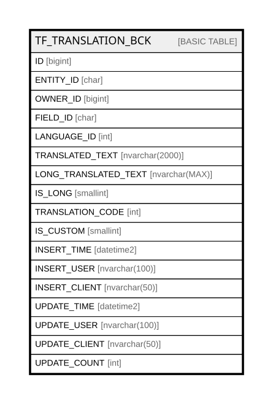

# TF_TRANSLATION_BCK

## Columns

| Name | Type | Default | Nullable | Comment |
| ---- | ---- | ------- | -------- | ------- |
| ID | bigint |  | false |  |
| ENTITY_ID | char |  | false |  |
| OWNER_ID | bigint |  | false |  |
| FIELD_ID | char |  | false |  |
| LANGUAGE_ID | int |  | false |  |
| TRANSLATED_TEXT | nvarchar(2000) |  | true |  |
| LONG_TRANSLATED_TEXT | nvarchar(MAX) |  | true |  |
| IS_LONG | smallint |  | false |  |
| TRANSLATION_CODE | int |  | false |  |
| IS_CUSTOM | smallint |  | false |  |
| INSERT_TIME | datetime2 |  | false |  |
| INSERT_USER | nvarchar(100) |  | false |  |
| INSERT_CLIENT | nvarchar(50) |  | false |  |
| UPDATE_TIME | datetime2 |  | false |  |
| UPDATE_USER | nvarchar(100) |  | false |  |
| UPDATE_CLIENT | nvarchar(50) |  | false |  |
| UPDATE_COUNT | int |  | false |  |

## Relations

---

> Generated by [tbls](https://github.com/k1LoW/tbls)
