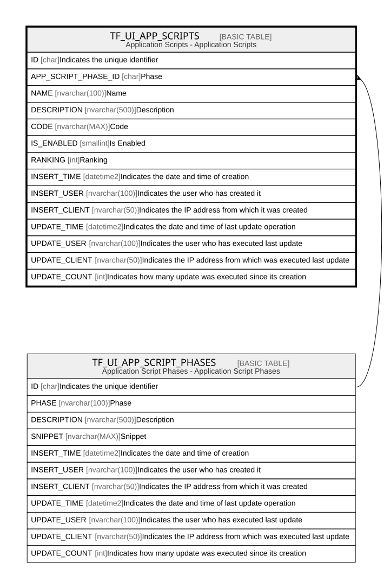

# TF_UI_APP_SCRIPTS

## Description

Application Scripts - Application Scripts  

## Columns

| Name | Type | Default | Nullable | Parents | Comment |
| ---- | ---- | ------- | -------- | ------- | ------- |
| ID | char |  | false |  | Indicates the unique identifier |
| APP_SCRIPT_PHASE_ID | char |  | false | [TF_UI_APP_SCRIPT_PHASES](TF_UI_APP_SCRIPT_PHASES.md) | Phase |
| NAME | nvarchar(100) |  | false |  | Name |
| DESCRIPTION | nvarchar(500) |  | true |  | Description |
| CODE | nvarchar(MAX) |  | false |  | Code |
| IS_ENABLED | smallint | ((0)) | true |  | Is Enabled |
| RANKING | int | ((0)) | false |  | Ranking |
| INSERT_TIME | datetime2 | (sysutcdatetime()) | false |  | Indicates the date and time of creation |
| INSERT_USER | nvarchar(100) | (N'MAIN') | false |  | Indicates the user who has created it |
| INSERT_CLIENT | nvarchar(50) | (N'localhost') | false |  | Indicates the IP address from which it was created |
| UPDATE_TIME | datetime2 | (sysutcdatetime()) | false |  | Indicates the date and time of last update operation |
| UPDATE_USER | nvarchar(100) | (N'MAIN') | false |  | Indicates the user who has executed last update |
| UPDATE_CLIENT | nvarchar(50) | (N'localhost') | false |  | Indicates the IP address from which was executed last update |
| UPDATE_COUNT | int | ((0)) | false |  | Indicates how many update was executed since its creation |

## Constraints

| Name | Type | Definition |
| ---- | ---- | ---------- |
| PK_APP_SCRIPTS | PRIMARY KEY | CLUSTERED, unique, part of a PRIMARY KEY constraint, [ ID ] |
| UQ_APP_SCRIPTS | UNIQUE | NONCLUSTERED, unique, part of a UNIQUE constraint, [ NAME ] |
| FK_APPSCRIPT_PHASE | FOREIGN KEY | FOREIGN KEY(APP_SCRIPT_PHASE_ID) REFERENCES TF_UI_APP_SCRIPT_PHASES(ID) ON UPDATE NO_ACTION ON DELETE NO_ACTION |

## Indexes

| Name | Definition |
| ---- | ---------- |
| PK_APP_SCRIPTS | CLUSTERED, unique, part of a PRIMARY KEY constraint, [ ID ] |
| UQ_APP_SCRIPTS | NONCLUSTERED, unique, part of a UNIQUE constraint, [ NAME ] |

## Relations

---

> Generated by [tbls](https://github.com/k1LoW/tbls)
