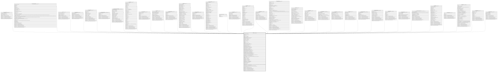

# TF_USERS

## Description

Users - The TF_USERS Entity  

## Columns

| Name | Type | Default | Nullable | Children | Comment |
| ---- | ---- | ------- | -------- | -------- | ------- |
| ID | bigint |  | false | [TF_FOLLOWING_ENTITIES](TF_FOLLOWING_ENTITIES.md) [TF_DATA_LOADER_TEMPLATES](TF_DATA_LOADER_TEMPLATES.md) [TF_LIKES](TF_LIKES.md) [TF_FOLLOWING_USERS](TF_FOLLOWING_USERS.md) [TF_SIGN_CERTIFICATES](TF_SIGN_CERTIFICATES.md) [TF_EPR_USER_PACKAGES](TF_EPR_USER_PACKAGES.md) [HR_CHARTER_PRINT_PREFERENCES](HR_CHARTER_PRINT_PREFERENCES.md) [TF_NOTIFICATION](TF_NOTIFICATION.md) [TF_USER_NOTIFICATIONS](TF_USER_NOTIFICATIONS.md) [TF_COMMENTS](TF_COMMENTS.md) [TF_NOTIFICATION_TARGET](TF_NOTIFICATION_TARGET.md) [TF_BATCHES](TF_BATCHES.md) [TF_EVENT_SUBSCRIPTIONS](TF_EVENT_SUBSCRIPTIONS.md) [TF_DOCUMENT_TEMPLATES](TF_DOCUMENT_TEMPLATES.md) [TF_USER_PASSWORD_HISTORY](TF_USER_PASSWORD_HISTORY.md) [TF_USER_PROFILES](TF_USER_PROFILES.md) [TF_ENTITYSETS](TF_ENTITYSETS.md) [TF_USER_PROPERTIES](TF_USER_PROPERTIES.md) [TF_EVENT_DEFINITIONS](TF_EVENT_DEFINITIONS.md) [TF_TOPICS](TF_TOPICS.md) [TF_TAG_CATEGORIES](TF_TAG_CATEGORIES.md) [TF_USER_PROVIDERS](TF_USER_PROVIDERS.md) [TF_PAGE_CFGS_ACL](TF_PAGE_CFGS_ACL.md) [TF_PROXY_ACL](TF_PROXY_ACL.md) [TF_DW_CHANNELS_USERS](TF_DW_CHANNELS_USERS.md) [TF_USER_TIME_TRACKING](TF_USER_TIME_TRACKING.md) [TF_WFRT_ACTORS](TF_WFRT_ACTORS.md) [TF_TOPIC_NAMED_USERS](TF_TOPIC_NAMED_USERS.md) [HR_USERSTALENTIAECOSYSTEM](HR_USERSTALENTIAECOSYSTEM.md) [TF_WFRT_TASKS](TF_WFRT_TASKS.md) [TF_USERGROUP_USERS](TF_USERGROUP_USERS.md) [TF_PAGE_CFGS](TF_PAGE_CFGS.md) [TF_EXTERNAL_USERS](TF_EXTERNAL_USERS.md) [TF_SHARED_RESOURCES](TF_SHARED_RESOURCES.md) | Indicates the unique identifier |
| PERSON_ID | bigint |  | true |  | Person linked to user |
| TYPE | int |  | true |  | Type |
| ACTIVE | smallint | ((1)) | true |  | Active |
| USERNAME | nvarchar(100) |  | false |  | User Name |
| USERGUID | varchar(50) |  | true |  | User guid |
| PASSWORD | nvarchar(500) |  | true |  | Password |
| PASSWORD_CREATION_TIME | datetime |  | true |  | Password creation time |
| SESSION_TIMEOUT | int |  | true |  | Set Session Timeout (seconds) |
| FIRST_NAME | nvarchar(100) |  | true |  | Firstname |
| LAST_NAME | nvarchar(100) |  | true |  | Lastname |
| DISPLAY_NAME | nvarchar(100) |  | true |  | Display name |
| EMAIL | nvarchar(500) |  | false |  | User e-mail |
| PICTURE | varbinary(MAX) |  | true |  | Picture |
| PICTURE | vector |  | true |  |  |
| THUMBNAIL | varbinary(MAX) |  | true |  | Thumbnail |
| THUMBNAIL | vector |  | true |  |  |
| PROPRIETARY_AUTH_ENABLED | smallint | ((1)) | false |  | Standard |
| API_ENABLED | smallint | ((0)) | false |  | Indicates if the API are enabled for the user. |
| ACCOUNT_LOCKED | smallint | ((0)) | false |  | Account Locked |
| ACCOUNT_LOCKED_TIME | datetime |  | true |  | Account Locked Time |
| LOGON_ATTEMPTS | int | ((0)) | false |  | Logon attempts |
| FAILED_LOGON_TIME | datetime |  | true |  | Failed logon time |
| MUST_CHANGE_PASSWORD | smallint |  | true |  | Must change password |
| PASSWORD_NEVER_EXPIRES | smallint |  | true |  | Password never expires |
| CANNOT_CHANGE_PASSWORD | smallint |  | true |  | Cannot change password |
| SECURITY_QUESTION | nvarchar(500) |  | true |  | Security question |
| SECURITY_ANSWER | nvarchar(500) |  | true |  | Security answer |
| SECURITY_ANSWER_ENABLED | smallint |  | true |  | Security answer enabled |
| MUST_SPECIFY_SECURITY_ANSWER | smallint |  | true |  | Must specify security answer |
| SECURITY_ANSWER_ATTEMPTS | int |  | true |  | Security answer attempts |
| FAILED_SECURITY_ANSWER_TIME | datetime |  | true |  | Failed security answer time |
| RESET_PASSWORD_TOKEN | nvarchar(100) |  | true |  | Reset password token |
| RESET_PASSWORD_TOKEN_TIME | datetime2 | (sysutcdatetime()) | true |  | Reset password token time |
| TFA_IS_ENABLED | smallint | ((0)) | true |  | Indicates whether the Two Factor Authentication is enabled |
| TFA_FORCE | bigint | ((0)) | true |  | Indicates whether the Two Factor Authentication is forced |
| TFA_ACTIVATION_DATE | datetime |  | true |  | The Two Factor Authentication Activation date |
| TFA_FORCE_DATE | datetime |  | true |  | The start date used to calculate the deadline for each user to complete the 2FA setup. |
| TFA_SECRET_KEY | nvarchar(500) |  | true |  | Two Factor Authentication secret key |
| TFA_RECOVERY_CODES | nvarchar(MAX) |  | true |  | Two Factor Authentication recovery codes |
| TFA_LAST_CHECK_DATE | datetime |  | true |  | Indicates the date of last time the user logon the system by the two factor authentication. |
| LOCALE_ID | int |  | true |  | Language ID |
| TIMEZONE_ID | nvarchar(50) |  | true |  | Time zone identifier |
| CALENDAR_ID | nvarchar(50) |  | true |  | Calendar |
| DATE_FORMAT | nvarchar(50) |  | true |  | Date format |
| DATE_SEPARATOR | nvarchar(50) |  | true |  | Date separator |
| TIME_FORMAT | nvarchar(50) |  | true |  | Time format |
| TIME_SEPARATOR | nvarchar(50) |  | true |  | Time separator |
| DECIMAL_SEPARATOR | nvarchar(50) |  | true |  | Decimal separator field |
| GROUP_SEPARATOR | nvarchar(50) |  | true |  | Group separator field |
| NUMBER_DECIMAL_DIGITS | int |  | true |  | Decimal digits field |
| START_DATE | datetime |  | true |  | Effective from |
| END_DATE | datetime |  | true |  | Effective to |
| NEVER_EXPIRE | smallint | ((0)) | false |  |  |
| IS_PERMANENT_DISABLED | smallint | ((0)) | false |  | With this option activated, the user can no longer be activated . All tasks / logs / activities this user was linked to will continue to be logged like that |
| IS_SANDBOX_USER | smallint | ((0)) | false |  | Available on Sandbox Environment |
| LAST_ACCESS_TIME | datetime2 |  | true |  | Date and time (Utc) when the user interactively accessed the system |
| LAST_ACCESS_CLIENT_ID | nvarchar(50) |  | true |  | The identifier of the client from where the user accessed the last time |
| IS_DW_SUGGESTION_SNOOZED | smallint |  | true |  |  |
| INSERT_TIME | datetime2 | (sysutcdatetime()) | false |  | Indicates the date and time of creation |
| INSERT_USER | nvarchar(100) | (N'MAIN') | false |  | Indicates the user who has created it |
| INSERT_CLIENT | nvarchar(50) | (N'localhost') | false |  | Indicates the IP address from which it was created |
| UPDATE_TIME | datetime2 | (sysutcdatetime()) | false |  | Indicates the date and time of last update operation |
| UPDATE_USER | nvarchar(100) | (N'MAIN') | false |  | Indicates the user who has executed last update |
| UPDATE_CLIENT | nvarchar(50) | (N'localhost') | false |  | Indicates the IP address from which was executed last update |
| UPDATE_COUNT | int | ((0)) | false |  | Indicates how many update was executed since its creation |

## Constraints

| Name | Type | Definition |
| ---- | ---- | ---------- |
| PK_USERS | PRIMARY KEY | CLUSTERED, unique, part of a PRIMARY KEY constraint, [ ID ] |
| UQ_USERS_USERNAME | UNIQUE | NONCLUSTERED, unique, part of a UNIQUE constraint, [ USERNAME ] |

## Indexes

| Name | Definition |
| ---- | ---------- |
| PK_USERS | CLUSTERED, unique, part of a PRIMARY KEY constraint, [ ID ] |
| UQ_USERS_USERNAME | NONCLUSTERED, unique, part of a UNIQUE constraint, [ USERNAME ] |
| IDX_USERS_PERSONS | NONCLUSTERED, [ PERSON_ID ] |

## Triggers

| Name | Definition |
| ---- | ---------- |
| AUDIT_TF_USERS | -- Talentia Software - All right reserved -- Type: TRIGGER                  Name: AUDIT_TF_USERS -- Date: 09-04-2026 07:27:59 (UTC) --  -- ChangeLogId: 00000000-0000-0000-0000-000000000000 -- ChangeSetId: 8567d7f4-ca12-4bcd-b064-371d7a503923 -- Original file name: C:\repos\Talentia-Software\hcm-core/DB/ProductDB/EDM\Schema\Triggers\AUDIT_TF_USERS.xml   CREATE TRIGGER AUDIT_TF_USERS    ON  TF_USERS    AFTER INSERT,DELETE,UPDATE AS  BEGIN 	-- SET NOCOUNT ON added to prevent extra result sets from 	-- interfering with SELECT statements. 	SET NOCOUNT ON;      -- Insert statements for trigger here  	DECLARE @TableName varchar(100) 	DECLARE @LinkedEntityID varchar(36)  	DECLARE	@DefAuditPolicyStatus bit 	DECLARE @OperationType smallint -- Insert 1, Update 2, Delete 3 	DECLARE @ColumnKey varchar(100) 	DECLARE @PrimaryKey int 	DECLARE @Fields nvarchar(max) 	DECLARE @PrimaryKeyFieldName nvarchar(100) 	DECLARE @UpdateDate varchar(23)  	DECLARE @HasEntityId bit = 0 	DECLARE @EntityIdColumn varchar(100)  	DECLARE @ColumnName nvarchar(max) 	DECLARE @EntityName nvarchar(max) 	DECLARE @EntityID char(36) 	DECLARE @ColumnID char(36) 	DECLARE @FieldID char(36) 	DECLARE @FieldName nvarchar(max) 	DECLARE @FieldType smallint  	DECLARE @ContextInfo varchar(128) 	DECLARE @ClientInfo nvarchar(max) 	DECLARE @DirectSQL bit = 0  	DECLARE @SQL nvarchar(max) 	   DECLARE @SQLWorkTable nvarchar(max) 	DECLARE @SQLWorkTable2 nvarchar(max) 	DECLARE @SQLWorkTableRef nvarchar(max) 	   DECLARE @SQLStartInsertTo nvarchar(max)    DECLARE @SQLPrimaryKeyField nvarchar(max) 	DECLARE @SQLNewValueFields nvarchar(max) 	DECLARE @SQLOldValueFields nvarchar(max) 	DECLARE @SQLInsertUser nvarchar(max) 	DECLARE @SQLInsertClient  nvarchar(max)  	DECLARE @ListNbLong BigInt = 0 	DECLARE @ListLong1 NVARCHAR(MAX)  = NULL 	DECLARE @ListLong2 NVARCHAR(MAX) = NULL 	DECLARE @ListNbDecimal BigInt = 0 	DECLARE @ListDecimal1 NVARCHAR(MAX) = NULL 	DECLARE @ListDecimal2 NVARCHAR(MAX) = NULL 	DECLARE @ListNbDateTime BigInt = 0 	DECLARE @ListDateTime1 NVARCHAR(MAX) = NULL 	DECLARE @ListDateTime2 NVARCHAR(MAX) = NULL 	DECLARE @ListNbStr BigInt = 0 	DECLARE @ListStr1 NVARCHAR(MAX) = NULL 	DECLARE @Liststr2 NVARCHAR(MAX) = NULL 	DECLARE @ListNbBinary BigInt = 0 	DECLARE @ListBinary1 NVARCHAR(MAX) = NULL 	DECLARE @ListBinary2 NVARCHAR(MAX) = NULL 	DECLARE @SQLUnion NVARCHAR(MAX) = ''  	DECLARE @LOOKUP_ENTITY_NAME VARCHAR(100) 	DECLARE @LOOKUP_ENTITY_ID VARCHAR(36) 	DECLARE @LOOKUP_COLUMN_NAME VARCHAR(100) 	DECLARE @LOOKUP_FIELD_NAME VARCHAR(100) 	DECLARE @LOOKUP_FOCUS NVARCHAR(500) 	DECLARE @LOOKUP_DESCRIPTION NVARCHAR(500)   	SET @Tablename = 'TF_USERS'     --IF AUDITED IS ENABLE 	SELECT @DefAuditPolicyStatus =    CASE WHEN (SELECT ACTIVE FROM TF_AUDIT_SWITCH WHERE ID = 1) = 1   THEN (SELECT CASE WHEN COUNT(ID) > 0 THEN 1 ELSE 0 END FROM TF_AUDITED_COLUMNS WHERE TABLE_NAME = @TableName)   ELSE 0   END  	if (@DefAuditPolicyStatus=1)  	BEGIN  		--Get Operation Type 		if exists (SELECT * FROM inserted) 			if exists (SELECT * FROM deleted) 				SELECT @OperationType = 2 --Update 			else 				SELECT @OperationType = 1 --Insert 		else 			SELECT @OperationType = 3 --Delete  		--GET HasEntityId 		SELECT  @HasEntityId = CASE WHEN Count(FIELD_NAME) > 0 THEN 1 ELSE 0 END, @EntityIdColumn = RTRIM(COLUMN_NAME)  FROM TF_AUDITED_COLUMNS WHERE TABLE_NAME = @Tablename and IS_ENTITY_ID = 1 GROUP BY COLUMN_NAME  		--GET THE SAME DATE FOR ALL 		SELECT @UpdateDate = '''' + convert(varchar(8), getutcdate(), 112) + ' ' + convert(varchar(12), getutcdate(), 114) + ''''  		--Get Primary field name 		SELECT @PrimaryKeyFieldName = RTRIM(C.NAME) 		FROM TF_BLPHYSICAL_COLUMNS C INNER JOIN TF_BLPHYSICAL_TABLES T ON C.TABLE_ID = T.ID 		WHERE C.IS_KEY = 1 AND T.Name = @Tablename  		--get Context Info 		IF CONTEXT_INFO() is null 			BEGIN 				SELECT @ContextInfo= '' 				SET @DirectSQL = 1 			END 		ELSE 			BEGIN 				-- Context Info should contain the Applicative UserName 				SELECT @ContextInfo = REPLACE(CAST(CONTEXT_INFO() as varchar(128)), NCHAR(0) COLLATE Latin1_General_100_BIN2, N''); 				SET @DirectSQL = 0 			END 	 		--Get Client Info 		--SELECT  @ClientInfo = client_net_address 		--FROM sys.dm_exec_connections 		--WHERE Session_id = @@SPID; 		----Or 		--SELECT @ClientInfo = CONVERT(char(15), CONNECTIONPROPERTY('client_net_address')) 		SET @ClientInfo = SYSTEM_USER  		-- TEMPORARY TABLES 		SELECT * INTO #ins FROM inserted 		SELECT * INTO #del FROM deleted  		-- Start of the SQL request	 		SET @SQLStartInsertTo = 'INSERT INTO TF_AUDIT 				(  [TABLE_NAME], [ENTITY_NAME], [ENTITY_ID], [COLUMN_NAME], [FIELD_NAME], [FIELD_ID], [FIELD_TYPE] 				    ,[PRIMARY_KEY], [OPERATION_TYPE] 					,[LONG_VALUE],[DECIMAL_VALUE],[DATETIME_VALUE],[STRING_VALUE],[VARBINARY_VALUE],[LOOKUP_DESC] 					,[OLD_LONG_VALUE],[OLD_DECIMAL_VALUE],[OLD_DATETIME_VALUE],[OLD_STRING_VALUE],[OLD_VARBINARY_VALUE],[OLD_LOOKUP_DESC] 					,[INSERT_USER],[INSERT_CLIENT],[INSERT_TIME],[TRANSACTION_ID] 				)  				' 	 		SELECT @ListNbLong = count(*) FROM TF_AUDITED_COLUMNS  WHERE TF_AUDITED_COLUMNS.TABLE_NAME = @TableName AND TF_AUDITED_COLUMNS.FIELD_TYPE = 2   AND TF_AUDITED_COLUMNS.DESCRIPTION IS NULL                                    		SET @ListLong1 = STUFF((SELECT DISTINCT ',' +   QUOTENAME(RTRIM(TF_AUDITED_COLUMNS.COLUMN_NAME))                      							FROM TF_AUDITED_COLUMNS 							WHERE TF_AUDITED_COLUMNS.TABLE_NAME = @TableName AND TF_AUDITED_COLUMNS.FIELD_TYPE = 2 AND TF_AUDITED_COLUMNS.DESCRIPTION IS NULL                                  							FOR XML PATH(''), TYPE).value('.', 'VARCHAR(MAX)')  							,1,1,'') 		SET @ListLong2 = STUFF((SELECT DISTINCT ',CONVERT(bigint, ' +   QUOTENAME(RTRIM(TF_AUDITED_COLUMNS.COLUMN_NAME)) +') as ' + QUOTENAME(RTRIM(TF_AUDITED_COLUMNS.COLUMN_NAME)) 							FROM TF_AUDITED_COLUMNS 							WHERE TF_AUDITED_COLUMNS.TABLE_NAME = @TableName AND TF_AUDITED_COLUMNS.FIELD_TYPE = 2 AND TF_AUDITED_COLUMNS.DESCRIPTION IS NULL  							FOR XML PATH(''), TYPE).value('.', 'VARCHAR(MAX)')  							,1,1,'') 		SELECT @ListNbDecimal = count(*) FROM TF_AUDITED_COLUMNS  WHERE TF_AUDITED_COLUMNS.TABLE_NAME = @TableName AND TF_AUDITED_COLUMNS.FIELD_TYPE = 3                                    		SET @ListDecimal1 = STUFF((SELECT DISTINCT ',' +   QUOTENAME(RTRIM(TF_AUDITED_COLUMNS.COLUMN_NAME) )                     							FROM TF_AUDITED_COLUMNS 							WHERE TF_AUDITED_COLUMNS.TABLE_NAME = @TableName AND TF_AUDITED_COLUMNS.FIELD_TYPE = 3                                    							FOR XML PATH(''), TYPE).value('.', 'VARCHAR(MAX)')  							,1,1,'') 		SET @ListDecimal2 = STUFF((SELECT DISTINCT ',CONVERT(decimal, ' +   QUOTENAME(RTRIM(TF_AUDITED_COLUMNS.COLUMN_NAME)) +') as ' + QUOTENAME(RTRIM(TF_AUDITED_COLUMNS.COLUMN_NAME)) 							FROM TF_AUDITED_COLUMNS 							WHERE TF_AUDITED_COLUMNS.TABLE_NAME = @TableName AND TF_AUDITED_COLUMNS.FIELD_TYPE = 3 							FOR XML PATH(''), TYPE).value('.', 'VARCHAR(MAX)')  							,1,1,'') 		SELECT @ListNbDateTime = count(*) FROM TF_AUDITED_COLUMNS  WHERE TF_AUDITED_COLUMNS.TABLE_NAME = @TableName AND TF_AUDITED_COLUMNS.FIELD_TYPE = 4 		SET @ListDateTime1 = STUFF((SELECT DISTINCT ',' +   QUOTENAME(RTRIM(TF_AUDITED_COLUMNS.COLUMN_NAME))                      							FROM TF_AUDITED_COLUMNS 							WHERE TF_AUDITED_COLUMNS.TABLE_NAME = @TableName AND TF_AUDITED_COLUMNS.FIELD_TYPE = 4                                    							FOR XML PATH(''), TYPE).value('.', 'VARCHAR(MAX)')  							,1,1,'') 		SET @ListDateTime2 = STUFF((SELECT DISTINCT ',CONVERT(datetime2, ' +   QUOTENAME(RTRIM(TF_AUDITED_COLUMNS.COLUMN_NAME)) +') as ' + QUOTENAME(RTRIM(TF_AUDITED_COLUMNS.COLUMN_NAME)) 							FROM TF_AUDITED_COLUMNS 							WHERE TF_AUDITED_COLUMNS.TABLE_NAME = @TableName AND TF_AUDITED_COLUMNS.FIELD_TYPE = 4 							FOR XML PATH(''), TYPE).value('.', 'VARCHAR(MAX)')  							,1,1,'') 		SELECT @ListNbStr = count(*) FROM TF_AUDITED_COLUMNS  WHERE TF_AUDITED_COLUMNS.TABLE_NAME = @TableName AND TF_AUDITED_COLUMNS.FIELD_TYPE = 1 		SET @ListStr1 = STUFF((SELECT DISTINCT ',' +   QUOTENAME(RTRIM(TF_AUDITED_COLUMNS.COLUMN_NAME))                      							FROM TF_AUDITED_COLUMNS 							WHERE TF_AUDITED_COLUMNS.TABLE_NAME = @TableName AND TF_AUDITED_COLUMNS.FIELD_TYPE = 1                                    							FOR XML PATH(''), TYPE).value('.', 'VARCHAR(MAX)')  							,1,1,'') 		SET @ListStr2 = STUFF((SELECT DISTINCT ',CONVERT(nvarchar(max), ' +   QUOTENAME(RTRIM(TF_AUDITED_COLUMNS.COLUMN_NAME)) +') as ' + QUOTENAME(RTRIM(TF_AUDITED_COLUMNS.COLUMN_NAME)) 							FROM TF_AUDITED_COLUMNS 							WHERE TF_AUDITED_COLUMNS.TABLE_NAME = @TableName AND TF_AUDITED_COLUMNS.FIELD_TYPE = 1 							FOR XML PATH(''), TYPE).value('.', 'VARCHAR(MAX)')  							,1,1,'') 		SELECT @ListNbBinary = count(*) FROM TF_AUDITED_COLUMNS  WHERE TF_AUDITED_COLUMNS.TABLE_NAME = @TableName AND TF_AUDITED_COLUMNS.FIELD_TYPE = 5 		SET @ListBinary1 = STUFF((SELECT DISTINCT ',' +   QUOTENAME(RTRIM(TF_AUDITED_COLUMNS.COLUMN_NAME))                     							FROM TF_AUDITED_COLUMNS 							WHERE TF_AUDITED_COLUMNS.TABLE_NAME = @TableName AND TF_AUDITED_COLUMNS.FIELD_TYPE = 5                                    							FOR XML PATH(''), TYPE).value('.', 'VARCHAR(MAX)')  							,1,1,'') 		SET @ListBinary2 = STUFF((SELECT DISTINCT ',CONVERT(varbinary(max), ' +   QUOTENAME(RTRIM(TF_AUDITED_COLUMNS.COLUMN_NAME)) +') as ' + QUOTENAME(RTRIM(TF_AUDITED_COLUMNS.COLUMN_NAME)) 							FROM TF_AUDITED_COLUMNS 							WHERE TF_AUDITED_COLUMNS.TABLE_NAME = @TableName AND TF_AUDITED_COLUMNS.FIELD_TYPE = 5 							FOR XML PATH(''), TYPE).value('.', 'VARCHAR(MAX)')  							,1,1,'')   		IF (@HasEntityId = 0) 			BEGIN	 				-- INSERTED OPERATION TYPE 				IF(@OperationType = 1) 				BEGIN 					SET @SQLWorkTable = '#ins' 					SET @SQLWorkTableRef = @SQLWOrkTable + '.' 					SET @SQLPrimaryKeyField = @SQLWorkTableRef + @PrimaryKeyFieldName 					SET @SQLInsertUser = '''' + Replace(@ContextInfo,'''','''''') + ''''  					SET @SQLInsertClient =  '''' + @ClientInfo + ''''  					if @ListNbLong > 0 						BEGIN 							If @SQLUNION <> ''  								BEGIN 									SET @SQLUNION = @SQLUNION + ' UNION ' 								END 							SET @SQLUNION = @SQLUNION + '( 									SELECT AUDITED_COLUMNS.[TABLE_NAME], AUDITED_COLUMNS.[ENTITY_NAME], AUDITED_COLUMNS.[ENTITY_ID], AUDITED_COLUMNS.[COLUMN_NAME], AUDITED_COLUMNS.[FIELD_NAME], AUDITED_COLUMNS.[FIELD_ID], AUDITED_COLUMNS.[FIELD_TYPE], 									A.#PK,  1, A.#LVALUE, A.#DVALUE, A.#TVALUE, A.#SVALUE, A.#BVALUE, NULL, NULL, NULL, NULL, NULL, NULL, NULL, ' + @SQLInsertUser + ',' + @SQLInsertClient +', ' + @UpdateDate + ', CURRENT_TRANSACTION_ID() 			 									FROM TF_AUDITED_COLUMNS AUDITED_COLUMNS INNER JOIN  									 (SELECT  #COL, #PK, value #LVALUE, NULL #DVALUE, NULL #TVALUE, NULL AS #SVALUE, NULL AS #BVALUE 										FROM  (SELECT  ' + @PrimaryKeyFieldName + ' AS #PK, ' + @ListLong2 +'  FROM  ' + @SQLWorkTable +' )  p 										UNPIVOT (value  FOR  #COL  IN  ('+@ListLong1+'))  as  unpvt) A ON AUDITED_COLUMNS.TABLE_NAME = '''+@TableName+''' AND AUDITED_COLUMNS.COLUMN_NAME = A.#COL 									)' 						END 					if @ListNbDecimal > 0 						BEGIN 							If @SQLUNION <> ''  								BEGIN 									SET @SQLUNION = @SQLUNION + ' UNION ' 								END 							SET @SQLUNION = @SQLUNION + '( 									SELECT AUDITED_COLUMNS.[TABLE_NAME], AUDITED_COLUMNS.[ENTITY_NAME], AUDITED_COLUMNS.[ENTITY_ID], AUDITED_COLUMNS.[COLUMN_NAME], AUDITED_COLUMNS.[FIELD_NAME], AUDITED_COLUMNS.[FIELD_ID], AUDITED_COLUMNS.[FIELD_TYPE], 									A.#PK,  1, A.#LVALUE, A.#DVALUE, A.#TVALUE, A.#SVALUE, A.#BVALUE, NULL, NULL, NULL, NULL, nULL, NULL, NULL, ' + @SQLInsertUser + ',' + @SQLInsertClient +', ' + @UpdateDate + ', CURRENT_TRANSACTION_ID() 			 									FROM TF_AUDITED_COLUMNS AUDITED_COLUMNS INNER JOIN  									 (SELECT  #COL, #PK, NULL #LVALUE, value #DVALUE, NULL #TVALUE, NULL AS #SVALUE, NULL AS #BVALUE 										FROM  (SELECT  ' + @PrimaryKeyFieldName + ' AS #PK, ' + @ListDecimal2 +'  FROM  ' + @SQLWorkTable + ')  p 										UNPIVOT (value  FOR  #COL  IN  ('+@ListDecimal1+'))  as  unpvt) A ON AUDITED_COLUMNS.TABLE_NAME = ''' + @TableName + ''' AND AUDITED_COLUMNS.COLUMN_NAME = A.#COL 									)' 						END 					if @ListNbDateTime > 0 						BEGIN 							If @SQLUNION <> ''  								BEGIN 									SET @SQLUNION = @SQLUNION + ' UNION ' 								END 							SET @SQLUNION = @SQLUNION + '( 									SELECT AUDITED_COLUMNS.[TABLE_NAME], AUDITED_COLUMNS.[ENTITY_NAME], AUDITED_COLUMNS.[ENTITY_ID], AUDITED_COLUMNS.[COLUMN_NAME], AUDITED_COLUMNS.[FIELD_NAME], AUDITED_COLUMNS.[FIELD_ID], AUDITED_COLUMNS.[FIELD_TYPE], 									A.#PK,  1, A.#LVALUE, A.#DVALUE, A.#TVALUE, A.#SVALUE, A.#BVALUE, NULL, NULL, NULL, NULL, nULL, NULL, NULL, ' + @SQLInsertUser + ',' + @SQLInsertClient +', ' + @UpdateDate + ', CURRENT_TRANSACTION_ID() 			 									FROM TF_AUDITED_COLUMNS AUDITED_COLUMNS INNER JOIN  									 (SELECT  #COL, #PK, NULL #LVALUE, NULL #DVALUE, value #TVALUE, NULL AS #SVALUE, NULL AS #BVALUE 										FROM  (SELECT  ' + @PrimaryKeyFieldName + ' AS #PK, ' + @ListDateTime2 +'  FROM  ' + @SQLWorkTable + ')  p 										UNPIVOT (value  FOR  #COL  IN  ('+@ListDateTime1+'))  as  unpvt) A ON AUDITED_COLUMNS.TABLE_NAME = ''' + @TableName + ''' AND AUDITED_COLUMNS.COLUMN_NAME = A.#COL 									)' 						END 					if @ListNbStr > 0 						BEGIN 							If @SQLUNION <> ''  								BEGIN 									SET @SQLUNION = @SQLUNION + ' UNION ' 								END 							SET @SQLUNION = @SQLUNION + '( 									SELECT AUDITED_COLUMNS.[TABLE_NAME], AUDITED_COLUMNS.[ENTITY_NAME], AUDITED_COLUMNS.[ENTITY_ID], AUDITED_COLUMNS.[COLUMN_NAME], AUDITED_COLUMNS.[FIELD_NAME], AUDITED_COLUMNS.[FIELD_ID], AUDITED_COLUMNS.[FIELD_TYPE], 									A.#PK,  1, A.#LVALUE, A.#DVALUE, A.#TVALUE, A.#SVALUE, A.#BVALUE, NULL, NULL, NULL, NULL, nULL, NULL, NULL, ' + @SQLInsertUser + ',' + @SQLInsertClient +', ' + @UpdateDate + ', CURRENT_TRANSACTION_ID() 			 									FROM TF_AUDITED_COLUMNS AUDITED_COLUMNS INNER JOIN  									 (SELECT  #COL, #PK, NULL #LVALUE, NULL #DVALUE, NULL #TVALUE, value AS #SVALUE, NULL AS #BVALUE 										FROM  (SELECT  ' + @PrimaryKeyFieldName + ' AS #PK, ' + @ListStr2 +'  FROM  ' + @SQLWorkTable + ')  p 										UNPIVOT (value  FOR  #COL  IN  ('+@ListStr1+'))  as  unpvt) A ON AUDITED_COLUMNS.TABLE_NAME = ''' + @TableName + ''' AND AUDITED_COLUMNS.COLUMN_NAME = A.#COL 									)' 						END 					if @ListNbBinary > 0 						BEGIN 							If @SQLUNION <> ''  								BEGIN 									SET @SQLUNION = @SQLUNION + ' UNION ' 								END 							SET @SQLUNION = @SQLUNION + '( 									SELECT AUDITED_COLUMNS.[TABLE_NAME], AUDITED_COLUMNS.[ENTITY_NAME], AUDITED_COLUMNS.[ENTITY_ID], AUDITED_COLUMNS.[COLUMN_NAME], AUDITED_COLUMNS.[FIELD_NAME], AUDITED_COLUMNS.[FIELD_ID], AUDITED_COLUMNS.[FIELD_TYPE], 									A.#PK,  1, A.#LVALUE, A.#DVALUE, A.#TVALUE, A.#SVALUE, A.#BVALUE, NULL, NULL, NULL, NULL, NULL, NULL, NULL, ' + @SQLInsertUser + ',' + @SQLInsertClient +', ' + @UpdateDate + ', CURRENT_TRANSACTION_ID() 			 									FROM TF_AUDITED_COLUMNS AUDITED_COLUMNS INNER JOIN  									 (SELECT  #COL, #PK, NULL #LVALUE, NULL #DVALUE, NULL #TVALUE, NULL #SVALUE, value AS #BVALUE 										FROM  (SELECT  ' + @PrimaryKeyFieldName + ' AS #PK, ' + @ListBinary2 +'  FROM  ' + @SQLWorkTable + ')  p 										UNPIVOT (value  FOR  #COL  IN  ('+@ListBinary1+'))  as  unpvt) A ON AUDITED_COLUMNS.TABLE_NAME = ''' + @TableName + ''' AND AUDITED_COLUMNS.COLUMN_NAME = A.#COL 									)' 						END  					DECLARE LOOKUP_CURSOR CURSOR   					FOR SELECT RTRIM(ENTITY_NAME) AS ENTITY_NAME, ENTITY_ID, RTRIM(COLUMN_NAME) AS COLUMN_NAME, RTRIM(FIELD_NAME) AS FIELD_NAME, RTRIM(FOCUS) AS FOCUS, RTRIM(DESCRIPTION) AS DESCRPTION 						FROM TF_AUDITED_COLUMNS 						WHERE TF_AUDITED_COLUMNS.TABLE_NAME = @TableName AND TF_AUDITED_COLUMNS.FIELD_TYPE = 2   AND TF_AUDITED_COLUMNS.DESCRIPTION IS not NULL  AND IS_KEY = 0 					OPEN LOOKUP_CURSOR   					FETCH NEXT FROM LOOKUP_CURSOR into @LOOKUP_ENTITY_NAME, @LOOKUP_ENTITY_ID, @LOOKUP_COLUMN_NAME, @LOOKUP_FIELD_NAME, @LOOKUP_FOCUS, @LOOKUP_DESCRIPTION 					WHILE @@FETCH_STATUS = 0   					BEGIN  						IF @SQLUNION <> ''  								BEGIN 									SET @SQLUNION = @SQLUNION + ' UNION ' 								END 						SET @SQLUNION = @SQLUNION + ' 						( 								SELECT AUDITED_COLUMNS.[TABLE_NAME], AUDITED_COLUMNS.[ENTITY_NAME], AUDITED_COLUMNS.[ENTITY_ID], AUDITED_COLUMNS.[COLUMN_NAME], AUDITED_COLUMNS.[FIELD_NAME], AUDITED_COLUMNS.[FIELD_ID], AUDITED_COLUMNS.[FIELD_TYPE], 								A.#PK,  1, A.#LVALUE, A.#DVALUE, A.#TVALUE, A.#SVALUE, A.#BVALUE, A.#LOOKUP_DESC, NULL, NULL, NULL, NULL, NULL, NULL, ' + @SQLInsertUser + ',' + @SQLInsertClient +', ' + @UpdateDate + ', CURRENT_TRANSACTION_ID()  								FROM TF_AUDITED_COLUMNS AUDITED_COLUMNS INNER JOIN  									 (SELECT  #COL, #PK, value #LVALUE, NULL #DVALUE, NULL #TVALUE, NULL AS #SVALUE, NULL AS #BVALUE, #LOOKUP_DESC 										FROM  (SELECT  ' + @PrimaryKeyFieldName + ' AS #PK, ' +@LOOKUP_COLUMN_NAME +', #LOOKUP.LOOKUP_DESCRIPTION as #LOOKUP_DESC FROM  ' + @SQLWorkTable + 										       ' LEFT OUTER JOIN (' + @LOOKUP_DESCRIPTION + ') #LOOKUP ON ' + @SQLWorkTable + '.' +@LOOKUP_COLUMN_NAME + ' = #LOOKUP.ID_LOOKUP' + 										     ')  p 										UNPIVOT (value  FOR  #COL  IN  ('+@LOOKUP_COLUMN_NAME+'))  as  unpvt) A ON AUDITED_COLUMNS.TABLE_NAME = ''' + @TableName + ''' AND AUDITED_COLUMNS.COLUMN_NAME = A.#COL 					    ) 						' 						FETCH NEXT FROM LOOKUP_CURSOR into @LOOKUP_ENTITY_NAME, @LOOKUP_ENTITY_ID, @LOOKUP_COLUMN_NAME, @LOOKUP_FIELD_NAME, @LOOKUP_FOCUS, @LOOKUP_DESCRIPTION  					END  					CLOSE LOOKUP_CURSOR;   					DEALLOCATE LOOKUP_CURSOR;  					SET @SQL = @SQLStartInsertTo + @SQLUNION  					EXEC ( @Sql )				 			    				END 				-- UPDATED OPERATION TYPE 				IF(@OperationType = 2) 				BEGIN 					SET @SQLWorkTable = '#ins' 					SET @SQLWorkTable2 = '#del' 					SET @SQLWorkTableRef = @SQLWOrkTable + '.' 					SET @SQLPrimaryKeyField = @SQLWorkTableRef + @PrimaryKeyFieldName 					SET @SQLInsertUser = '''' + Replace(@ContextInfo,'''','''''') + ''''  					SET @SQLInsertClient =  '''' + @ClientInfo + ''''  					if @ListNbLong > 0 						BEGIN 							If @SQLUNION <> ''  								BEGIN 									SET @SQLUNION = @SQLUNION + ' UNION ' 								END 							SET @SQLUNION = @SQLUNION + ' 							( 								SELECT AUDITED_COLUMNS.[TABLE_NAME], AUDITED_COLUMNS.[ENTITY_NAME], AUDITED_COLUMNS.[ENTITY_ID], AUDITED_COLUMNS.[COLUMN_NAME], AUDITED_COLUMNS.[FIELD_NAME], AUDITED_COLUMNS.[FIELD_ID], AUDITED_COLUMNS.[FIELD_TYPE], 								C.#PK,  2, C.#LVALUE, C.#DVALUE, C.#TVALUE, C.#SVALUE, C.#BVALUE, C.#LOOKUPDESC,  C.#OLDLVALUE, C.#OLDDVALUE, C.#OLDTVALUE, C.#OLDSVALUE, C.#OLDBVALUE, C.#OLDLOOKUPDESC, ' + @SQLInsertUser + ',' + @SQLInsertClient +', ' + @UpdateDate + ', CURRENT_TRANSACTION_ID()  								FROM TF_AUDITED_COLUMNS AUDITED_COLUMNS INNER JOIN  								( 								SELECT case WHEN A.#COL is null then B.#COL else A.#COL END #COL, 								   case WHEN A.#PK is null then B.#PK else A.#PK END #PK, 								   A.#LVALUE #LVALUE,  								   A.#DVALUE #DVALUE,  								   A.#TVALUE #TVALUE,  								   A.#SVALUE #SVALUE,  								   A.#BVALUE #BVALUE, 								   A.#LOOKUP_DESC #LOOKUPDESC, 								   B.#LVALUE #OLDLVALUE,  								   B.#DVALUE #OLDDVALUE,  								   B.#TVALUE #OLDTVALUE,  								   B.#SVALUE #OLDSVALUE,  								   B.#BVALUE #OLDBVALUE, 								   B.#LOOKUP_DESC #OLDLOOKUPDESC 							    FROM 									 ( 									 SELECT  #COL, #PK, value #LVALUE, NULL #DVALUE, NULL #TVALUE, NULL AS #SVALUE, NULL AS #BVALUE, NULL as #LOOKUP_DESC 									 FROM  (SELECT  ' + @PrimaryKeyFieldName + ' AS #PK, ' + @ListLong2 +'  FROM  ' + @SQLWorkTable +' )  p 									 UNPIVOT (value  FOR  #COL  IN  ('+@ListLong1+'))  as  unpvt 									 ) A 								FULL JOIN  									 ( 									 SELECT  #COL, #PK, value #LVALUE, NULL #DVALUE, NULL #TVALUE, NULL AS #SVALUE, NULL AS #BVALUE, NULL as #LOOKUP_DESC 									 FROM  (SELECT  ' + @PrimaryKeyFieldName + ' AS #PK, ' + @ListLong2 +'  FROM  ' + @SQLWorkTable2 +' )  p 									 UNPIVOT (value  FOR  #COL  IN  ('+@ListLong1+'))  as  unpvt 									 ) B  								ON A.#COL = B.#COL  AND A.#PK = B.#PK 								WHERE (A.#LVALUE is NULL AND B.#LVALUE IS NOT NULL) OR (A.#LVALUE IS NOT NULL AND B.#LVALUE IS NULL) OR (B.#LVALUE <> A.#LVALUE) 								) C 								ON AUDITED_COLUMNS.TABLE_NAME = '''+@TableName+''' AND AUDITED_COLUMNS.COLUMN_NAME = C.#COL 							)' 						END 					if @ListNbDecimal > 0 						BEGIN 							If @SQLUNION <> ''  								BEGIN 									SET @SQLUNION = @SQLUNION + ' UNION ' 								END 							SET @SQLUNION = @SQLUNION + ' 							( 								SELECT AUDITED_COLUMNS.[TABLE_NAME], AUDITED_COLUMNS.[ENTITY_NAME], AUDITED_COLUMNS.[ENTITY_ID], AUDITED_COLUMNS.[COLUMN_NAME], AUDITED_COLUMNS.[FIELD_NAME], AUDITED_COLUMNS.[FIELD_ID], AUDITED_COLUMNS.[FIELD_TYPE], 								C.#PK,  2, C.#LVALUE, C.#DVALUE, C.#TVALUE, C.#SVALUE, C.#BVALUE, C.#LOOKUPDESC,  C.#OLDLVALUE, C.#OLDDVALUE, C.#OLDTVALUE, C.#OLDSVALUE, C.#OLDBVALUE, C.#OLDLOOKUPDESC, ' + @SQLInsertUser + ',' + @SQLInsertClient +', ' + @UpdateDate + ', CURRENT_TRANSACTION_ID() 			 									FROM TF_AUDITED_COLUMNS AUDITED_COLUMNS INNER JOIN  									( 									SELECT case WHEN A.#COL is null then B.#COL else A.#COL END #COL, 									   case WHEN A.#PK is null then B.#PK else A.#PK END #PK, 									   A.#LVALUE #LVALUE,  									   A.#DVALUE #DVALUE,  									   A.#TVALUE #TVALUE,  									   A.#SVALUE #SVALUE,  									   A.#BVALUE #BVALUE, 									   A.#LOOKUP_DESC #LOOKUPDESC, 									   B.#LVALUE #OLDLVALUE,  									   B.#DVALUE #OLDDVALUE,  									   B.#TVALUE #OLDTVALUE,  									   B.#SVALUE #OLDSVALUE,  									   B.#BVALUE #OLDBVALUE, 									   B.#LOOKUP_DESC #OLDLOOKUPDESC 									FROM 										( 										SELECT  #COL, #PK, NULL #LVALUE, value #DVALUE, NULL #TVALUE, NULL AS #SVALUE, NULL AS #BVALUE, NULL as #LOOKUP_DESC 										FROM  (SELECT  ' + @PrimaryKeyFieldName + ' AS #PK, ' + @ListDecimal2 +'  FROM  ' + @SQLWorkTable + ')  p 										UNPIVOT (value  FOR  #COL  IN  ('+@ListDecimal1+'))  as  unpvt 										) A  									FULL JOIN  										( 										SELECT  #COL, #PK, NULL #LVALUE, value #DVALUE, NULL #TVALUE, NULL AS #SVALUE, NULL AS #BVALUE, NULL as #LOOKUP_DESC 										FROM  (SELECT  ' + @PrimaryKeyFieldName + ' AS #PK, ' + @ListDecimal2 +'  FROM  ' + @SQLWorkTable2 + ')  p 										UNPIVOT (value  FOR  #COL  IN  ('+@ListDecimal1+'))  as  unpvt 										) B  										ON A.#COL = B.#COL  AND A.#PK = B.#PK 									WHERE (A.#DVALUE is NULL AND B.#DVALUE IS NOT NULL) OR (A.#DVALUE IS NOT NULL AND B.#DVALUE IS NULL) OR (B.#DVALUE <> A.#DVALUE)                   									) C 									ON AUDITED_COLUMNS.TABLE_NAME = '''+@TableName+''' AND AUDITED_COLUMNS.COLUMN_NAME = C.#COL 							)' 						END 					if @ListNbDateTime > 0 						BEGIN 							If @SQLUNION <> ''  								BEGIN 									SET @SQLUNION = @SQLUNION + ' UNION ' 								END 							SET @SQLUNION = @SQLUNION + ' 							( 								SELECT AUDITED_COLUMNS.[TABLE_NAME], AUDITED_COLUMNS.[ENTITY_NAME], AUDITED_COLUMNS.[ENTITY_ID], AUDITED_COLUMNS.[COLUMN_NAME], AUDITED_COLUMNS.[FIELD_NAME], AUDITED_COLUMNS.[FIELD_ID], AUDITED_COLUMNS.[FIELD_TYPE], 								C.#PK,  2, C.#LVALUE, C.#DVALUE, C.#TVALUE, C.#SVALUE, C.#BVALUE, C.#LOOKUPDESC,  C.#OLDLVALUE, C.#OLDDVALUE, C.#OLDTVALUE, C.#OLDSVALUE, C.#OLDBVALUE, C.#OLDLOOKUPDESC, ' + @SQLInsertUser + ',' + @SQLInsertClient +', ' + @UpdateDate + ', CURRENT_TRANSACTION_ID() 			 									FROM TF_AUDITED_COLUMNS AUDITED_COLUMNS INNER JOIN 									(  									SELECT case WHEN A.#COL is null then B.#COL else A.#COL END #COL, 									   case WHEN A.#PK is null then B.#PK else A.#PK END #PK, 									   A.#LVALUE #LVALUE,  									   A.#DVALUE #DVALUE,  									   A.#TVALUE #TVALUE,  									   A.#SVALUE #SVALUE,  									   A.#BVALUE #BVALUE, 									   A.#LOOKUP_DESC #LOOKUPDESC, 									   B.#LVALUE #OLDLVALUE,  									   B.#DVALUE #OLDDVALUE,  									   B.#TVALUE #OLDTVALUE,  									   B.#SVALUE #OLDSVALUE,  									   B.#BVALUE #OLDBVALUE, 									   B.#LOOKUP_DESC #OLDLOOKUPDESC 									FROM 										( 										SELECT  #COL, #PK, NULL #LVALUE, NULL #DVALUE, value #TVALUE, NULL AS #SVALUE, NULL AS #BVALUE, NULL as #LOOKUP_DESC 										FROM  (SELECT  ' + @PrimaryKeyFieldName + ' AS #PK, ' + @ListDateTime2 +'  FROM  ' + @SQLWorkTable + ')  p 										UNPIVOT (value  FOR  #COL  IN  ('+@ListDateTime1+'))  as  unpvt 										) A 									FULL JOIN  										( 										SELECT  #COL, #PK, NULL #LVALUE, NULL #DVALUE, value #TVALUE, NULL AS #SVALUE, NULL AS #BVALUE, NULL as #LOOKUP_DESC 										FROM  (SELECT  ' + @PrimaryKeyFieldName + ' AS #PK, ' + @ListDateTime2 +'  FROM  ' + @SQLWorkTable2 + ')  p 										UNPIVOT (value  FOR  #COL  IN  ('+@ListDateTime1+'))  as  unpvt 										) B 									ON A.#COL = B.#COL  AND A.#PK = B.#PK									                   WHERE (A.#TVALUE is NULL AND B.#TVALUE IS NOT NULL) OR (A.#TVALUE IS NOT NULL AND B.#TVALUE IS NULL) OR (B.#TVALUE <> A.#TVALUE)                   									) C 									ON AUDITED_COLUMNS.TABLE_NAME = '''+@TableName+''' AND AUDITED_COLUMNS.COLUMN_NAME = C.#COL 							)' 						END 					if @ListNbStr > 0 						BEGIN 							If @SQLUNION <> ''  								BEGIN 									SET @SQLUNION = @SQLUNION + ' UNION ' 								END 							SET @SQLUNION = @SQLUNION + ' 							( 								SELECT AUDITED_COLUMNS.[TABLE_NAME], AUDITED_COLUMNS.[ENTITY_NAME], AUDITED_COLUMNS.[ENTITY_ID], AUDITED_COLUMNS.[COLUMN_NAME], AUDITED_COLUMNS.[FIELD_NAME], AUDITED_COLUMNS.[FIELD_ID], AUDITED_COLUMNS.[FIELD_TYPE], 								C.#PK,  2, C.#LVALUE, C.#DVALUE, C.#TVALUE, C.#SVALUE, C.#BVALUE, C.#LOOKUPDESC,  C.#OLDLVALUE, C.#OLDDVALUE, C.#OLDTVALUE, C.#OLDSVALUE, C.#OLDBVALUE, C.#OLDLOOKUPDESC, ' + @SQLInsertUser + ',' + @SQLInsertClient +', ' + @UpdateDate + ', CURRENT_TRANSACTION_ID() 			 									FROM TF_AUDITED_COLUMNS AUDITED_COLUMNS INNER JOIN  									( 									SELECT case WHEN A.#COL is null then B.#COL else A.#COL END #COL, 									   case WHEN A.#PK is null then B.#PK else A.#PK END #PK, 									   A.#LVALUE #LVALUE,  									   A.#DVALUE #DVALUE,  									   A.#TVALUE #TVALUE,  									   A.#SVALUE #SVALUE,  									   A.#BVALUE #BVALUE, 									   A.#LOOKUP_DESC #LOOKUPDESC, 									   B.#LVALUE #OLDLVALUE,  									   B.#DVALUE #OLDDVALUE,  									   B.#TVALUE #OLDTVALUE,  									   B.#SVALUE #OLDSVALUE,  									   B.#BVALUE #OLDBVALUE, 									   B.#LOOKUP_DESC #OLDLOOKUPDESC 									FROM 										( 										SELECT  #COL, #PK, NULL #LVALUE, NULL #DVALUE, NULL #TVALUE, value AS #SVALUE, NULL AS #BVALUE, NULL as #LOOKUP_DESC 										FROM  (SELECT  ' + @PrimaryKeyFieldName + ' AS #PK, ' + @ListStr2 +'  FROM  ' + @SQLWorkTable + ')  p 										UNPIVOT (value  FOR  #COL  IN  ('+@ListStr1+'))  as  unpvt 										) A 									FULL JOIN  										( 										SELECT  #COL, #PK, NULL #LVALUE, NULL #DVALUE, NULL #TVALUE, value AS #SVALUE, NULL AS #BVALUE, NULL as #LOOKUP_DESC 										FROM  (SELECT  ' + @PrimaryKeyFieldName + ' AS #PK, ' + @ListStr2 +'  FROM  ' + @SQLWorkTable2 + ')  p 										UNPIVOT (value  FOR  #COL  IN  ('+@ListStr1+'))  as  unpvt 										) B 									ON A.#COL = B.#COL  AND A.#PK = B.#PK                   WHERE (A.#SVALUE is NULL AND B.#SVALUE IS NOT NULL) OR (A.#SVALUE IS NOT NULL AND B.#SVALUE IS NULL) OR (B.#SVALUE <> A.#SVALUE)                   									) C 									ON AUDITED_COLUMNS.TABLE_NAME = '''+@TableName+''' AND AUDITED_COLUMNS.COLUMN_NAME = C.#COL 							)' 						END 					if @ListNbBinary > 0 						BEGIN 							If @SQLUNION <> ''  								BEGIN 									SET @SQLUNION = @SQLUNION + ' UNION ' 								END 							SET @SQLUNION = @SQLUNION + ' 							( 								SELECT AUDITED_COLUMNS.[TABLE_NAME], AUDITED_COLUMNS.[ENTITY_NAME], AUDITED_COLUMNS.[ENTITY_ID], AUDITED_COLUMNS.[COLUMN_NAME], AUDITED_COLUMNS.[FIELD_NAME], AUDITED_COLUMNS.[FIELD_ID], AUDITED_COLUMNS.[FIELD_TYPE], 								C.#PK,  2, C.#LVALUE, C.#DVALUE, C.#TVALUE, C.#SVALUE, C.#BVALUE, C.#LOOKUPDESC, C.#OLDLVALUE, C.#OLDDVALUE, C.#OLDTVALUE, C.#OLDSVALUE, C.#OLDBVALUE, C.#OLDLOOKUPDESC, ' + @SQLInsertUser + ',' + @SQLInsertClient +', ' + @UpdateDate + ', CURRENT_TRANSACTION_ID()  									FROM TF_AUDITED_COLUMNS AUDITED_COLUMNS INNER JOIN  									( 									SELECT case WHEN A.#COL is null then B.#COL else A.#COL END #COL, 									   case WHEN A.#PK is null then B.#PK else A.#PK END #PK, 									   A.#LVALUE #LVALUE,  									   A.#DVALUE #DVALUE,  									   A.#TVALUE #TVALUE,  									   A.#SVALUE #SVALUE,  									   A.#BVALUE #BVALUE,                      A.#LOOKUP_DESC #LOOKUPDESC, 									   B.#LVALUE #OLDLVALUE,  									   B.#DVALUE #OLDDVALUE,  									   B.#TVALUE #OLDTVALUE,  									   B.#SVALUE #OLDSVALUE,  									   B.#BVALUE #OLDBVALUE,                      B.#LOOKUP_DESC #OLDLOOKUPDESC 									FROM 										( 										SELECT  #COL, #PK, NULL #LVALUE, NULL #DVALUE, NULL #TVALUE, NULL #SVALUE, value AS #BVALUE, NULL as #LOOKUP_DESC 										FROM  (SELECT  ' + @PrimaryKeyFieldName + ' AS #PK, ' + @ListBinary2 +'  FROM  ' + @SQLWorkTable + ')  p 										UNPIVOT (value  FOR  #COL  IN  ('+@ListBinary1+'))  as  unpvt 										) A 									FULL JOIN  										( 										SELECT  #COL, #PK, NULL #LVALUE, NULL #DVALUE, NULL #TVALUE, NULL #SVALUE, value AS #BVALUE, NULL as #LOOKUP_DESC 										FROM  (SELECT  ' + @PrimaryKeyFieldName + ' AS #PK, ' + @ListBinary2 +'  FROM  ' + @SQLWorkTable2 + ')  p 										UNPIVOT (value  FOR  #COL  IN  ('+@ListBinary1+'))  as  unpvt 										) B 									ON A.#COL = B.#COL  AND A.#PK = B.#PK 									WHERE (A.#BVALUE is NULL AND B.#BVALUE IS NOT NULL) OR (A.#BVALUE IS NOT NULL AND B.#BVALUE IS NULL) OR (B.#BVALUE <> A.#BVALUE) 									) C 									ON AUDITED_COLUMNS.TABLE_NAME = '''+@TableName+''' AND AUDITED_COLUMNS.COLUMN_NAME = C.#COL 							)' 						END  					DECLARE LOOKUP_CURSOR CURSOR   					FOR SELECT RTRIM(ENTITY_NAME) AS ENTITY_NAME, ENTITY_ID, RTRIM(COLUMN_NAME) AS COLUMN_NAME, RTRIM(FIELD_NAME) AS FIELD_NAME, RTRIM(FOCUS) AS FOCUS, RTRIM(DESCRIPTION) AS DESCRPTION 						FROM TF_AUDITED_COLUMNS 						WHERE TF_AUDITED_COLUMNS.TABLE_NAME = @TableName AND TF_AUDITED_COLUMNS.FIELD_TYPE = 2   AND TF_AUDITED_COLUMNS.DESCRIPTION IS not NULL  AND IS_KEY = 0 					OPEN LOOKUP_CURSOR   					FETCH NEXT FROM LOOKUP_CURSOR into @LOOKUP_ENTITY_NAME, @LOOKUP_ENTITY_ID, @LOOKUP_COLUMN_NAME, @LOOKUP_FIELD_NAME, @LOOKUP_FOCUS, @LOOKUP_DESCRIPTION 					WHILE @@FETCH_STATUS = 0   					BEGIN  						IF @SQLUNION <> ''  								BEGIN 									SET @SQLUNION = @SQLUNION + ' UNION ' 								END 						SET @SQLUNION = @SQLUNION + ' 						( 								SELECT AUDITED_COLUMNS.[TABLE_NAME], AUDITED_COLUMNS.[ENTITY_NAME], AUDITED_COLUMNS.[ENTITY_ID], AUDITED_COLUMNS.[COLUMN_NAME], AUDITED_COLUMNS.[FIELD_NAME], AUDITED_COLUMNS.[FIELD_ID], AUDITED_COLUMNS.[FIELD_TYPE], 								C.#PK,  2, C.#LVALUE, C.#DVALUE, C.#TVALUE, C.#SVALUE, C.#BVALUE, C.#LOOKUPDESC, C.#OLDLVALUE, C.#OLDDVALUE, C.#OLDTVALUE, C.#OLDSVALUE, C.#OLDBVALUE, C.#OLDLOOKUPDESC, ' + @SQLInsertUser + ',' + @SQLInsertClient +', ' + @UpdateDate + ', CURRENT_TRANSACTION_ID()  								FROM TF_AUDITED_COLUMNS AUDITED_COLUMNS INNER JOIN  								( 								SELECT case WHEN A.#COL is null then B.#COL else A.#COL END #COL, 								   case WHEN A.#PK is null then B.#PK else A.#PK END #PK, 								   A.#LVALUE #LVALUE,  								   A.#DVALUE #DVALUE,  								   A.#TVALUE #TVALUE,  								   A.#SVALUE #SVALUE,  								   A.#BVALUE #BVALUE, 								   A.#LOOKUP_DESC #LOOKUPDESC, 								   B.#LVALUE #OLDLVALUE,  								   B.#DVALUE #OLDDVALUE,  								   B.#TVALUE #OLDTVALUE,  								   B.#SVALUE #OLDSVALUE,  								   B.#BVALUE #OLDBVALUE, 								   B.#LOOKUP_DESC #OLDLOOKUPDESC 							    FROM 									 ( 									 SELECT  #COL, #PK, value #LVALUE, NULL #DVALUE, NULL #TVALUE, NULL AS #SVALUE, NULL AS #BVALUE, #LOOKUP_DESC 									 FROM  (SELECT  ' + @PrimaryKeyFieldName + ' AS #PK, ' + @SQLWorkTable + '.' +@LOOKUP_COLUMN_NAME +' AS  ' +@LOOKUP_COLUMN_NAME + ', #LOOKUP.LOOKUP_DESCRIPTION as #LOOKUP_DESC FROM  ' + @SQLWorkTable + 										' LEFT OUTER JOIN (' + @LOOKUP_DESCRIPTION + ') #LOOKUP ON ' + @SQLWorkTable + '.' +@LOOKUP_COLUMN_NAME + ' = #LOOKUP.ID_LOOKUP' + 										' )  p 									 UNPIVOT (value  FOR  #COL  IN  ('+@LOOKUP_COLUMN_NAME+'))  as  unpvt 									 ) A 								FULL JOIN  									 ( 									 SELECT  #COL, #PK, value #LVALUE, NULL #DVALUE, NULL #TVALUE, NULL AS #SVALUE, NULL AS #BVALUE, #LOOKUP_DESC 									 FROM  (SELECT  ' + @PrimaryKeyFieldName + ' AS #PK, ' +  + @SQLWorkTable2 + '.' +@LOOKUP_COLUMN_NAME +' AS  ' +@LOOKUP_COLUMN_NAME  + ', #LOOKUP.LOOKUP_DESCRIPTION as #LOOKUP_DESC FROM  ' + @SQLWorkTable2 + 									 ' LEFT OUTER JOIN (' + @LOOKUP_DESCRIPTION + ') #LOOKUP ON ' + @SQLWorkTable2 + '.' +@LOOKUP_COLUMN_NAME + ' = #LOOKUP.ID_LOOKUP' + 										 ' )  p 									 UNPIVOT (value  FOR  #COL  IN  ('+@LOOKUP_COLUMN_NAME+'))  as  unpvt 									 ) B  								ON A.#COL = B.#COL  AND A.#PK = B.#PK 								WHERE (A.#LVALUE is NULL AND B.#LVALUE IS NOT NULL) OR (A.#LVALUE IS NOT NULL AND B.#LVALUE IS NULL) OR (B.#LVALUE <> A.#LVALUE) 								) C 								ON AUDITED_COLUMNS.TABLE_NAME = '''+@TableName+''' AND AUDITED_COLUMNS.COLUMN_NAME = C.#COL 							) 						' 						FETCH NEXT FROM LOOKUP_CURSOR into @LOOKUP_ENTITY_NAME, @LOOKUP_ENTITY_ID, @LOOKUP_COLUMN_NAME, @LOOKUP_FIELD_NAME, @LOOKUP_FOCUS, @LOOKUP_DESCRIPTION  					END  					CLOSE LOOKUP_CURSOR;   					DEALLOCATE LOOKUP_CURSOR; 					 					SET @SQL = @SQLStartInsertTo + @SQLUNION  					EXEC ( @Sql )				 			    				END 				-- DELETED OPERATION TYPE 				IF(@OperationType = 3) 				BEGIN  					SET @SQLWorkTable = '#del' 					SET @SQLWorkTableRef = @SQLWOrkTable + '.' 					SET @SQLPrimaryKeyField = @SQLWorkTableRef + @PrimaryKeyFieldName 					SET @SQLInsertUser = '''' + Replace(@ContextInfo,'''','''''') + '''' 					SET @SQLInsertClient =  '''' + @ClientInfo + '''' 					 					if @ListNbLong > 0 						BEGIN 							If @SQLUNION <> ''  								BEGIN 									SET @SQLUNION = @SQLUNION + ' UNION ' 								END 							SET @SQLUNION = @SQLUNION + '( 									SELECT AUDITED_COLUMNS.[TABLE_NAME], AUDITED_COLUMNS.[ENTITY_NAME], AUDITED_COLUMNS.[ENTITY_ID], AUDITED_COLUMNS.[COLUMN_NAME], AUDITED_COLUMNS.[FIELD_NAME], AUDITED_COLUMNS.[FIELD_ID], AUDITED_COLUMNS.[FIELD_TYPE], 									A.#PK,  3, A.#LVALUE, A.#DVALUE, A.#TVALUE, A.#SVALUE, A.#BVALUE, NULL, NULL, NULL, NULL, NULL, NULL, NULL, ' + @SQLInsertUser + ',' + @SQLInsertClient +', ' + @UpdateDate + ', CURRENT_TRANSACTION_ID() 			 									FROM TF_AUDITED_COLUMNS AUDITED_COLUMNS INNER JOIN  									 (SELECT  #COL, #PK, value #LVALUE, NULL #DVALUE, NULL #TVALUE, NULL AS #SVALUE, NULL AS #BVALUE 										FROM  (SELECT  ' + @PrimaryKeyFieldName + ' AS #PK, ' + @ListLong2 +'  FROM  ' + @SQLWorkTable +' )  p 										UNPIVOT (value  FOR  #COL  IN  ('+@ListLong1+'))  as  unpvt) A ON AUDITED_COLUMNS.TABLE_NAME = '''+@TableName+''' AND AUDITED_COLUMNS.COLUMN_NAME = A.#COL 									)' 						END 					if @ListNbDecimal > 0 						BEGIN 							If @SQLUNION <> ''  								BEGIN 									SET @SQLUNION = @SQLUNION + ' UNION ' 								END 							SET @SQLUNION = @SQLUNION + '( 									SELECT AUDITED_COLUMNS.[TABLE_NAME], AUDITED_COLUMNS.[ENTITY_NAME], AUDITED_COLUMNS.[ENTITY_ID], AUDITED_COLUMNS.[COLUMN_NAME], AUDITED_COLUMNS.[FIELD_NAME], AUDITED_COLUMNS.[FIELD_ID], AUDITED_COLUMNS.[FIELD_TYPE], 									A.#PK,  3, A.#LVALUE, A.#DVALUE, A.#TVALUE, A.#SVALUE, A.#BVALUE, NULL, NULL, NULL, NULL, nULL, NULL, NULL, ' + @SQLInsertUser + ',' + @SQLInsertClient +', ' + @UpdateDate + ', CURRENT_TRANSACTION_ID() 			 									FROM TF_AUDITED_COLUMNS AUDITED_COLUMNS INNER JOIN  									 (SELECT  #COL, #PK, NULL #LVALUE, value #DVALUE, NULL #TVALUE, NULL AS #SVALUE, NULL AS #BVALUE 										FROM  (SELECT  ' + @PrimaryKeyFieldName + ' AS #PK, ' + @ListDecimal2 +'  FROM  ' + @SQLWorkTable + ')  p 										UNPIVOT (value  FOR  #COL  IN  ('+@ListDecimal1+'))  as  unpvt) A ON AUDITED_COLUMNS.TABLE_NAME = ''' + @TableName + ''' AND AUDITED_COLUMNS.COLUMN_NAME = A.#COL 									)' 						END 					if @ListNbDateTime > 0 						BEGIN 							If @SQLUNION <> ''  								BEGIN 									SET @SQLUNION = @SQLUNION + ' UNION ' 								END 							SET @SQLUNION = @SQLUNION + '( 									SELECT AUDITED_COLUMNS.[TABLE_NAME], AUDITED_COLUMNS.[ENTITY_NAME], AUDITED_COLUMNS.[ENTITY_ID], AUDITED_COLUMNS.[COLUMN_NAME], AUDITED_COLUMNS.[FIELD_NAME], AUDITED_COLUMNS.[FIELD_ID], AUDITED_COLUMNS.[FIELD_TYPE], 									A.#PK,  3, A.#LVALUE, A.#DVALUE, A.#TVALUE, A.#SVALUE, A.#BVALUE, NULL, NULL, NULL, NULL, nULL, NULL, NULL, ' + @SQLInsertUser + ',' + @SQLInsertClient +', ' + @UpdateDate + ', CURRENT_TRANSACTION_ID() 			 									FROM TF_AUDITED_COLUMNS AUDITED_COLUMNS INNER JOIN  									 (SELECT  #COL, #PK, NULL #LVALUE, NULL #DVALUE, value #TVALUE, NULL AS #SVALUE, NULL AS #BVALUE 										FROM  (SELECT  ' + @PrimaryKeyFieldName + ' AS #PK, ' + @ListDateTime2 +'  FROM  ' + @SQLWorkTable + ')  p 										UNPIVOT (value  FOR  #COL  IN  ('+@ListDateTime1+'))  as  unpvt) A ON AUDITED_COLUMNS.TABLE_NAME = ''' + @TableName + ''' AND AUDITED_COLUMNS.COLUMN_NAME = A.#COL 									)' 						END 					if @ListNbStr > 0 						BEGIN 							If @SQLUNION <> ''  								BEGIN 									SET @SQLUNION = @SQLUNION + ' UNION ' 								END 							SET @SQLUNION = @SQLUNION + '( 									SELECT AUDITED_COLUMNS.[TABLE_NAME], AUDITED_COLUMNS.[ENTITY_NAME], AUDITED_COLUMNS.[ENTITY_ID], AUDITED_COLUMNS.[COLUMN_NAME], AUDITED_COLUMNS.[FIELD_NAME], AUDITED_COLUMNS.[FIELD_ID], AUDITED_COLUMNS.[FIELD_TYPE], 									A.#PK,  3, A.#LVALUE, A.#DVALUE, A.#TVALUE, A.#SVALUE, A.#BVALUE, NULL, NULL, NULL, NULL, nULL, NULL, NULL, ' + @SQLInsertUser + ',' + @SQLInsertClient +', ' + @UpdateDate + ', CURRENT_TRANSACTION_ID() 			 									FROM TF_AUDITED_COLUMNS AUDITED_COLUMNS INNER JOIN  									 (SELECT  #COL, #PK, NULL #LVALUE, NULL #DVALUE, NULL #TVALUE, value AS #SVALUE, NULL AS #BVALUE 										FROM  (SELECT  ' + @PrimaryKeyFieldName + ' AS #PK, ' + @ListStr2 +'  FROM  ' + @SQLWorkTable + ')  p 										UNPIVOT (value  FOR  #COL  IN  ('+@ListStr1+'))  as  unpvt) A ON AUDITED_COLUMNS.TABLE_NAME = ''' + @TableName + ''' AND AUDITED_COLUMNS.COLUMN_NAME = A.#COL 									)' 						END 					if @ListNbBinary > 0 						BEGIN 							If @SQLUNION <> ''  								BEGIN 									SET @SQLUNION = @SQLUNION + ' UNION ' 								END 							SET @SQLUNION = @SQLUNION + '( 									SELECT AUDITED_COLUMNS.[TABLE_NAME], AUDITED_COLUMNS.[ENTITY_NAME], AUDITED_COLUMNS.[ENTITY_ID], AUDITED_COLUMNS.[COLUMN_NAME], AUDITED_COLUMNS.[FIELD_NAME], AUDITED_COLUMNS.[FIELD_ID], AUDITED_COLUMNS.[FIELD_TYPE], 									A.#PK,  3, A.#LVALUE, A.#DVALUE, A.#TVALUE, A.#SVALUE, A.#BVALUE, NULL, NULL, NULL, NULL, nULL, NULL, NULL, ' + @SQLInsertUser + ',' + @SQLInsertClient +', ' + @UpdateDate + ', CURRENT_TRANSACTION_ID() 			 									FROM TF_AUDITED_COLUMNS AUDITED_COLUMNS INNER JOIN  									 (SELECT  #COL, #PK, NULL #LVALUE, NULL #DVALUE, NULL #TVALUE, NULL #SVALUE, value AS #BVALUE 										FROM  (SELECT  ' + @PrimaryKeyFieldName + ' AS #PK, ' + @ListBinary2 +'  FROM  ' + @SQLWorkTable + ')  p 										UNPIVOT (value  FOR  #COL  IN  ('+@ListBinary1+'))  as  unpvt) A ON AUDITED_COLUMNS.TABLE_NAME = ''' + @TableName + ''' AND AUDITED_COLUMNS.COLUMN_NAME = A.#COL 									)' 						END  					DECLARE LOOKUP_CURSOR CURSOR   					FOR SELECT RTRIM(ENTITY_NAME) AS ENTITY_NAME, ENTITY_ID, RTRIM(COLUMN_NAME) AS COLUMN_NAME, RTRIM(FIELD_NAME) AS FIELD_NAME, RTRIM(FOCUS) AS FOCUS, RTRIM(DESCRIPTION) AS DESCRPTION 						FROM TF_AUDITED_COLUMNS 						WHERE TF_AUDITED_COLUMNS.TABLE_NAME = @TableName AND TF_AUDITED_COLUMNS.FIELD_TYPE = 2   AND TF_AUDITED_COLUMNS.DESCRIPTION IS not NULL  AND IS_KEY = 0 					OPEN LOOKUP_CURSOR   					FETCH NEXT FROM LOOKUP_CURSOR into @LOOKUP_ENTITY_NAME, @LOOKUP_ENTITY_ID, @LOOKUP_COLUMN_NAME, @LOOKUP_FIELD_NAME, @LOOKUP_FOCUS, @LOOKUP_DESCRIPTION 					WHILE @@FETCH_STATUS = 0   					BEGIN  						IF @SQLUNION <> ''  								BEGIN 									SET @SQLUNION = @SQLUNION + ' UNION ' 								END 						SET @SQLUNION = @SQLUNION + ' 						( 								SELECT AUDITED_COLUMNS.[TABLE_NAME], AUDITED_COLUMNS.[ENTITY_NAME], AUDITED_COLUMNS.[ENTITY_ID], AUDITED_COLUMNS.[COLUMN_NAME], AUDITED_COLUMNS.[FIELD_NAME], AUDITED_COLUMNS.[FIELD_ID], AUDITED_COLUMNS.[FIELD_TYPE], 								A.#PK,  3, A.#LVALUE, A.#DVALUE, A.#TVALUE, A.#SVALUE, A.#BVALUE, A.#LOOKUP_DESC, NULL, NULL, NULL, NULL, NULL, NULL, ' + @SQLInsertUser + ',' + @SQLInsertClient +', ' + @UpdateDate + ', CURRENT_TRANSACTION_ID()  								FROM TF_AUDITED_COLUMNS AUDITED_COLUMNS INNER JOIN  									 (SELECT  #COL, #PK, value #LVALUE, NULL #DVALUE, NULL #TVALUE, NULL AS #SVALUE, NULL AS #BVALUE, #LOOKUP_DESC 										FROM  (SELECT  ' + @PrimaryKeyFieldName + ' AS #PK, ' +@LOOKUP_COLUMN_NAME +', #LOOKUP.LOOKUP_DESCRIPTION as #LOOKUP_DESC FROM  ' + @SQLWorkTable + 										       ' LEFT OUTER JOIN (' + @LOOKUP_DESCRIPTION + ') #LOOKUP ON ' + @SQLWorkTable + '.' +@LOOKUP_COLUMN_NAME + ' = #LOOKUP.ID_LOOKUP' + 										     ')  p 										UNPIVOT (value  FOR  #COL  IN  ('+@LOOKUP_COLUMN_NAME+'))  as  unpvt) A ON AUDITED_COLUMNS.TABLE_NAME = ''' + @TableName + ''' AND AUDITED_COLUMNS.COLUMN_NAME = A.#COL 					    ) 						' 						FETCH NEXT FROM LOOKUP_CURSOR into @LOOKUP_ENTITY_NAME, @LOOKUP_ENTITY_ID, @LOOKUP_COLUMN_NAME,@LOOKUP_COLUMN_NAME, @LOOKUP_FOCUS, @LOOKUP_DESCRIPTION  					END  					CLOSE LOOKUP_CURSOR;   					DEALLOCATE LOOKUP_CURSOR;  					SET @SQL = @SQLStartInsertTo + @SQLUNION  					EXEC ( @Sql )				 				END 			END 		ELSE 			BEGIN 				-- INSERTED OPERATION TYPE 				IF(@OperationType = 1) 				BEGIN 					SET @SQLWorkTable = '#ins' 					SET @SQLWorkTableRef = @SQLWOrkTable + '.' 					SET @SQLPrimaryKeyField = @SQLWorkTableRef + @PrimaryKeyFieldName 					 					SET @SQLInsertUser = '''' + Replace(@ContextInfo,'''','''''') + ''''  					SET @SQLInsertClient =  '''' + @ClientInfo + ''''                      if @ListNbLong > 0 						BEGIN 							If @SQLUNION <> ''  								BEGIN 									SET @SQLUNION = @SQLUNION + ' UNION ' 								END 							SET @SQLUNION = @SQLUNION + '( 									SELECT AUDITED_COLUMNS.[TABLE_NAME], AUDITED_COLUMNS.[ENTITY_NAME], AUDITED_COLUMNS.[ENTITY_ID], AUDITED_COLUMNS.[COLUMN_NAME], AUDITED_COLUMNS.[FIELD_NAME], AUDITED_COLUMNS.[FIELD_ID], AUDITED_COLUMNS.[FIELD_TYPE], 									A.#PK,  1, A.#LVALUE, A.#DVALUE, A.#TVALUE, A.#SVALUE, A.#BVALUE, NULL, NULL, NULL, NULL, NULL, NULL, NULL, ' + @SQLInsertUser + ',' + @SQLInsertClient +', ' + @UpdateDate + ', CURRENT_TRANSACTION_ID() 			 									FROM TF_AUDITED_COLUMNS AUDITED_COLUMNS INNER JOIN  									 (SELECT  #COL, #PK, #ENTITY_ID, value #LVALUE, NULL #DVALUE, NULL #TVALUE, NULL AS #SVALUE, NULL AS #BVALUE 										FROM  (SELECT  ' + @PrimaryKeyFieldName + ' AS #PK, '+ @EntityIdColumn +' AS #ENTITY_ID, ' + @ListLong2 +'  FROM  ' + @SQLWorkTable +' )  p 										UNPIVOT (value  FOR  #COL  IN  ('+@ListLong1+'))  as  unpvt) A ON AUDITED_COLUMNS.TABLE_NAME = '''+@TableName+''' AND AUDITED_COLUMNS.COLUMN_NAME = A.#COL AND AUDITED_COLUMNS.ENTITY_ID = A.#ENTITY_ID 									)'  						END 					if @ListNbDecimal > 0 						BEGIN 							If @SQLUNION <> ''  								BEGIN 									SET @SQLUNION = @SQLUNION + ' UNION ' 								END 							SET @SQLUNION = @SQLUNION + '( 									SELECT AUDITED_COLUMNS.[TABLE_NAME], AUDITED_COLUMNS.[ENTITY_NAME], AUDITED_COLUMNS.[ENTITY_ID], AUDITED_COLUMNS.[COLUMN_NAME], AUDITED_COLUMNS.[FIELD_NAME], AUDITED_COLUMNS.[FIELD_ID], AUDITED_COLUMNS.[FIELD_TYPE], 									A.#PK,  1, A.#LVALUE, A.#DVALUE, A.#TVALUE, A.#SVALUE, A.#BVALUE, NULL, NULL, NULL, NULL, NULL, NULL, NULL, ' + @SQLInsertUser + ',' + @SQLInsertClient +', ' + @UpdateDate + ', CURRENT_TRANSACTION_ID() 			 									FROM TF_AUDITED_COLUMNS AUDITED_COLUMNS INNER JOIN  									 (SELECT  #COL, #PK, #ENTITY_ID, NULL #LVALUE, value #DVALUE, NULL #TVALUE, NULL AS #SVALUE, NULL AS #BVALUE 										FROM  (SELECT  ' + @PrimaryKeyFieldName + ' AS #PK, '+ @EntityIdColumn +' AS #ENTITY_ID, ' + @ListDecimal2 +'  FROM  ' + @SQLWorkTable + ')  p 										UNPIVOT (value  FOR  #COL  IN  ('+@ListDecimal1+'))  as  unpvt) A ON AUDITED_COLUMNS.TABLE_NAME = ''' + @TableName + ''' AND AUDITED_COLUMNS.COLUMN_NAME = A.#COL AND AUDITED_COLUMNS.ENTITY_ID = A.#ENTITY_ID 									)' 						END 					if @ListNbDateTime > 0 						BEGIN 							If @SQLUNION <> ''  								BEGIN 									SET @SQLUNION = @SQLUNION + ' UNION ' 								END 							SET @SQLUNION = @SQLUNION + '( 									SELECT AUDITED_COLUMNS.[TABLE_NAME], AUDITED_COLUMNS.[ENTITY_NAME], AUDITED_COLUMNS.[ENTITY_ID], AUDITED_COLUMNS.[COLUMN_NAME], AUDITED_COLUMNS.[FIELD_NAME], AUDITED_COLUMNS.[FIELD_ID], AUDITED_COLUMNS.[FIELD_TYPE], 									A.#PK,  1, A.#LVALUE, A.#DVALUE, A.#TVALUE, A.#SVALUE, A.#BVALUE, NULL, NULL, NULL, NULL, NULL, NULL, NULL, ' + @SQLInsertUser + ',' + @SQLInsertClient +', ' + @UpdateDate + ', CURRENT_TRANSACTION_ID() 			 									FROM TF_AUDITED_COLUMNS AUDITED_COLUMNS INNER JOIN  									 (SELECT  #COL, #PK,  #ENTITY_ID, NULL #LVALUE, NULL #DVALUE, value #TVALUE, NULL AS #SVALUE, NULL AS #BVALUE 										FROM  (SELECT  ' + @PrimaryKeyFieldName + ' AS #PK, '+ @EntityIdColumn +' AS #ENTITY_ID, ' + @ListDateTime2 +'  FROM  ' + @SQLWorkTable + ')  p 										UNPIVOT (value  FOR  #COL  IN  ('+@ListDateTime1+'))  as  unpvt) A ON AUDITED_COLUMNS.TABLE_NAME = ''' + @TableName + ''' AND AUDITED_COLUMNS.COLUMN_NAME = A.#COL AND AUDITED_COLUMNS.ENTITY_ID = A.#ENTITY_ID 									)' 						END 					if @ListNbStr > 0 						BEGIN 							If @SQLUNION <> ''  								BEGIN 									SET @SQLUNION = @SQLUNION + ' UNION ' 								END 							SET @SQLUNION = @SQLUNION + '( 									SELECT AUDITED_COLUMNS.[TABLE_NAME], AUDITED_COLUMNS.[ENTITY_NAME], AUDITED_COLUMNS.[ENTITY_ID], AUDITED_COLUMNS.[COLUMN_NAME], AUDITED_COLUMNS.[FIELD_NAME], AUDITED_COLUMNS.[FIELD_ID], AUDITED_COLUMNS.[FIELD_TYPE], 									A.#PK,  1, A.#LVALUE, A.#DVALUE, A.#TVALUE, A.#SVALUE, A.#BVALUE, NULL, NULL, NULL, NULL, NULL, NULL, NULL, ' + @SQLInsertUser + ',' + @SQLInsertClient +', ' + @UpdateDate + ', CURRENT_TRANSACTION_ID() 			 									FROM TF_AUDITED_COLUMNS AUDITED_COLUMNS INNER JOIN  									 (SELECT  #COL, #PK, #ENTITY_ID, NULL #LVALUE, NULL #DVALUE, NULL #TVALUE, value AS #SVALUE, NULL AS #BVALUE 										FROM  (SELECT  ' + @PrimaryKeyFieldName + ' AS #PK, '+ @EntityIdColumn +' AS #ENTITY_ID, ' + @ListStr2 +'  FROM  ' + @SQLWorkTable + ')  p 										UNPIVOT (value  FOR  #COL  IN  ('+@ListStr1+'))  as  unpvt) A ON AUDITED_COLUMNS.TABLE_NAME = ''' + @TableName + ''' AND AUDITED_COLUMNS.COLUMN_NAME = A.#COL AND AUDITED_COLUMNS.ENTITY_ID = A.#ENTITY_ID 									)' 						END 					if @ListNbBinary > 0 						BEGIN 							If @SQLUNION <> ''  								BEGIN 									SET @SQLUNION = @SQLUNION + ' UNION ' 								END 							SET @SQLUNION = @SQLUNION + '( 									SELECT AUDITED_COLUMNS.[TABLE_NAME], AUDITED_COLUMNS.[ENTITY_NAME], AUDITED_COLUMNS.[ENTITY_ID], AUDITED_COLUMNS.[COLUMN_NAME], AUDITED_COLUMNS.[FIELD_NAME], AUDITED_COLUMNS.[FIELD_ID], AUDITED_COLUMNS.[FIELD_TYPE], 									A.#PK,  1, A.#LVALUE, A.#DVALUE, A.#TVALUE, A.#SVALUE, A.#BVALUE, NULL, NULL, NULL, NULL, NULL, NULL, NULL, ' + @SQLInsertUser + ',' + @SQLInsertClient +', ' + @UpdateDate + ', CURRENT_TRANSACTION_ID() 			 									FROM TF_AUDITED_COLUMNS AUDITED_COLUMNS INNER JOIN  									 (SELECT  #COL, #PK, #ENTITY_ID, NULL #LVALUE, NULL #DVALUE, NULL #TVALUE, NULL #SVALUE, value AS #BVALUE 										FROM  (SELECT  ' + @PrimaryKeyFieldName + ' AS #PK, '+ @EntityIdColumn +' AS #ENTITY_ID, ' + @ListBinary2 +'  FROM  ' + @SQLWorkTable + ')  p 										UNPIVOT (value  FOR  #COL  IN  ('+@ListBinary1+'))  as  unpvt) A ON AUDITED_COLUMNS.TABLE_NAME = ''' + @TableName + ''' AND AUDITED_COLUMNS.COLUMN_NAME = A.#COL AND AUDITED_COLUMNS.ENTITY_ID = A.#ENTITY_ID 									)' 						END  					DECLARE LOOKUP_CURSOR CURSOR   					FOR SELECT RTRIM(ENTITY_NAME) AS ENTITY_NAME, ENTITY_ID, RTRIM(COLUMN_NAME) AS COLUMN_NAME, RTRIM(FIELD_NAME) AS FIELD_NAME, RTRIM(FOCUS) AS FOCUS, RTRIM(DESCRIPTION) AS DESCRPTION 						FROM TF_AUDITED_COLUMNS 						WHERE TF_AUDITED_COLUMNS.TABLE_NAME = @TableName AND TF_AUDITED_COLUMNS.FIELD_TYPE = 2   AND TF_AUDITED_COLUMNS.DESCRIPTION IS not NULL  AND IS_KEY = 0 					OPEN LOOKUP_CURSOR   					FETCH NEXT FROM LOOKUP_CURSOR into @LOOKUP_ENTITY_NAME, @LOOKUP_ENTITY_ID, @LOOKUP_COLUMN_NAME, @LOOKUP_FIELD_NAME, @LOOKUP_FOCUS, @LOOKUP_DESCRIPTION 					WHILE @@FETCH_STATUS = 0   					BEGIN  						IF @SQLUNION <> ''  								BEGIN 									SET @SQLUNION = @SQLUNION + ' UNION ' 								END 						SET @SQLUNION = @SQLUNION + ' 						( 								SELECT AUDITED_COLUMNS.[TABLE_NAME], AUDITED_COLUMNS.[ENTITY_NAME], AUDITED_COLUMNS.[ENTITY_ID], AUDITED_COLUMNS.[COLUMN_NAME], AUDITED_COLUMNS.[FIELD_NAME], AUDITED_COLUMNS.[FIELD_ID], AUDITED_COLUMNS.[FIELD_TYPE], 								A.#PK,  1, A.#LVALUE, A.#DVALUE, A.#TVALUE, A.#SVALUE, A.#BVALUE, A.#LOOKUP_DESC, NULL, NULL, NULL, NULL, NULL, NULL, ' + @SQLInsertUser + ',' + @SQLInsertClient +', ' + @UpdateDate + ', CURRENT_TRANSACTION_ID()  								FROM TF_AUDITED_COLUMNS AUDITED_COLUMNS INNER JOIN  									 (SELECT  #COL, #PK, #ENTITY_ID, value #LVALUE, NULL #DVALUE, NULL #TVALUE, NULL AS #SVALUE, NULL AS #BVALUE, #LOOKUP_DESC 										FROM  (SELECT  ' + @PrimaryKeyFieldName + ' AS #PK, ' + @EntityIdColumn +' AS #ENTITY_ID, ' +@LOOKUP_COLUMN_NAME +', #LOOKUP.LOOKUP_DESCRIPTION as #LOOKUP_DESC FROM  ' + @SQLWorkTable + 										       ' LEFT OUTER JOIN (' + @LOOKUP_DESCRIPTION + ') #LOOKUP ON ' + @SQLWorkTable + '.' +@LOOKUP_COLUMN_NAME + ' = #LOOKUP.ID_LOOKUP' + 										     ')  p 										UNPIVOT (value  FOR  #COL  IN  ('+@LOOKUP_COLUMN_NAME+'))  as  unpvt) A ON AUDITED_COLUMNS.TABLE_NAME = ''' + @TableName + ''' AND AUDITED_COLUMNS.COLUMN_NAME = A.#COL  AND AUDITED_COLUMNS.ENTITY_ID = A.#ENTITY_ID 					    ) 						' 						FETCH NEXT FROM LOOKUP_CURSOR into @LOOKUP_ENTITY_NAME, @LOOKUP_ENTITY_ID, @LOOKUP_COLUMN_NAME, @LOOKUP_FIELD_NAME, @LOOKUP_FOCUS, @LOOKUP_DESCRIPTION  					END  					CLOSE LOOKUP_CURSOR;   					DEALLOCATE LOOKUP_CURSOR;  					SET @SQL = @SQLStartInsertTo + @SQLUNION  					EXEC ( @Sql )		 			    				END 				-- UPDATED OPERATION TYPE 				IF(@OperationType = 2) 				BEGIN 					SET @SQLWorkTable = '#ins' 				    SET @SQLWorkTable2 = '#del' 					SET @SQLWorkTableRef = @SQLWOrkTable + '.' 					SET @SQLPrimaryKeyField = @SQLWorkTableRef + @PrimaryKeyFieldName 					 					SET @SQLInsertUser = '''' + Replace(@ContextInfo,'''','''''') + ''''  					SET @SQLInsertClient =  '''' + @ClientInfo + '''' 					 					if @ListNbLong > 0 						BEGIN 							If @SQLUNION <> ''  								BEGIN 									SET @SQLUNION = @SQLUNION + ' UNION ' 								END 							SET @SQLUNION = @SQLUNION + ' 							( 								SELECT AUDITED_COLUMNS.[TABLE_NAME], AUDITED_COLUMNS.[ENTITY_NAME], AUDITED_COLUMNS.[ENTITY_ID], AUDITED_COLUMNS.[COLUMN_NAME], AUDITED_COLUMNS.[FIELD_NAME], AUDITED_COLUMNS.[FIELD_ID], AUDITED_COLUMNS.[FIELD_TYPE], 								C.#PK,  2, C.#LVALUE, C.#DVALUE, C.#TVALUE, C.#SVALUE, C.#BVALUE,  C.#OLDLVALUE, C.#OLDDVALUE, C.#OLDTVALUE, C.#OLDSVALUE, C.#OLDBVALUE, ' + @SQLInsertUser + ',' + @SQLInsertClient +', ' + @UpdateDate + ', CURRENT_TRANSACTION_ID()  								FROM TF_AUDITED_COLUMNS AUDITED_COLUMNS INNER JOIN  								( 								SELECT case WHEN A.#COL is null then B.#COL else A.#COL END #COL, 									   case WHEN A.#PK is null then B.#PK else A.#PK END #PK, 									   case WHEN A.#ENTITY_ID is null then B.#ENTITY_ID else A.#ENTITY_ID END #ENTITY_ID, 									   A.#LVALUE #LVALUE,  									   A.#DVALUE #DVALUE,  									   A.#TVALUE #TVALUE,  									   A.#SVALUE #SVALUE,  									   A.#BVALUE #BVALUE, 									   B.#LVALUE #OLDLVALUE,  									   B.#DVALUE #OLDDVALUE,  									   B.#TVALUE #OLDTVALUE,  									   B.#SVALUE #OLDSVALUE,  									   B.#BVALUE #OLDBVALUE 								FROM 									 ( 									 SELECT  #COL, #PK, #ENTITY_ID, value #LVALUE, NULL #DVALUE, NULL #TVALUE, NULL AS #SVALUE, NULL AS #BVALUE 									 FROM  (SELECT  ' + @PrimaryKeyFieldName + ' AS #PK, '+ @EntityIdColumn +' AS #ENTITY_ID, ' + @ListLong2 +'  FROM  ' + @SQLWorkTable +' )  p 									 UNPIVOT (value  FOR  #COL  IN  ('+@ListLong1+'))  as  unpvt 									 ) A 								FULL JOIN  									 ( 									 SELECT  #COL, #PK, #ENTITY_ID, value #LVALUE, NULL #DVALUE, NULL #TVALUE, NULL AS #SVALUE, NULL AS #BVALUE 									 FROM  (SELECT  ' + @PrimaryKeyFieldName + ' AS #PK, '+ @EntityIdColumn +' AS #ENTITY_ID, ' + @ListLong2 +'  FROM  ' + @SQLWorkTable2 +' )  p 									 UNPIVOT (value  FOR  #COL  IN  ('+@ListLong1+'))  as  unpvt 									 ) B  								ON A.#COL = B.#COL  AND A.#PK = B.#PK 								WHERE (A.#LVALUE is NULL AND B.#LVALUE IS NOT NULL) OR (A.#LVALUE IS NOT NULL AND B.#LVALUE IS NULL) OR (B.#LVALUE <> A.#LVALUE) 								) C 								ON AUDITED_COLUMNS.TABLE_NAME = '''+@TableName+''' AND AUDITED_COLUMNS.COLUMN_NAME = C.#COL AND AUDITED_COLUMNS.ENTITY_ID = C.#ENTITY_ID 							)' 						END 					if @ListNbDecimal > 0 						BEGIN 							If @SQLUNION <> ''  								BEGIN 									SET @SQLUNION = @SQLUNION + ' UNION ' 								END 							SET @SQLUNION = @SQLUNION + ' 							( 								SELECT AUDITED_COLUMNS.[TABLE_NAME], AUDITED_COLUMNS.[ENTITY_NAME], AUDITED_COLUMNS.[ENTITY_ID], AUDITED_COLUMNS.[COLUMN_NAME], AUDITED_COLUMNS.[FIELD_NAME], AUDITED_COLUMNS.[FIELD_ID], AUDITED_COLUMNS.[FIELD_TYPE], 								C.#PK,  2, C.#LVALUE, C.#DVALUE, C.#TVALUE, C.#SVALUE, C.#BVALUE,  C.#OLDLVALUE, C.#OLDDVALUE, C.#OLDTVALUE, C.#OLDSVALUE, C.#OLDBVALUE, ' + @SQLInsertUser + ',' + @SQLInsertClient +', ' + @UpdateDate + ', CURRENT_TRANSACTION_ID() 			 								FROM TF_AUDITED_COLUMNS AUDITED_COLUMNS INNER JOIN  								( 								SELECT case WHEN A.#COL is null then B.#COL else A.#COL END #COL, 									   case WHEN A.#PK is null then B.#PK else A.#PK END #PK, 									   case WHEN A.#ENTITY_ID is null then B.#ENTITY_ID else A.#ENTITY_ID END #ENTITY_ID, 									   A.#LVALUE #LVALUE,  									   A.#DVALUE #DVALUE,  									   A.#TVALUE #TVALUE,  									   A.#SVALUE #SVALUE,  									   A.#BVALUE #BVALUE, 									   B.#LVALUE #OLDLVALUE,  									   B.#DVALUE #OLDDVALUE,  									   B.#TVALUE #OLDTVALUE,  									   B.#SVALUE #OLDSVALUE,  									   B.#BVALUE #OLDBVALUE 								FROM 									 ( 									 SELECT  #COL, #PK, #ENTITY_ID, NULL #LVALUE, value #DVALUE, NULL #TVALUE, NULL AS #SVALUE, NULL AS #BVALUE 									 FROM  (SELECT  ' + @PrimaryKeyFieldName + ' AS #PK, '+ @EntityIdColumn +' AS #ENTITY_ID, ' + @ListDecimal2 +'  FROM  ' + @SQLWorkTable + ')  p 									 UNPIVOT (value  FOR  #COL  IN  ('+@ListDecimal1+'))  as  unpvt 									 ) A 								FULL JOIN  									 ( 									 SELECT  #COL, #PK, #ENTITY_ID, NULL #LVALUE, value #DVALUE, NULL #TVALUE, NULL AS #SVALUE, NULL AS #BVALUE 									 FROM  (SELECT  ' + @PrimaryKeyFieldName + ' AS #PK, '+ @EntityIdColumn +' AS #ENTITY_ID, ' + @ListDecimal2 +'  FROM  ' + @SQLWorkTable2 + ')  p 									 UNPIVOT (value  FOR  #COL  IN  ('+@ListDecimal1+'))  as  unpvt 									 ) B 								ON A.#COL = B.#COL  AND A.#PK = B.#PK 								WHERE (A.#DVALUE is NULL AND B.#DVALUE IS NOT NULL) OR (A.#DVALUE IS NOT NULL AND B.#DVALUE IS NULL) OR (B.#DVALUE <> A.#DVALUE) 								) C  								ON AUDITED_COLUMNS.TABLE_NAME = '''+@TableName+''' AND AUDITED_COLUMNS.COLUMN_NAME = C.#COL AND AUDITED_COLUMNS.ENTITY_ID = C.#ENTITY_ID 							)' 						END 					if @ListNbDateTime > 0 						BEGIN 							If @SQLUNION <> ''  								BEGIN 									SET @SQLUNION = @SQLUNION + ' UNION ' 								END 							SET @SQLUNION = @SQLUNION + ' 							( 								SELECT AUDITED_COLUMNS.[TABLE_NAME], AUDITED_COLUMNS.[ENTITY_NAME], AUDITED_COLUMNS.[ENTITY_ID], AUDITED_COLUMNS.[COLUMN_NAME], AUDITED_COLUMNS.[FIELD_NAME], AUDITED_COLUMNS.[FIELD_ID], AUDITED_COLUMNS.[FIELD_TYPE], 								C.#PK,  2, C.#LVALUE, C.#DVALUE, C.#TVALUE, C.#SVALUE, C.#BVALUE,  C.#OLDLVALUE, C.#OLDDVALUE, C.#OLDTVALUE, C.#OLDSVALUE, C.#OLDBVALUE, ' + @SQLInsertUser + ',' + @SQLInsertClient +', ' + @UpdateDate + ', CURRENT_TRANSACTION_ID() 			 								FROM TF_AUDITED_COLUMNS AUDITED_COLUMNS INNER JOIN  								( 									 ( 									 SELECT  #COL, #PK,  #ENTITY_ID, NULL #LVALUE, NULL #DVALUE, value #TVALUE, NULL AS #SVALUE, NULL AS #BVALUE 									 FROM  (SELECT  ' + @PrimaryKeyFieldName + ' AS #PK, '+ @EntityIdColumn +' AS #ENTITY_ID, ' + @ListDateTime2 +'  FROM  ' + @SQLWorkTable + ')  p 									 UNPIVOT (value  FOR  #COL  IN  ('+@ListDateTime1+'))  as  unpvt 									 ) A 								FULL JOIN  									 ( 									 SELECT  #COL, #PK,  #ENTITY_ID, NULL #LVALUE, NULL #DVALUE, value #TVALUE, NULL AS #SVALUE, NULL AS #BVALUE 									 FROM  (SELECT  ' + @PrimaryKeyFieldName + ' AS #PK, '+ @EntityIdColumn +' AS #ENTITY_ID, ' + @ListDateTime2 +'  FROM  ' + @SQLWorkTable2 + ')  p 									 UNPIVOT (value  FOR  #COL  IN  ('+@ListDateTime1+'))  as  unpvt 									 ) B 								ON A.#COL = B.#COL  AND A.#PK = B.#PK 								WHERE (A.#TVALUE is NULL AND B.#TVALUE IS NOT NULL) OR (A.#TVALUE IS NOT NULL AND B.#TVALUE IS NULL) OR (B.#TVALUE <> A.#TVALUE) 								) C 								ON AUDITED_COLUMNS.TABLE_NAME = '''+@TableName+''' AND AUDITED_COLUMNS.COLUMN_NAME = C.#COL AND AUDITED_COLUMNS.ENTITY_ID = C.#ENTITY_ID 							)' 						END 					if @ListNbStr > 0 						BEGIN 							If @SQLUNION <> ''  								BEGIN 									SET @SQLUNION = @SQLUNION + ' UNION ' 								END 							SET @SQLUNION = @SQLUNION + '( 								SELECT AUDITED_COLUMNS.[TABLE_NAME], AUDITED_COLUMNS.[ENTITY_NAME], AUDITED_COLUMNS.[ENTITY_ID], AUDITED_COLUMNS.[COLUMN_NAME], AUDITED_COLUMNS.[FIELD_NAME], AUDITED_COLUMNS.[FIELD_ID], AUDITED_COLUMNS.[FIELD_TYPE], 								C.#PK,  2, C.#LVALUE, C.#DVALUE, C.#TVALUE, C.#SVALUE, C.#BVALUE,  C.#OLDLVALUE, C.#OLDDVALUE, C.#OLDTVALUE, C.#OLDSVALUE, C.#OLDBVALUE, ' + @SQLInsertUser + ',' + @SQLInsertClient +', ' + @UpdateDate + ', CURRENT_TRANSACTION_ID() 			 								FROM TF_AUDITED_COLUMNS AUDITED_COLUMNS INNER JOIN  								( 								SELECT case WHEN A.#COL is null then B.#COL else A.#COL END #COL, 									   case WHEN A.#PK is null then B.#PK else A.#PK END #PK, 									   case WHEN A.#ENTITY_ID is null then B.#ENTITY_ID else A.#ENTITY_ID END #ENTITY_ID, 									   A.#LVALUE #LVALUE,  									   A.#DVALUE #DVALUE,  									   A.#TVALUE #TVALUE,  									   A.#SVALUE #SVALUE,  									   A.#BVALUE #BVALUE, 									   B.#LVALUE #OLDLVALUE,  									   B.#DVALUE #OLDDVALUE,  									   B.#TVALUE #OLDTVALUE,  									   B.#SVALUE #OLDSVALUE,  									   B.#BVALUE #OLDBVALUE 								FROM 									 ( 									 SELECT  #COL, #PK, #ENTITY_ID, NULL #LVALUE, NULL #DVALUE, NULL #TVALUE, value AS #SVALUE, NULL AS #BVALUE 									 FROM  (SELECT  ' + @PrimaryKeyFieldName + ' AS #PK, '+ @EntityIdColumn +' AS #ENTITY_ID, ' + @ListStr2 +'  FROM  ' + @SQLWorkTable + ')  p 									 UNPIVOT (value  FOR  #COL  IN  ('+@ListStr1+'))  as  unpvt 									 ) A 								FULL JOIN  									 ( 									 SELECT  #COL, #PK, #ENTITY_ID, NULL #LVALUE, NULL #DVALUE, NULL #TVALUE, value AS #SVALUE, NULL AS #BVALUE 									 FROM  (SELECT  ' + @PrimaryKeyFieldName + ' AS #PK, '+ @EntityIdColumn +' AS #ENTITY_ID, ' + @ListStr2 +'  FROM  ' + @SQLWorkTable2 + ')  p 									 UNPIVOT (value  FOR  #COL  IN  ('+@ListStr1+'))  as  unpvt 									 ) B 								ON A.#COL = B.#COL  AND A.#PK = B.#PK 								WHERE (A.#SVALUE is NULL AND B.#SVALUE IS NOT NULL) OR (A.#SVALUE IS NOT NULL AND B.#SVALUE IS NULL) OR (B.#SVALUE <> A.#SVALUE) 								) C 								ON AUDITED_COLUMNS.TABLE_NAME = '''+@TableName+''' AND AUDITED_COLUMNS.COLUMN_NAME = C.#COL AND AUDITED_COLUMNS.ENTITY_ID = C.#ENTITY_ID 							)' 						END 					if @ListNbBinary > 0 						BEGIN 							If @SQLUNION <> ''  								BEGIN 									SET @SQLUNION = @SQLUNION + ' UNION ' 								END 							SET @SQLUNION = @SQLUNION + ' 							( 								SELECT AUDITED_COLUMNS.[TABLE_NAME], AUDITED_COLUMNS.[ENTITY_NAME], AUDITED_COLUMNS.[ENTITY_ID], AUDITED_COLUMNS.[COLUMN_NAME], AUDITED_COLUMNS.[FIELD_NAME], AUDITED_COLUMNS.[FIELD_ID], AUDITED_COLUMNS.[FIELD_TYPE], 								C.#PK,  2, C.#LVALUE, C.#DVALUE, C.#TVALUE, C.#SVALUE, C.#BVALUE,  C.#OLDLVALUE, C.#OLDDVALUE, C.#OLDTVALUE, C.#OLDSVALUE, C.#OLDBVALUE, ' + @SQLInsertUser + ',' + @SQLInsertClient +', ' + @UpdateDate + ', CURRENT_TRANSACTION_ID() 			 								FROM TF_AUDITED_COLUMNS AUDITED_COLUMNS INNER JOIN  								( 								SELECT case WHEN A.#COL is null then B.#COL else A.#COL END #COL, 									   case WHEN A.#PK is null then B.#PK else A.#PK END #PK, 									   case WHEN A.#ENTITY_ID is null then B.#ENTITY_ID else A.#ENTITY_ID END #ENTITY_ID, 									   A.#LVALUE #LVALUE,  									   A.#DVALUE #DVALUE,  									   A.#TVALUE #TVALUE,  									   A.#SVALUE #SVALUE,  									   A.#BVALUE #BVALUE, 									   B.#LVALUE #OLDLVALUE,  									   B.#DVALUE #OLDDVALUE,  									   B.#TVALUE #OLDTVALUE,  									   B.#SVALUE #OLDSVALUE,  									   B.#BVALUE #OLDBVALUE 								FROM 									 ( 									 SELECT  #COL, #PK, #ENTITY_ID, NULL #LVALUE, NULL #DVALUE, NULL #TVALUE, NULL #SVALUE, value AS #BVALUE 									 FROM  (SELECT  ' + @PrimaryKeyFieldName + ' AS #PK, '+ @EntityIdColumn +' AS #ENTITY_ID, ' + @ListBinary2 +'  FROM  ' + @SQLWorkTable + ')  p 									 UNPIVOT (value  FOR  #COL  IN  ('+@ListBinary1+'))  as  unpvt 									 ) A  								FULL JOIN  									 ( 									 SELECT  #COL, #PK, #ENTITY_ID, NULL #LVALUE, NULL #DVALUE, NULL #TVALUE, NULL #SVALUE, value AS #BVALUE 									 FROM  (SELECT  ' + @PrimaryKeyFieldName + ' AS #PK, '+ @EntityIdColumn +' AS #ENTITY_ID, ' + @ListBinary2 +'  FROM  ' + @SQLWorkTable2 + ')  p 									 UNPIVOT (value  FOR  #COL  IN  ('+@ListBinary1+'))  as  unpvt 									 ) B 								ON A.#COL = B.#COL  AND A.#PK = B.#PK 								WHERE NULLIF(A.#BVALUE,B.#BVALUE) is NOT NULL 								) C 								ON AUDITED_COLUMNS.TABLE_NAME = '''+@TableName+''' AND AUDITED_COLUMNS.COLUMN_NAME = C.#COL AND AUDITED_COLUMNS.ENTITY_ID = C.#ENTITY_ID 							)' 						END  				    DECLARE LOOKUP_CURSOR CURSOR   					FOR SELECT RTRIM(ENTITY_NAME) AS ENTITY_NAME, ENTITY_ID, RTRIM(COLUMN_NAME) AS COLUMN_NAME, RTRIM(FIELD_NAME) AS FIELD_NAME, RTRIM(FOCUS) AS FOCUS, RTRIM(DESCRIPTION) AS DESCRPTION 						FROM TF_AUDITED_COLUMNS 						WHERE TF_AUDITED_COLUMNS.TABLE_NAME = @TableName AND TF_AUDITED_COLUMNS.FIELD_TYPE = 2   AND TF_AUDITED_COLUMNS.DESCRIPTION IS not NULL  AND IS_KEY = 0 					OPEN LOOKUP_CURSOR   					FETCH NEXT FROM LOOKUP_CURSOR into @LOOKUP_ENTITY_NAME, @LOOKUP_ENTITY_ID, @LOOKUP_COLUMN_NAME, @LOOKUP_FIELD_NAME, @LOOKUP_FOCUS, @LOOKUP_DESCRIPTION 					WHILE @@FETCH_STATUS = 0   					BEGIN  						IF @SQLUNION <> ''  								BEGIN 									SET @SQLUNION = @SQLUNION + ' UNION ' 								END 						SET @SQLUNION = @SQLUNION + ' 						( 								SELECT AUDITED_COLUMNS.[TABLE_NAME], AUDITED_COLUMNS.[ENTITY_NAME], AUDITED_COLUMNS.[ENTITY_ID], AUDITED_COLUMNS.[COLUMN_NAME], AUDITED_COLUMNS.[FIELD_NAME], AUDITED_COLUMNS.[FIELD_ID], AUDITED_COLUMNS.[FIELD_TYPE], 								C.#PK,  2, C.#LVALUE, C.#DVALUE, C.#TVALUE, C.#SVALUE, C.#BVALUE, C.#LOOKUPDESC, C.#OLDLVALUE, C.#OLDDVALUE, C.#OLDTVALUE, C.#OLDSVALUE, C.#OLDBVALUE, C.#OLDLOOKUPDESC, ' + @SQLInsertUser + ',' + @SQLInsertClient +', ' + @UpdateDate + ', CURRENT_TRANSACTION_ID()  								FROM TF_AUDITED_COLUMNS AUDITED_COLUMNS INNER JOIN  								( 								SELECT case WHEN A.#COL is null then B.#COL else A.#COL END #COL, 								   case WHEN A.#PK is null then B.#PK else A.#PK END #PK, 								   case WHEN A.#ENTITY_ID is null then B.#ENTITY_ID else A.#ENTITY_ID END #ENTITY_ID, 								   A.#LVALUE #LVALUE,  								   A.#DVALUE #DVALUE,  								   A.#TVALUE #TVALUE,  								   A.#SVALUE #SVALUE,  								   A.#BVALUE #BVALUE, 								   A.#LOOKUP_DESC #LOOKUPDESC, 								   B.#LVALUE #OLDLVALUE,  								   B.#DVALUE #OLDDVALUE,  								   B.#TVALUE #OLDTVALUE,  								   B.#SVALUE #OLDSVALUE,  								   B.#BVALUE #OLDBVALUE, 								   B.#LOOKUP_DESC #OLDLOOKUPDESC 							    FROM 									 ( 									 SELECT  #COL, #PK, #ENTITY_ID, value #LVALUE, NULL #DVALUE, NULL #TVALUE, NULL AS #SVALUE, NULL AS #BVALUE, #LOOKUP_DESC 									 FROM  (SELECT  ' + @PrimaryKeyFieldName + ' AS #PK, ' + @EntityIdColumn +' AS #ENTITY_ID, ' + @SQLWorkTable + '.' +@LOOKUP_COLUMN_NAME +' AS  ' +@LOOKUP_COLUMN_NAME + ', #LOOKUP.LOOKUP_DESCRIPTION as #LOOKUP_DESC FROM  ' + @SQLWorkTable + 										' LEFT OUTER JOIN (' + @LOOKUP_DESCRIPTION + ') #LOOKUP ON ' + @SQLWorkTable + '.' +@LOOKUP_COLUMN_NAME + ' = #LOOKUP.ID_LOOKUP' + 										' )  p 									 UNPIVOT (value  FOR  #COL  IN  ('+@LOOKUP_COLUMN_NAME+'))  as  unpvt 									 ) A 								FULL JOIN  									 ( 									 SELECT  #COL, #PK, #ENTITY_ID, value #LVALUE, NULL #DVALUE, NULL #TVALUE, NULL AS #SVALUE, NULL AS #BVALUE, #LOOKUP_DESC 									 FROM  (SELECT  ' + @PrimaryKeyFieldName + ' AS #PK, '+ @EntityIdColumn +' AS #ENTITY_ID, ' + @SQLWorkTable2 + '.' +@LOOKUP_COLUMN_NAME +' AS  ' +@LOOKUP_COLUMN_NAME  + ', #LOOKUP.LOOKUP_DESCRIPTION as #LOOKUP_DESC FROM  ' + @SQLWorkTable2 + 									 ' LEFT OUTER JOIN (' + @LOOKUP_DESCRIPTION + ') #LOOKUP ON ' + @SQLWorkTable2 + '.' +@LOOKUP_COLUMN_NAME + ' = #LOOKUP.ID_LOOKUP' + 										 ' )  p 									 UNPIVOT (value  FOR  #COL  IN  ('+@LOOKUP_COLUMN_NAME+'))  as  unpvt 									 ) B  								ON A.#COL = B.#COL  AND A.#PK = B.#PK 								WHERE (A.#LVALUE is NULL AND B.#LVALUE IS NOT NULL) OR (A.#LVALUE IS NOT NULL AND B.#LVALUE IS NULL) OR (B.#LVALUE <> A.#LVALUE) 								) C 								ON AUDITED_COLUMNS.TABLE_NAME = '''+@TableName+''' AND AUDITED_COLUMNS.COLUMN_NAME = C.#COL 							) 						' 						FETCH NEXT FROM LOOKUP_CURSOR into @LOOKUP_ENTITY_NAME, @LOOKUP_ENTITY_ID, @LOOKUP_COLUMN_NAME, @LOOKUP_FIELD_NAME, @LOOKUP_FOCUS, @LOOKUP_DESCRIPTION  					END  					CLOSE LOOKUP_CURSOR;   					DEALLOCATE LOOKUP_CURSOR;  					SET @SQL = @SQLStartInsertTo + @SQLUNION  					EXEC ( @Sql )		 			    				END 				-- DELETED OPERATION TYPE 				IF(@OperationType = 3) 				BEGIN 					SET @SQLWorkTable = '#del' 					SET @SQLWorkTableRef = @SQLWOrkTable + '.' 					SET @SQLPrimaryKeyField = @SQLWorkTableRef + @PrimaryKeyFieldName 					 					SET @SQLInsertUser = '''' + Replace(@ContextInfo,'''','''''') + ''''  					SET @SQLInsertClient =  '''' + @ClientInfo + '''' 									 					if @ListNbLong > 0 						BEGIN 							If @SQLUNION <> ''  								BEGIN 									SET @SQLUNION = @SQLUNION + ' UNION ' 								END 							SET @SQLUNION = @SQLUNION + '( 									SELECT AUDITED_COLUMNS.[TABLE_NAME], AUDITED_COLUMNS.[ENTITY_NAME], AUDITED_COLUMNS.[ENTITY_ID], AUDITED_COLUMNS.[COLUMN_NAME], AUDITED_COLUMNS.[FIELD_NAME], AUDITED_COLUMNS.[FIELD_ID], AUDITED_COLUMNS.[FIELD_TYPE], 									A.#PK,  3, A.#LVALUE, A.#DVALUE, A.#TVALUE, A.#SVALUE, A.#BVALUE, NULL, NULL, NULL, NULL, NULL, NULL, NULL, ' + @SQLInsertUser + ',' + @SQLInsertClient +', ' + @UpdateDate + ', CURRENT_TRANSACTION_ID() 			 									FROM TF_AUDITED_COLUMNS AUDITED_COLUMNS INNER JOIN  									 (SELECT  #COL, #PK, #ENTITY_ID, value #LVALUE, NULL #DVALUE, NULL #TVALUE, NULL AS #SVALUE, NULL AS #BVALUE 										FROM  (SELECT  ' + @PrimaryKeyFieldName + ' AS #PK, '+ @EntityIdColumn +' AS #ENTITY_ID, ' + @ListLong2 +'  FROM  ' + @SQLWorkTable +' )  p 										UNPIVOT (value  FOR  #COL  IN  ('+@ListLong1+'))  as  unpvt) A ON AUDITED_COLUMNS.TABLE_NAME = '''+@TableName+''' AND AUDITED_COLUMNS.COLUMN_NAME = A.#COL AND AUDITED_COLUMNS.ENTITY_ID = A.#ENTITY_ID 									)' 						END 					if @ListNbDecimal > 0 						BEGIN 							If @SQLUNION <> ''  								BEGIN 									SET @SQLUNION = @SQLUNION + ' UNION ' 								END 							SET @SQLUNION = @SQLUNION + '( 									SELECT AUDITED_COLUMNS.[TABLE_NAME], AUDITED_COLUMNS.[ENTITY_NAME], AUDITED_COLUMNS.[ENTITY_ID], AUDITED_COLUMNS.[COLUMN_NAME], AUDITED_COLUMNS.[FIELD_NAME], AUDITED_COLUMNS.[FIELD_ID], AUDITED_COLUMNS.[FIELD_TYPE], 									A.#PK,  3, A.#LVALUE, A.#DVALUE, A.#TVALUE, A.#SVALUE, A.#BVALUE, NULL, NULL, NULL, NULL, nULL, NULL, NULL, ' + @SQLInsertUser + ',' + @SQLInsertClient +', ' + @UpdateDate + ', CURRENT_TRANSACTION_ID() 			 									FROM TF_AUDITED_COLUMNS AUDITED_COLUMNS INNER JOIN  									 (SELECT  #COL, #PK, #ENTITY_ID, NULL #LVALUE, value #DVALUE, NULL #TVALUE, NULL AS #SVALUE, NULL AS #BVALUE 										FROM  (SELECT  ' + @PrimaryKeyFieldName + ' AS #PK, '+ @EntityIdColumn +' AS #ENTITY_ID, ' + @ListDecimal2 +'  FROM  ' + @SQLWorkTable + ')  p 										UNPIVOT (value  FOR  #COL  IN  ('+@ListDecimal1+'))  as  unpvt) A ON AUDITED_COLUMNS.TABLE_NAME = ''' + @TableName + ''' AND AUDITED_COLUMNS.COLUMN_NAME = A.#COL AND AUDITED_COLUMNS.ENTITY_ID = A.#ENTITY_ID 									)' 						END 					if @ListNbDateTime > 0 						BEGIN 							If @SQLUNION <> ''  								BEGIN 									SET @SQLUNION = @SQLUNION + ' UNION ' 								END 							SET @SQLUNION = @SQLUNION + '( 									SELECT AUDITED_COLUMNS.[TABLE_NAME], AUDITED_COLUMNS.[ENTITY_NAME], AUDITED_COLUMNS.[ENTITY_ID], AUDITED_COLUMNS.[COLUMN_NAME], AUDITED_COLUMNS.[FIELD_NAME], AUDITED_COLUMNS.[FIELD_ID], AUDITED_COLUMNS.[FIELD_TYPE], 									A.#PK,  3, A.#LVALUE, A.#DVALUE, A.#TVALUE, A.#SVALUE, A.#BVALUE, NULL, NULL, NULL, NULL, nULL, NULL, NULL, ' + @SQLInsertUser + ',' + @SQLInsertClient +', ' + @UpdateDate + ', CURRENT_TRANSACTION_ID() 			 									FROM TF_AUDITED_COLUMNS AUDITED_COLUMNS INNER JOIN  									 (SELECT  #COL, #PK,  #ENTITY_ID, NULL #LVALUE, NULL #DVALUE, value #TVALUE, NULL AS #SVALUE, NULL AS #BVALUE 										FROM  (SELECT  ' + @PrimaryKeyFieldName + ' AS #PK, '+ @EntityIdColumn +' AS #ENTITY_ID, ' + @ListDateTime2 +'  FROM  ' + @SQLWorkTable + ')  p 										UNPIVOT (value  FOR  #COL  IN  ('+@ListDateTime1+'))  as  unpvt) A ON AUDITED_COLUMNS.TABLE_NAME = ''' + @TableName + ''' AND AUDITED_COLUMNS.COLUMN_NAME = A.#COL AND AUDITED_COLUMNS.ENTITY_ID = A.#ENTITY_ID 									)' 						END 					if @ListNbStr > 0 						BEGIN 							If @SQLUNION <> ''  								BEGIN 									SET @SQLUNION = @SQLUNION + ' UNION ' 								END 							SET @SQLUNION = @SQLUNION + '( 									SELECT AUDITED_COLUMNS.[TABLE_NAME], AUDITED_COLUMNS.[ENTITY_NAME], AUDITED_COLUMNS.[ENTITY_ID], AUDITED_COLUMNS.[COLUMN_NAME], AUDITED_COLUMNS.[FIELD_NAME], AUDITED_COLUMNS.[FIELD_ID], AUDITED_COLUMNS.[FIELD_TYPE], 									A.#PK,  3, A.#LVALUE, A.#DVALUE, A.#TVALUE, A.#SVALUE, A.#BVALUE, NULL, NULL, NULL, NULL, nULL, NULL, NULL, ' + @SQLInsertUser + ',' + @SQLInsertClient +', ' + @UpdateDate + ', CURRENT_TRANSACTION_ID() 			 									FROM TF_AUDITED_COLUMNS AUDITED_COLUMNS INNER JOIN  									 (SELECT  #COL, #PK, #ENTITY_ID, NULL #LVALUE, NULL #DVALUE, NULL #TVALUE, value AS #SVALUE, NULL AS #BVALUE 										FROM  (SELECT  ' + @PrimaryKeyFieldName + ' AS #PK, '+ @EntityIdColumn +' AS #ENTITY_ID, ' + @ListStr2 +'  FROM  ' + @SQLWorkTable + ')  p 										UNPIVOT (value  FOR  #COL  IN  ('+@ListStr1+'))  as  unpvt) A ON AUDITED_COLUMNS.TABLE_NAME = ''' + @TableName + ''' AND AUDITED_COLUMNS.COLUMN_NAME = A.#COL AND AUDITED_COLUMNS.ENTITY_ID = A.#ENTITY_ID 									)' 						END 					if @ListNbBinary > 0 						BEGIN 							If @SQLUNION <> ''  								BEGIN 									SET @SQLUNION = @SQLUNION + ' UNION ' 								END 							SET @SQLUNION = @SQLUNION + '( 									SELECT AUDITED_COLUMNS.[TABLE_NAME], AUDITED_COLUMNS.[ENTITY_NAME], AUDITED_COLUMNS.[ENTITY_ID], AUDITED_COLUMNS.[COLUMN_NAME], AUDITED_COLUMNS.[FIELD_NAME], AUDITED_COLUMNS.[FIELD_ID], AUDITED_COLUMNS.[FIELD_TYPE], 									A.#PK,  3, A.#LVALUE, A.#DVALUE, A.#TVALUE, A.#SVALUE, A.#BVALUE, NULL, NULL, NULL, NULL, nULL, NULL, NULL, ' + @SQLInsertUser + ',' + @SQLInsertClient +', ' + @UpdateDate + ', CURRENT_TRANSACTION_ID() 			 									FROM TF_AUDITED_COLUMNS AUDITED_COLUMNS INNER JOIN  									 (SELECT  #COL, #PK, #ENTITY_ID, NULL #LVALUE, NULL #DVALUE, NULL #TVALUE, NULL #SVALUE, value AS #BVALUE 										FROM  (SELECT  ' + @PrimaryKeyFieldName + ' AS #PK, '+ @EntityIdColumn +' AS #ENTITY_ID, ' + @ListBinary2 +'  FROM  ' + @SQLWorkTable + ')  p 										UNPIVOT (value  FOR  #COL  IN  ('+@ListBinary1+'))  as  unpvt) A ON AUDITED_COLUMNS.TABLE_NAME = ''' + @TableName + ''' AND AUDITED_COLUMNS.COLUMN_NAME = A.#COL AND AUDITED_COLUMNS.ENTITY_ID = A.#ENTITY_ID 									)' 						END  					DECLARE LOOKUP_CURSOR CURSOR   					FOR SELECT RTRIM(ENTITY_NAME) AS ENTITY_NAME, ENTITY_ID, RTRIM(COLUMN_NAME) AS COLUMN_NAME, RTRIM(FIELD_NAME) AS FIELD_NAME, RTRIM(FOCUS) AS FOCUS, RTRIM(DESCRIPTION) AS DESCRPTION 						FROM TF_AUDITED_COLUMNS 						WHERE TF_AUDITED_COLUMNS.TABLE_NAME = @TableName AND TF_AUDITED_COLUMNS.FIELD_TYPE = 2   AND TF_AUDITED_COLUMNS.DESCRIPTION IS not NULL  AND IS_KEY = 0 					OPEN LOOKUP_CURSOR   					FETCH NEXT FROM LOOKUP_CURSOR into @LOOKUP_ENTITY_NAME, @LOOKUP_ENTITY_ID, @LOOKUP_COLUMN_NAME, @LOOKUP_FIELD_NAME, @LOOKUP_FOCUS, @LOOKUP_DESCRIPTION 					WHILE @@FETCH_STATUS = 0   					BEGIN  						IF @SQLUNION <> ''  								BEGIN 									SET @SQLUNION = @SQLUNION + ' UNION ' 								END 						SET @SQLUNION = @SQLUNION + ' 						( 								SELECT AUDITED_COLUMNS.[TABLE_NAME], AUDITED_COLUMNS.[ENTITY_NAME], AUDITED_COLUMNS.[ENTITY_ID], AUDITED_COLUMNS.[COLUMN_NAME], AUDITED_COLUMNS.[FIELD_NAME], AUDITED_COLUMNS.[FIELD_ID], AUDITED_COLUMNS.[FIELD_TYPE], 								A.#PK,  3, A.#LVALUE, A.#DVALUE, A.#TVALUE, A.#SVALUE, A.#BVALUE, A.#LOOKUP_DESC, NULL, NULL, NULL, NULL, NULL, NULL, ' + @SQLInsertUser + ',' + @SQLInsertClient +', ' + @UpdateDate + ', CURRENT_TRANSACTION_ID()  								FROM TF_AUDITED_COLUMNS AUDITED_COLUMNS INNER JOIN  									 (SELECT  #COL, #PK, #ENTITY_ID, value #LVALUE, NULL #DVALUE, NULL #TVALUE, NULL AS #SVALUE, NULL AS #BVALUE, #LOOKUP_DESC 										FROM  (SELECT  ' + @PrimaryKeyFieldName + ' AS #PK, ' + @EntityIdColumn +' AS #ENTITY_ID, ' +@LOOKUP_COLUMN_NAME +', #LOOKUP.LOOKUP_DESCRIPTION as #LOOKUP_DESC FROM  ' + @SQLWorkTable + 										       ' LEFT OUTER JOIN (' + @LOOKUP_DESCRIPTION + ') #LOOKUP ON ' + @SQLWorkTable + '.' +@LOOKUP_COLUMN_NAME + ' = #LOOKUP.ID_LOOKUP' + 										     ')  p 										UNPIVOT (value  FOR  #COL  IN  ('+@LOOKUP_COLUMN_NAME+'))  as  unpvt) A ON AUDITED_COLUMNS.TABLE_NAME = ''' + @TableName + ''' AND AUDITED_COLUMNS.COLUMN_NAME = A.#COL  AND AUDITED_COLUMNS.ENTITY_ID = A.#ENTITY_ID 					    ) 						' 						FETCH NEXT FROM LOOKUP_CURSOR into @LOOKUP_ENTITY_NAME, @LOOKUP_ENTITY_ID, @LOOKUP_COLUMN_NAME,@LOOKUP_COLUMN_NAME, @LOOKUP_FOCUS, @LOOKUP_DESCRIPTION  					END  					CLOSE LOOKUP_CURSOR;   					DEALLOCATE LOOKUP_CURSOR;  					SET @SQL = @SQLStartInsertTo + @SQLUNION  					EXEC ( @Sql )			 			    				END 			END 		END END   |

## Relations

---

> Generated by [tbls](https://github.com/k1LoW/tbls)
