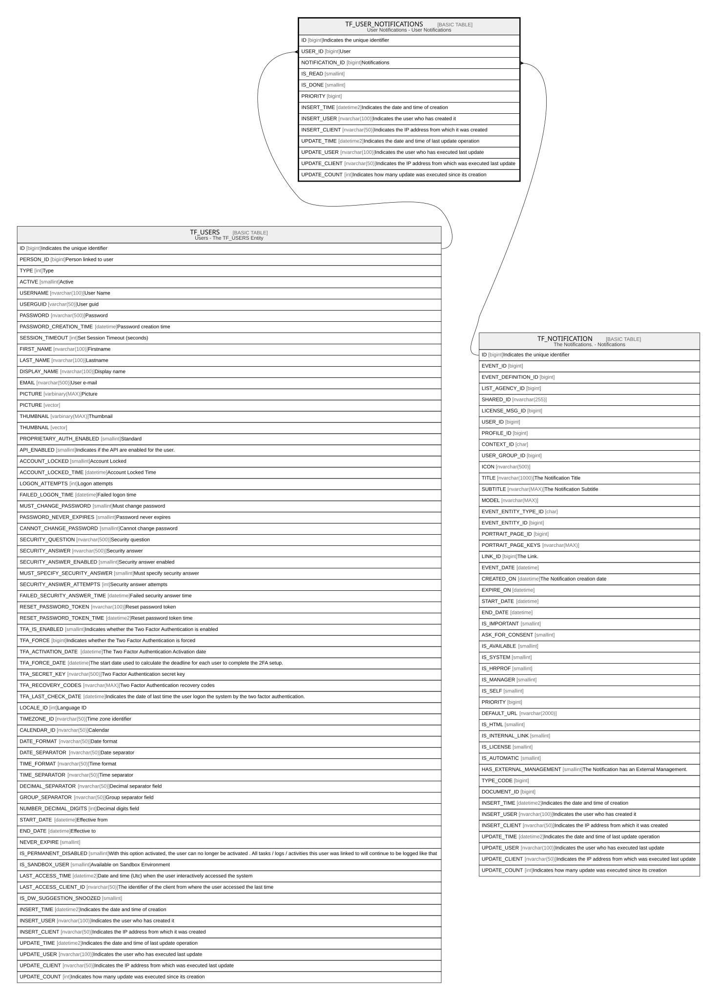

# TF_USER_NOTIFICATIONS

## Description

User Notifications - User Notifications  

## Columns

| Name | Type | Default | Nullable | Parents | Comment |
| ---- | ---- | ------- | -------- | ------- | ------- |
| ID | bigint |  | false |  | Indicates the unique identifier |
| USER_ID | bigint |  | false | [TF_USERS](TF_USERS.md) | User |
| NOTIFICATION_ID | bigint |  | false | [TF_NOTIFICATION](TF_NOTIFICATION.md) | Notifications |
| IS_READ | smallint | ((0)) | false |  |  |
| IS_DONE | smallint | ((0)) | false |  |  |
| PRIORITY | bigint | ((2)) | false |  |  |
| INSERT_TIME | datetime2 | (sysutcdatetime()) | true |  | Indicates the date and time of creation |
| INSERT_USER | nvarchar(100) | (N'MAIN') | true |  | Indicates the user who has created it |
| INSERT_CLIENT | nvarchar(50) | (N'localhost') | true |  | Indicates the IP address from which it was created |
| UPDATE_TIME | datetime2 | (sysutcdatetime()) | true |  | Indicates the date and time of last update operation |
| UPDATE_USER | nvarchar(100) | (N'MAIN') | true |  | Indicates the user who has executed last update |
| UPDATE_CLIENT | nvarchar(50) | (N'localhost') | true |  | Indicates the IP address from which was executed last update |
| UPDATE_COUNT | int | ((0)) | true |  | Indicates how many update was executed since its creation |

## Constraints

| Name | Type | Definition |
| ---- | ---- | ---------- |
| PK_TFUSRNOTID | PRIMARY KEY | CLUSTERED, unique, part of a PRIMARY KEY constraint, [ ID ] |
| FK_TFUSRNOTNOTIFID | FOREIGN KEY | FOREIGN KEY(NOTIFICATION_ID) REFERENCES TF_NOTIFICATION(ID) ON UPDATE NO_ACTION ON DELETE CASCADE |
| FK_TFUSRNOTUSERID | FOREIGN KEY | FOREIGN KEY(USER_ID) REFERENCES TF_USERS(ID) ON UPDATE NO_ACTION ON DELETE CASCADE |

## Indexes

| Name | Definition |
| ---- | ---------- |
| PK_TFUSRNOTID | CLUSTERED, unique, part of a PRIMARY KEY constraint, [ ID ] |
| IDX_USRNOT_USER_ID | NONCLUSTERED, [ USER_ID ] |
| IDX_USRNOT_NOT_ID | NONCLUSTERED, [ NOTIFICATION_ID ] |

## Relations

---

> Generated by [tbls](https://github.com/k1LoW/tbls)
