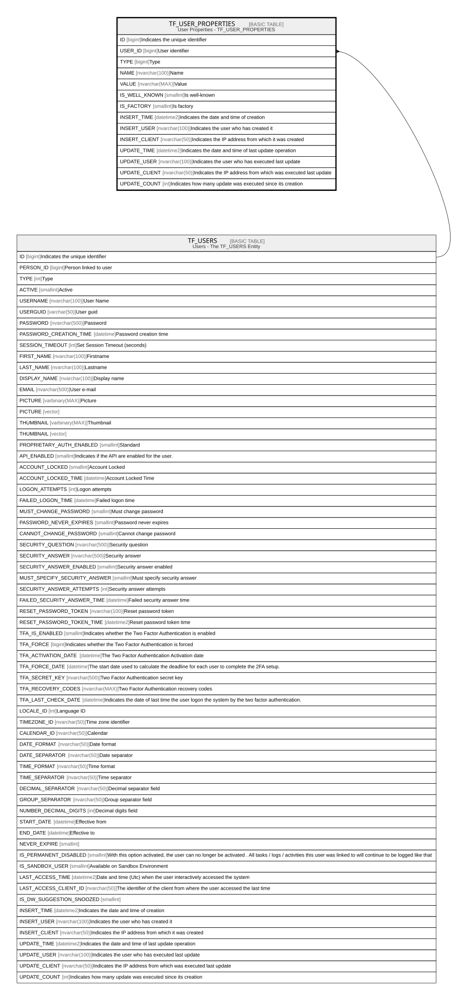

# TF_USER_PROPERTIES

## Description

User Properties - TF_USER_PROPERTIES  

## Columns

| Name | Type | Default | Nullable | Parents | Comment |
| ---- | ---- | ------- | -------- | ------- | ------- |
| ID | bigint |  | false |  | Indicates the unique identifier |
| USER_ID | bigint |  | false | [TF_USERS](TF_USERS.md) | User identifier |
| TYPE | bigint | ((1)) | false |  | Type |
| NAME | nvarchar(100) |  | false |  | Name |
| VALUE | nvarchar(MAX) |  | false |  | Value |
| IS_WELL_KNOWN | smallint | ((0)) | false |  | Is well-known |
| IS_FACTORY | smallint | ((0)) | false |  | Is factory |
| INSERT_TIME | datetime2 | (sysutcdatetime()) | false |  | Indicates the date and time of creation |
| INSERT_USER | nvarchar(100) | (N'MAIN') | false |  | Indicates the user who has created it |
| INSERT_CLIENT | nvarchar(50) | (N'localhost') | false |  | Indicates the IP address from which it was created |
| UPDATE_TIME | datetime2 | (sysutcdatetime()) | false |  | Indicates the date and time of last update operation |
| UPDATE_USER | nvarchar(100) | (N'MAIN') | false |  | Indicates the user who has executed last update |
| UPDATE_CLIENT | nvarchar(50) | (N'localhost') | false |  | Indicates the IP address from which was executed last update |
| UPDATE_COUNT | int | ((0)) | false |  | Indicates how many update was executed since its creation |

## Constraints

| Name | Type | Definition |
| ---- | ---- | ---------- |
| PK_USER_INFO | PRIMARY KEY | CLUSTERED, unique, part of a PRIMARY KEY constraint, [ ID ] |
| UQ_USER_INFO_NAME | UNIQUE | NONCLUSTERED, unique, part of a UNIQUE constraint, [ USER_ID, NAME ] |
| FK_USER_INFO_USERS | FOREIGN KEY | FOREIGN KEY(USER_ID) REFERENCES TF_USERS(ID) ON UPDATE NO_ACTION ON DELETE CASCADE |

## Indexes

| Name | Definition |
| ---- | ---------- |
| PK_USER_INFO | CLUSTERED, unique, part of a PRIMARY KEY constraint, [ ID ] |
| UQ_USER_INFO_NAME | NONCLUSTERED, unique, part of a UNIQUE constraint, [ USER_ID, NAME ] |

## Relations

---

> Generated by [tbls](https://github.com/k1LoW/tbls)
