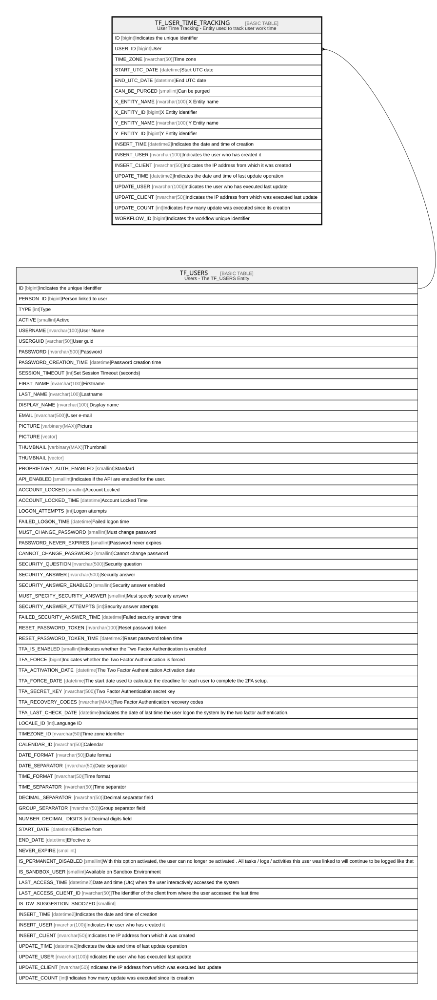

# TF_USER_TIME_TRACKING

## Description

User Time Tracking - Entity used to track user work time  

## Columns

| Name | Type | Default | Nullable | Parents | Comment |
| ---- | ---- | ------- | -------- | ------- | ------- |
| ID | bigint |  | false |  | Indicates the unique identifier |
| USER_ID | bigint |  | false | [TF_USERS](TF_USERS.md) | User |
| TIME_ZONE | nvarchar(50) |  | false |  | Time zone |
| START_UTC_DATE | datetime | (getutcdate()) | false |  | Start UTC date |
| END_UTC_DATE | datetime |  | true |  | End UTC date |
| CAN_BE_PURGED | smallint | ((0)) | false |  | Can be purged |
| X_ENTITY_NAME | nvarchar(100) |  | true |  | X Entity name |
| X_ENTITY_ID | bigint |  | true |  | X Entity identifier |
| Y_ENTITY_NAME | nvarchar(100) |  | true |  | Y Entity name |
| Y_ENTITY_ID | bigint |  | true |  | Y Entity identifier |
| INSERT_TIME | datetime2 | (sysutcdatetime()) | false |  | Indicates the date and time of creation |
| INSERT_USER | nvarchar(100) | (N'MAIN') | false |  | Indicates the user who has created it |
| INSERT_CLIENT | nvarchar(50) | (N'localhost') | false |  | Indicates the IP address from which it was created |
| UPDATE_TIME | datetime2 | (sysutcdatetime()) | false |  | Indicates the date and time of last update operation |
| UPDATE_USER | nvarchar(100) | (N'MAIN') | false |  | Indicates the user who has executed last update |
| UPDATE_CLIENT | nvarchar(50) | (N'localhost') | false |  | Indicates the IP address from which was executed last update |
| UPDATE_COUNT | int | ((0)) | false |  | Indicates how many update was executed since its creation |
| WORKFLOW_ID | bigint |  | true |  | Indicates the workflow unique identifier |

## Constraints

| Name | Type | Definition |
| ---- | ---- | ---------- |
| PK_USER_TIME_TRACKING | PRIMARY KEY | CLUSTERED, unique, part of a PRIMARY KEY constraint, [ ID ] |
| UQ_USER_TIME_TRACKING | UNIQUE | NONCLUSTERED, unique, part of a UNIQUE constraint, [ USER_ID, START_UTC_DATE ] |
| FK_USER_TIME_TRACKING_USERS | FOREIGN KEY | FOREIGN KEY(USER_ID) REFERENCES TF_USERS(ID) ON UPDATE NO_ACTION ON DELETE NO_ACTION |

## Indexes

| Name | Definition |
| ---- | ---------- |
| PK_USER_TIME_TRACKING | CLUSTERED, unique, part of a PRIMARY KEY constraint, [ ID ] |
| UQ_USER_TIME_TRACKING | NONCLUSTERED, unique, part of a UNIQUE constraint, [ USER_ID, START_UTC_DATE ] |

## Relations

---

> Generated by [tbls](https://github.com/k1LoW/tbls)
