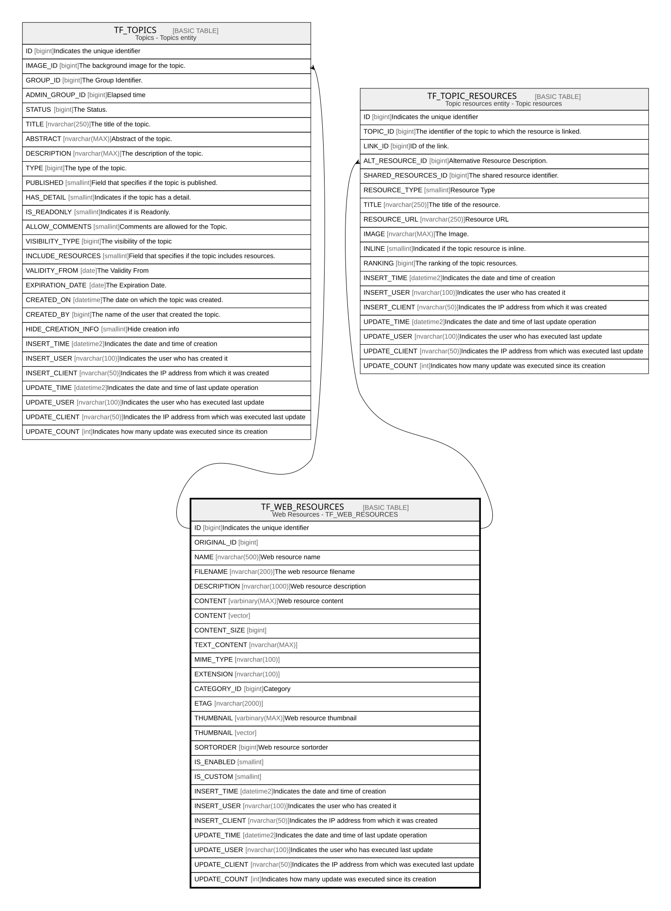

# TF_WEB_RESOURCES

## Description

Web Resources - TF_WEB_RESOURCES  

## Columns

| Name | Type | Default | Nullable | Children | Comment |
| ---- | ---- | ------- | -------- | -------- | ------- |
| ID | bigint |  | false | [TF_TOPICS](TF_TOPICS.md) [TF_TOPIC_RESOURCES](TF_TOPIC_RESOURCES.md) | Indicates the unique identifier |
| ORIGINAL_ID | bigint |  | true |  |  |
| NAME | nvarchar(500) |  | false |  | Web resource name |
| FILENAME | nvarchar(200) |  | true |  | The web resource filename |
| DESCRIPTION | nvarchar(1000) |  | true |  | Web resource description |
| CONTENT | varbinary(MAX) |  | true |  | Web resource content |
| CONTENT | vector |  | true |  |  |
| CONTENT_SIZE | bigint |  | true |  |  |
| TEXT_CONTENT | nvarchar(MAX) |  | true |  |  |
| MIME_TYPE | nvarchar(100) |  | false |  |  |
| EXTENSION | nvarchar(100) |  | false |  |  |
| CATEGORY_ID | bigint |  | false |  | Category |
| ETAG | nvarchar(2000) |  | true |  |  |
| THUMBNAIL | varbinary(MAX) |  | true |  | Web resource thumbnail |
| THUMBNAIL | vector |  | true |  |  |
| SORTORDER | bigint |  | false |  | Web resource sortorder |
| IS_ENABLED | smallint | ((0)) | false |  |  |
| IS_CUSTOM | smallint | ((0)) | false |  |  |
| INSERT_TIME | datetime2 | (sysutcdatetime()) | false |  | Indicates the date and time of creation |
| INSERT_USER | nvarchar(100) | (N'MAIN') | false |  | Indicates the user who has created it |
| INSERT_CLIENT | nvarchar(50) | (N'localhost') | false |  | Indicates the IP address from which it was created |
| UPDATE_TIME | datetime2 | (sysutcdatetime()) | false |  | Indicates the date and time of last update operation |
| UPDATE_USER | nvarchar(100) | (N'MAIN') | false |  | Indicates the user who has executed last update |
| UPDATE_CLIENT | nvarchar(50) | (N'localhost') | false |  | Indicates the IP address from which was executed last update |
| UPDATE_COUNT | int | ((0)) | false |  | Indicates how many update was executed since its creation |

## Constraints

| Name | Type | Definition |
| ---- | ---- | ---------- |
| PK_WEB_RESOURCES | PRIMARY KEY | CLUSTERED, unique, part of a PRIMARY KEY constraint, [ ID ] |

## Indexes

| Name | Definition |
| ---- | ---------- |
| PK_WEB_RESOURCES | CLUSTERED, unique, part of a PRIMARY KEY constraint, [ ID ] |
| IDX_WEB_RESOURCES | NONCLUSTERED, [ NAME ] |
| IDX_WEB_RES_CUSTOM_FACTORY | NONCLUSTERED, [ ORIGINAL_ID, IS_CUSTOM ] |

## Relations

---

> Generated by [tbls](https://github.com/k1LoW/tbls)
