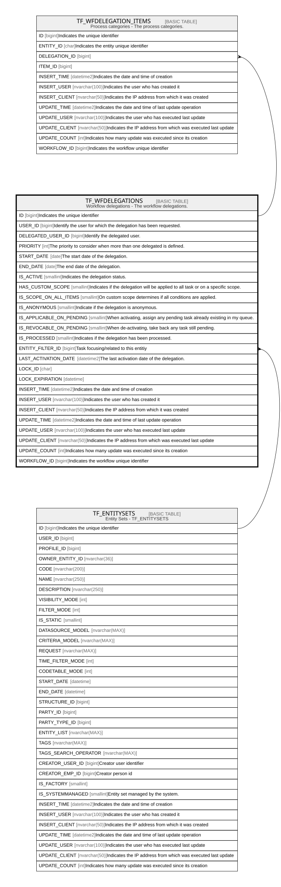

# TF_WFDELEGATIONS

## Description

Workflow delegations - The workflow delegations.  

## Columns

| Name | Type | Default | Nullable | Children | Parents | Comment |
| ---- | ---- | ------- | -------- | -------- | ------- | ------- |
| ID | bigint |  | false | [TF_WFDELEGATION_ITEMS](TF_WFDELEGATION_ITEMS.md) |  | Indicates the unique identifier |
| USER_ID | bigint |  | false |  |  | Identify the user for which the delegation has been requested. |
| DELEGATED_USER_ID | bigint |  | false |  |  | Identify the delegated user. |
| PRIORITY | int | ((0)) | false |  |  | The priority to consider when more than one delegated is defined. |
| START_DATE | date | (getdate()) | false |  |  | The start date of the delegation. |
| END_DATE | date |  | true |  |  | The end date of the delegation. |
| IS_ACTIVE | smallint | ((0)) | false |  |  | Indicates the delegation status. |
| HAS_CUSTOM_SCOPE | smallint | ((0)) | true |  |  | Indicates if the delegation will be applied to all task or on a specific scope. |
| IS_SCOPE_ON_ALL_ITEMS | smallint | ((0)) | true |  |  | On custom scope determines if all conditions are applied. |
| IS_ANONYMOUS | smallint | ((0)) | true |  |  | Indicate if the delegation is anonymous. |
| IS_APPLICABLE_ON_PENDING | smallint | ((0)) | true |  |  | When activating, assign any pending task already existing in my queue. |
| IS_REVOCABLE_ON_PENDING | smallint | ((0)) | true |  |  | When de-activating, take back any task still pending. |
| IS_PROCESSED | smallint | ((0)) | true |  |  | Indicates if the delegation has been processed. |
| ENTITY_FILTER_ID | bigint |  | true |  | [TF_ENTITYSETS](TF_ENTITYSETS.md) | Task focusing/related to this entitiy |
| LAST_ACTIVATION_DATE | datetime2 |  | true |  |  | The last activation date of the delegation. |
| LOCK_ID | char |  | true |  |  |  |
| LOCK_EXPIRATION | datetime |  | true |  |  |  |
| INSERT_TIME | datetime2 | (sysutcdatetime()) | false |  |  | Indicates the date and time of creation |
| INSERT_USER | nvarchar(100) | (N'MAIN') | false |  |  | Indicates the user who has created it |
| INSERT_CLIENT | nvarchar(50) | (N'localhost') | false |  |  | Indicates the IP address from which it was created |
| UPDATE_TIME | datetime2 | (sysutcdatetime()) | false |  |  | Indicates the date and time of last update operation |
| UPDATE_USER | nvarchar(100) | (N'MAIN') | false |  |  | Indicates the user who has executed last update |
| UPDATE_CLIENT | nvarchar(50) | (N'localhost') | false |  |  | Indicates the IP address from which was executed last update |
| UPDATE_COUNT | int | ((0)) | false |  |  | Indicates how many update was executed since its creation |
| WORKFLOW_ID | bigint |  | true |  |  | Indicates the workflow unique identifier |

## Constraints

| Name | Type | Definition |
| ---- | ---- | ---------- |
| PK_WFDELEGATIONS | PRIMARY KEY | CLUSTERED, unique, part of a PRIMARY KEY constraint, [ ID ] |
| FK_WFDELEGATIONS_ENTITYSETS | FOREIGN KEY | FOREIGN KEY(ENTITY_FILTER_ID) REFERENCES TF_ENTITYSETS(ID) ON UPDATE NO_ACTION ON DELETE NO_ACTION |

## Indexes

| Name | Definition |
| ---- | ---------- |
| PK_WFDELEGATIONS | CLUSTERED, unique, part of a PRIMARY KEY constraint, [ ID ] |
| IDX_WFDELEGATIONS_USERID | NONCLUSTERED, [ USER_ID ] |

## Relations

---

> Generated by [tbls](https://github.com/k1LoW/tbls)
