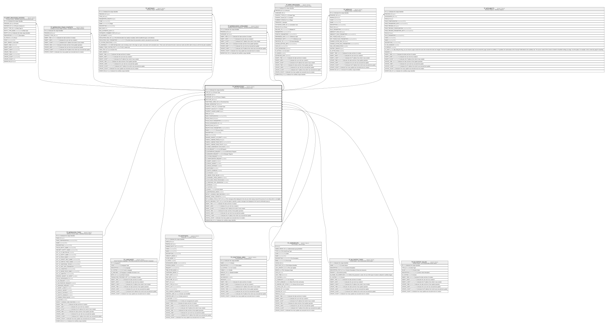

# TF_WFPROCESSES

## Description

Processes - Workflow Processes View  

## Columns

| Name | Type | Default | Nullable | Children | Parents | Comment |
| ---- | ---- | ------- | -------- | -------- | ------- | ------- |
| ID | bigint |  | false | [TF_WFRT_PROCESSES_ENTITIES](TF_WFRT_PROCESSES_ENTITIES.md) [TF_WFPROCESS_STAGE_CONTEXTS](TF_WFPROCESS_STAGE_CONTEXTS.md) [TF_WFSTAGES](TF_WFSTAGES.md) [TF_WFRESOURCE_CATEGORIES](TF_WFRESOURCE_CATEGORIES.md) [TF_WFRT_PROCESSES](TF_WFRT_PROCESSES.md) [TF_WFROLES](TF_WFROLES.md) [TF_WFSUBJECTS](TF_WFSUBJECTS.md) |  | Indicates the unique identifier |
| TYPE_ID | bigint |  | false |  | [TF_WFPROCESS_TYPES](TF_WFPROCESS_TYPES.md) | Process Type |
| LANGUAGE_ID | int |  | true |  | [TF_LANGUAGES](TF_LANGUAGES.md) |  |
| CATEGORY_ID | bigint |  | true |  |  | Process Category |
| ENTITYSET_ID | bigint |  | true |  | [TF_ENTITYSETS](TF_ENTITYSETS.md) |  |
| FUNCTIONAL_AREA_ID | bigint |  | true |  | [TF_FUNCTIONAL_AREA](TF_FUNCTIONAL_AREA.md) | Functional Area |
| ADMIN_USERGROUP_ID | bigint |  | true |  | [TF_USERGROUPS](TF_USERGROUPS.md) |  |
| CONTEXT_TYPE_ID | char | ('00000000-0000-0000-0000-000000000001') | false |  | [TF_BLCONTEXT_TYPES](TF_BLCONTEXT_TYPES.md) | Context Type |
| CONTEXT_VALUE_ID | char |  | true |  | [TF_BLCONTEXT_VALUES](TF_BLCONTEXT_VALUES.md) | Context |
| CONTEXT_LAUNCH_MODE | bigint |  | false |  |  |  |
| PAGE_ID | bigint |  | true |  |  |  |
| PAGE_CONFIGURATION | nvarchar(1000) |  | true |  |  |  |
| FOCUS_RULE_ID | bigint |  | false |  |  |  |
| FOCUS_RULE_PARAMETERS | nvarchar(MAX) |  | true |  |  |  |
| FOCUS_DATASOURCE_ID | char |  | true |  |  |  |
| DELETE_RULE_ID | bigint |  | true |  |  |  |
| DELETE_RULE_PARAMETERS | nvarchar(MAX) |  | true |  |  |  |
| NAME | nvarchar(100) |  | false |  |  | Process Name |
| DESCRIPTION | nvarchar(1000) |  | true |  |  |  |
| ICON | nvarchar(500) |  | true |  |  |  |
| MANAGE_SUBJECT_AS_DRAFT | smallint |  | true |  |  |  |
| CANCEL_LANDING_PAGE_ID | bigint |  | true |  |  |  |
| CANCEL_LANDING_PAGE_KEYS | nvarchar(MAX) |  | true |  |  |  |
| CANCEL_LANDING_PAGE_POLICY | bigint | ((1)) | false |  |  |  |
| IS_ADMIN_USERGROUP_EXCLUSIVE | smallint | ((0)) | false |  |  |  |
| IS_HR_REQUEST | smallint |  | true |  |  | Is HR Request |
| IS_SELFSERVICE_REQUEST | smallint |  | true |  |  | Is Self Service Request |
| IS_MANAGER_REQUEST | smallint |  | true |  |  | Is Manager Reguest |
| IS_SYSTEM_REQUEST | smallint |  | true |  |  |  |
| IS_CONFIGURATOR_REQUEST | smallint |  | true |  |  |  |
| IS_SMART_LAUNCH | smallint |  | true |  |  |  |
| IS_SINGLE_SUBJECT | smallint |  | true |  |  |  |
| IS_SINGLE_INSTANCE | smallint |  | true |  |  |  |
| IS_BATCHABLE | smallint | ((1)) | false |  |  |  |
| IS_SKETCH_ENABLED | smallint | ((0)) | false |  |  |  |
| IS_AUTOSAVE | smallint | ((0)) | false |  |  |  |
| IS_HIDDEN_FROM_INLINE | smallint | ((0)) | false |  |  |  |
| IS_RUNNABLE_FROM_SEARCH | smallint | ((0)) | false |  |  |  |
| IS_EXCLUDED_FROM_PROCESSES | smallint | ((0)) | false |  |  |  |
| IS_TAKEOVER_FOR_USERGROUP | smallint | ((1)) | false |  |  |  |
| IS_ENABLED | smallint | ((1)) | false |  |  |  |
| IS_CUSTOM | smallint | ((1)) | false |  |  |  |
| IS_MODEL | smallint | ((0)) | false |  |  | Process Model |
| IS_MAINTENANCE_MODE | smallint | ((0)) | false |  |  |  |
| DETECT_CHANGES_NEW_RECORDS | smallint | ((1)) | false |  |  |  |
| MANAGE_STAGE_CONTEXTS | smallint | ((0)) | false |  |  |  |
| NOT_ELIGIBLE_FOCUS_TEXT_ID | bigint |  | true |  |  | This message will be displayed to the end user when trying to launch this process for an entity which is not eligible. |
| DELETE_MESSAGE_TEXT_ID | bigint |  | true |  |  | Use this option to specify a custom message to be displayed in the Cancel confirmation pop up. |
| INSERT_TIME | datetime2 | (sysutcdatetime()) | false |  |  | Indicates the date and time of creation |
| INSERT_USER | nvarchar(100) | (N'MAIN') | false |  |  | Indicates the user who has created it |
| INSERT_CLIENT | nvarchar(50) | (N'localhost') | false |  |  | Indicates the IP address from which it was created |
| UPDATE_TIME | datetime2 | (sysutcdatetime()) | false |  |  | Indicates the date and time of last update operation |
| UPDATE_USER | nvarchar(100) | (N'MAIN') | false |  |  | Indicates the user who has executed last update |
| UPDATE_CLIENT | nvarchar(50) | (N'localhost') | false |  |  | Indicates the IP address from which was executed last update |
| UPDATE_COUNT | int | ((0)) | false |  |  | Indicates how many update was executed since its creation |
| WORKFLOW_ID | bigint |  | true |  |  | Indicates the workflow unique identifier |

## Constraints

| Name | Type | Definition |
| ---- | ---- | ---------- |
| PK_WFPROCESSES | PRIMARY KEY | CLUSTERED, unique, part of a PRIMARY KEY constraint, [ ID ] |
| FK_WFPROCESS_FUNCTIONALAREA | FOREIGN KEY | FOREIGN KEY(FUNCTIONAL_AREA_ID) REFERENCES TF_FUNCTIONAL_AREA(ID) ON UPDATE NO_ACTION ON DELETE NO_ACTION |
| FK_WFPROCESS_LANGUAGE | FOREIGN KEY | FOREIGN KEY(LANGUAGE_ID) REFERENCES TF_LANGUAGES(ID) ON UPDATE NO_ACTION ON DELETE NO_ACTION |
| FK_WFPROCESSES_CTXS_TYPES | FOREIGN KEY | FOREIGN KEY(CONTEXT_TYPE_ID) REFERENCES TF_BLCONTEXT_TYPES(ID) ON UPDATE NO_ACTION ON DELETE NO_ACTION |
| FK_WFPROCESSES_CTXS_VALUES | FOREIGN KEY | FOREIGN KEY(CONTEXT_VALUE_ID) REFERENCES TF_BLCONTEXT_VALUES(ID) ON UPDATE NO_ACTION ON DELETE NO_ACTION |
| FK_WFPROCESSES_ENTITYSET | FOREIGN KEY | FOREIGN KEY(ENTITYSET_ID) REFERENCES TF_ENTITYSETS(ID) ON UPDATE NO_ACTION ON DELETE NO_ACTION |
| FK_WFPROCESSES_TYPES | FOREIGN KEY | FOREIGN KEY(TYPE_ID) REFERENCES TF_WFPROCESS_TYPES(ID) ON UPDATE NO_ACTION ON DELETE NO_ACTION |
| FK_WFPROCESSES_USERGROUPS | FOREIGN KEY | FOREIGN KEY(ADMIN_USERGROUP_ID) REFERENCES TF_USERGROUPS(ID) ON UPDATE NO_ACTION ON DELETE NO_ACTION |

## Indexes

| Name | Definition |
| ---- | ---------- |
| PK_WFPROCESSES | CLUSTERED, unique, part of a PRIMARY KEY constraint, [ ID ] |
| IDX_WFPROCESSES_CATEGORY | NONCLUSTERED, [ CATEGORY_ID ] |
| IDX_PROCESS_TYPE | NONCLUSTERED, [ TYPE_ID ] |

## Relations

---

> Generated by [tbls](https://github.com/k1LoW/tbls)
