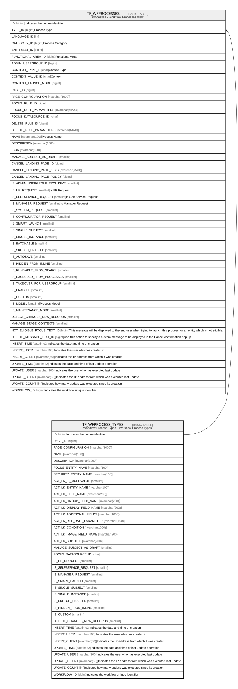

# TF_WFPROCESS_TYPES

## Description

Workflow Process Types - Workflow Process Types  

## Columns

| Name | Type | Default | Nullable | Children | Comment |
| ---- | ---- | ------- | -------- | -------- | ------- |
| ID | bigint |  | false | [TF_WFPROCESSES](TF_WFPROCESSES.md) | Indicates the unique identifier |
| PAGE_ID | bigint |  | true |  |  |
| PAGE_CONFIGURATION | nvarchar(1000) |  | true |  |  |
| NAME | nvarchar(100) |  | false |  |  |
| DESCRIPTION | nvarchar(1000) |  | true |  |  |
| FOCUS_ENTITY_NAME | nvarchar(100) |  | false |  |  |
| SECURITY_ENTITY_NAME | nvarchar(100) |  | true |  |  |
| ACT_LK_IS_MULTIVALUE | smallint | ((0)) | true |  |  |
| ACT_LK_ENTITY_NAME | nvarchar(100) |  | true |  |  |
| ACT_LK_FIELD_NAME | nvarchar(200) |  | true |  |  |
| ACT_LK_GROUP_FIELD_NAME | nvarchar(200) |  | true |  |  |
| ACT_LK_DISPLAY_FIELD_NAME | nvarchar(200) |  | true |  |  |
| ACT_LK_ADDITIONAL_FIELDS | nvarchar(1000) |  | true |  |  |
| ACT_LK_REF_DATE_PARAMETER | nvarchar(100) |  | true |  |  |
| ACT_LK_CONDITION | nvarchar(1000) |  | true |  |  |
| ACT_LK_IMAGE_FIELD_NAME | nvarchar(200) |  | true |  |  |
| ACT_LK_SUBTITLE | nvarchar(200) |  | true |  |  |
| MANAGE_SUBJECT_AS_DRAFT | smallint | ((1)) | false |  |  |
| FOCUS_DATASOURCE_ID | char |  | true |  |  |
| IS_HR_REQUEST | smallint | ((0)) | false |  |  |
| IS_SELFSERVICE_REQUEST | smallint | ((0)) | false |  |  |
| IS_MANAGER_REQUEST | smallint | ((0)) | false |  |  |
| IS_SMART_LAUNCH | smallint | ((0)) | false |  |  |
| IS_SINGLE_SUBJECT | smallint | ((1)) | false |  |  |
| IS_SINGLE_INSTANCE | smallint | ((0)) | false |  |  |
| IS_SKETCH_ENABLED | smallint | ((0)) | false |  |  |
| IS_HIDDEN_FROM_INLINE | smallint | ((0)) | false |  |  |
| IS_CUSTOM | smallint | ((1)) | false |  |  |
| DETECT_CHANGES_NEW_RECORDS | smallint | ((1)) | false |  |  |
| INSERT_TIME | datetime2 | (sysutcdatetime()) | false |  | Indicates the date and time of creation |
| INSERT_USER | nvarchar(100) | (N'MAIN') | false |  | Indicates the user who has created it |
| INSERT_CLIENT | nvarchar(50) | (N'localhost') | false |  | Indicates the IP address from which it was created |
| UPDATE_TIME | datetime2 | (sysutcdatetime()) | false |  | Indicates the date and time of last update operation |
| UPDATE_USER | nvarchar(100) | (N'MAIN') | false |  | Indicates the user who has executed last update |
| UPDATE_CLIENT | nvarchar(50) | (N'localhost') | false |  | Indicates the IP address from which was executed last update |
| UPDATE_COUNT | int | ((0)) | false |  | Indicates how many update was executed since its creation |
| WORKFLOW_ID | bigint |  | true |  | Indicates the workflow unique identifier |

## Constraints

| Name | Type | Definition |
| ---- | ---- | ---------- |
| PK_WFPROCESS_TYPES | PRIMARY KEY | CLUSTERED, unique, part of a PRIMARY KEY constraint, [ ID ] |

## Indexes

| Name | Definition |
| ---- | ---------- |
| PK_WFPROCESS_TYPES | CLUSTERED, unique, part of a PRIMARY KEY constraint, [ ID ] |

## Relations

---

> Generated by [tbls](https://github.com/k1LoW/tbls)
