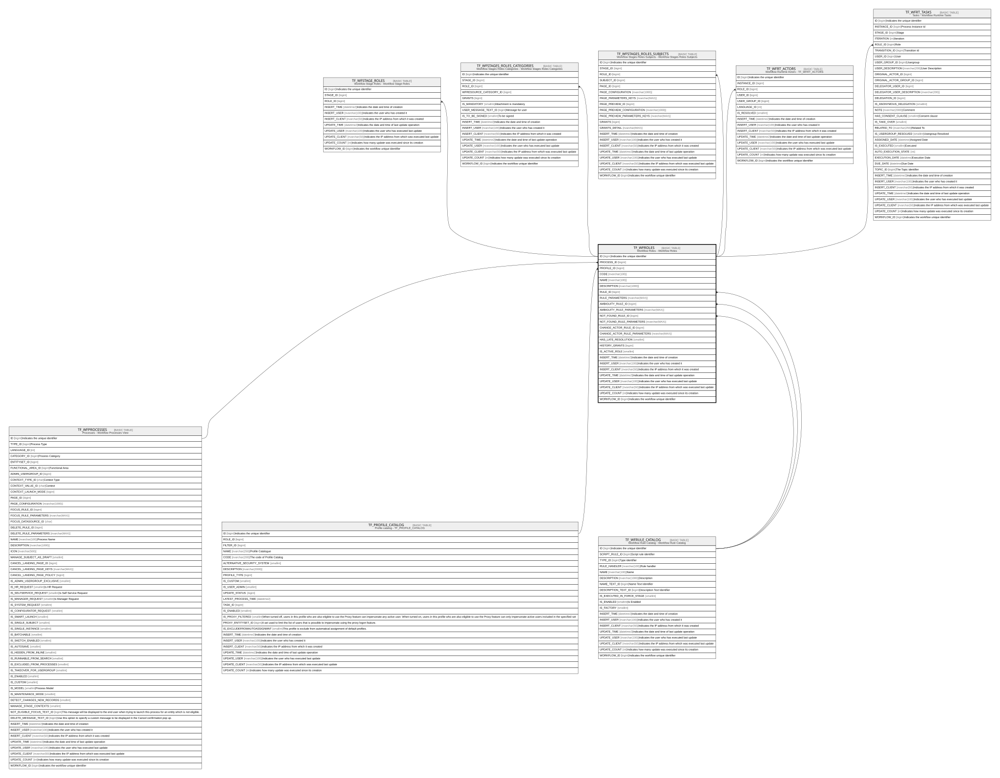

# TF_WFROLES

## Description

Workflow Roles - Workflow Roles  

## Columns

| Name | Type | Default | Nullable | Children | Parents | Comment |
| ---- | ---- | ------- | -------- | -------- | ------- | ------- |
| ID | bigint |  | false | [TF_WFSTAGE_ROLES](TF_WFSTAGE_ROLES.md) [TF_WFSTAGES_ROLES_CATEGORIES](TF_WFSTAGES_ROLES_CATEGORIES.md) [TF_WFSTAGES_ROLES_SUBJECTS](TF_WFSTAGES_ROLES_SUBJECTS.md) [TF_WFRT_ACTORS](TF_WFRT_ACTORS.md) [TF_WFRT_TASKS](TF_WFRT_TASKS.md) |  | Indicates the unique identifier |
| PROCESS_ID | bigint |  | false |  | [TF_WFPROCESSES](TF_WFPROCESSES.md) |  |
| PROFILE_ID | bigint |  | true |  | [TF_PROFILE_CATALOG](TF_PROFILE_CATALOG.md) |  |
| CODE | nvarchar(100) |  | false |  |  |  |
| NAME | nvarchar(100) |  | false |  |  |  |
| DESCRIPTION | nvarchar(1000) |  | true |  |  |  |
| RULE_ID | bigint |  | false |  | [TF_WFRULE_CATALOG](TF_WFRULE_CATALOG.md) |  |
| RULE_PARAMETERS | nvarchar(MAX) |  | true |  |  |  |
| AMBIGUITY_RULE_ID | bigint |  | true |  | [TF_WFRULE_CATALOG](TF_WFRULE_CATALOG.md) |  |
| AMBIGUITY_RULE_PARAMETERS | nvarchar(MAX) |  | true |  |  |  |
| NOT_FOUND_RULE_ID | bigint |  | true |  | [TF_WFRULE_CATALOG](TF_WFRULE_CATALOG.md) |  |
| NOT_FOUND_RULE_PARAMETERS | nvarchar(MAX) |  | true |  |  |  |
| CHANGE_ACTOR_RULE_ID | bigint |  | true |  |  |  |
| CHANGE_ACTOR_RULE_PARAMETERS | nvarchar(MAX) |  | true |  |  |  |
| HAS_LATE_RESOLUTION | smallint | ((0)) | false |  |  |  |
| HISTORY_GRANTS | bigint | ((0)) | false |  |  |  |
| IS_ACTIVE_ROLE | smallint | ((1)) | false |  |  |  |
| INSERT_TIME | datetime2 | (sysutcdatetime()) | false |  |  | Indicates the date and time of creation |
| INSERT_USER | nvarchar(100) | (N'MAIN') | false |  |  | Indicates the user who has created it |
| INSERT_CLIENT | nvarchar(50) | (N'localhost') | false |  |  | Indicates the IP address from which it was created |
| UPDATE_TIME | datetime2 | (sysutcdatetime()) | false |  |  | Indicates the date and time of last update operation |
| UPDATE_USER | nvarchar(100) | (N'MAIN') | false |  |  | Indicates the user who has executed last update |
| UPDATE_CLIENT | nvarchar(50) | (N'localhost') | false |  |  | Indicates the IP address from which was executed last update |
| UPDATE_COUNT | int | ((0)) | false |  |  | Indicates how many update was executed since its creation |
| WORKFLOW_ID | bigint |  | true |  |  | Indicates the workflow unique identifier |

## Constraints

| Name | Type | Definition |
| ---- | ---- | ---------- |
| PK_WFROLES | PRIMARY KEY | CLUSTERED, unique, part of a PRIMARY KEY constraint, [ ID ] |
| UQ_WFROLES | UNIQUE | NONCLUSTERED, unique, part of a UNIQUE constraint, [ PROCESS_ID, CODE ] |
| FK_WFROLES_PROCESSES | FOREIGN KEY | FOREIGN KEY(PROCESS_ID) REFERENCES TF_WFPROCESSES(ID) ON UPDATE NO_ACTION ON DELETE CASCADE |
| FK_WFROLES_PROFILE | FOREIGN KEY | FOREIGN KEY(PROFILE_ID) REFERENCES TF_PROFILE_CATALOG(ID) ON UPDATE NO_ACTION ON DELETE NO_ACTION |
| FK_WFROLES_RULES | FOREIGN KEY | FOREIGN KEY(RULE_ID) REFERENCES TF_WFRULE_CATALOG(ID) ON UPDATE NO_ACTION ON DELETE NO_ACTION |
| FK_WFROLES_RULES_AMB | FOREIGN KEY | FOREIGN KEY(AMBIGUITY_RULE_ID) REFERENCES TF_WFRULE_CATALOG(ID) ON UPDATE NO_ACTION ON DELETE NO_ACTION |
| FK_WFROLES_RULES_NOT | FOREIGN KEY | FOREIGN KEY(NOT_FOUND_RULE_ID) REFERENCES TF_WFRULE_CATALOG(ID) ON UPDATE NO_ACTION ON DELETE NO_ACTION |

## Indexes

| Name | Definition |
| ---- | ---------- |
| PK_WFROLES | CLUSTERED, unique, part of a PRIMARY KEY constraint, [ ID ] |
| UQ_WFROLES | NONCLUSTERED, unique, part of a UNIQUE constraint, [ PROCESS_ID, CODE ] |

## Relations

---

> Generated by [tbls](https://github.com/k1LoW/tbls)
