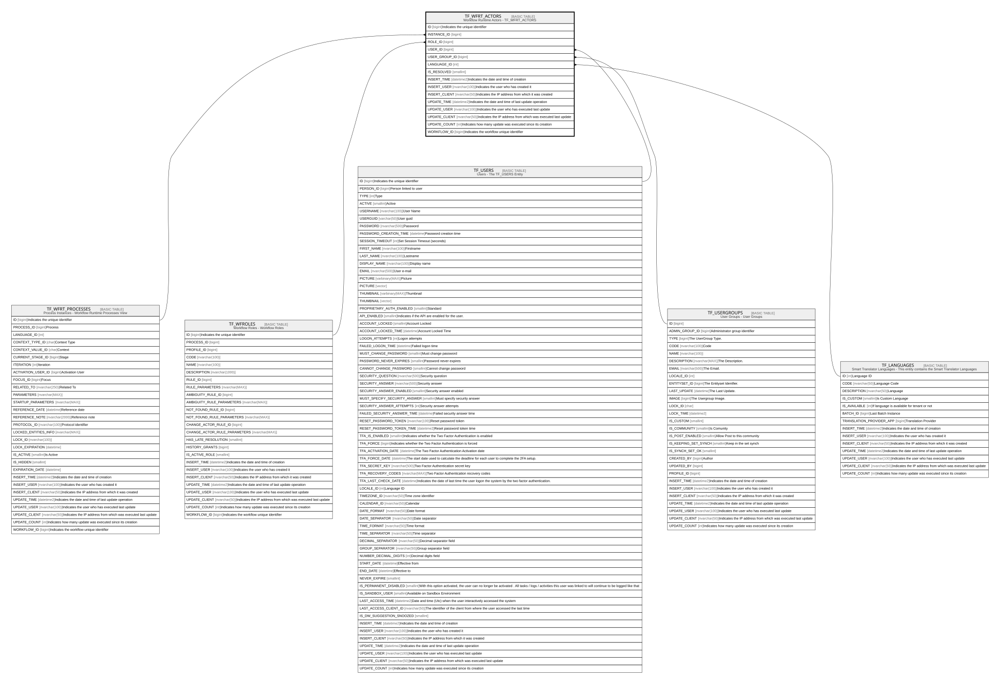

# TF_WFRT_ACTORS

## Description

Workflow Runtime Actors - TF_WFRT_ACTORS  

## Columns

| Name | Type | Default | Nullable | Parents | Comment |
| ---- | ---- | ------- | -------- | ------- | ------- |
| ID | bigint |  | false |  | Indicates the unique identifier |
| INSTANCE_ID | bigint |  | false | [TF_WFRT_PROCESSES](TF_WFRT_PROCESSES.md) |  |
| ROLE_ID | bigint |  | false | [TF_WFROLES](TF_WFROLES.md) |  |
| USER_ID | bigint |  | true | [TF_USERS](TF_USERS.md) |  |
| USER_GROUP_ID | bigint |  | true | [TF_USERGROUPS](TF_USERGROUPS.md) |  |
| LANGUAGE_ID | int |  | true | [TF_LANGUAGES](TF_LANGUAGES.md) |  |
| IS_RESOLVED | smallint |  | false |  |  |
| INSERT_TIME | datetime2 | (sysutcdatetime()) | false |  | Indicates the date and time of creation |
| INSERT_USER | nvarchar(100) | (N'MAIN') | false |  | Indicates the user who has created it |
| INSERT_CLIENT | nvarchar(50) | (N'localhost') | false |  | Indicates the IP address from which it was created |
| UPDATE_TIME | datetime2 | (sysutcdatetime()) | false |  | Indicates the date and time of last update operation |
| UPDATE_USER | nvarchar(100) | (N'MAIN') | false |  | Indicates the user who has executed last update |
| UPDATE_CLIENT | nvarchar(50) | (N'localhost') | false |  | Indicates the IP address from which was executed last update |
| UPDATE_COUNT | int | ((0)) | false |  | Indicates how many update was executed since its creation |
| WORKFLOW_ID | bigint |  | true |  | Indicates the workflow unique identifier |

## Constraints

| Name | Type | Definition |
| ---- | ---- | ---------- |
| PK_WFRT_ACTORS | PRIMARY KEY | CLUSTERED, unique, part of a PRIMARY KEY constraint, [ ID ] |
| UQ_WFRT_ACTORS | UNIQUE | NONCLUSTERED, unique, part of a UNIQUE constraint, [ INSTANCE_ID, ROLE_ID, USER_ID ] |
| FK_WFRT_ACTORS_INSTANCES | FOREIGN KEY | FOREIGN KEY(INSTANCE_ID) REFERENCES TF_WFRT_PROCESSES(ID) ON UPDATE NO_ACTION ON DELETE CASCADE |
| FK_WFRT_ACTORS_LANGUAGES | FOREIGN KEY | FOREIGN KEY(LANGUAGE_ID) REFERENCES TF_LANGUAGES(ID) ON UPDATE NO_ACTION ON DELETE NO_ACTION |
| FK_WFRT_ACTORS_ROLES | FOREIGN KEY | FOREIGN KEY(ROLE_ID) REFERENCES TF_WFROLES(ID) ON UPDATE NO_ACTION ON DELETE CASCADE |
| FK_WFRT_ACTORS_USERGROUPS | FOREIGN KEY | FOREIGN KEY(USER_GROUP_ID) REFERENCES TF_USERGROUPS(ID) ON UPDATE NO_ACTION ON DELETE NO_ACTION |
| FK_WFRT_ACTORS_USERS | FOREIGN KEY | FOREIGN KEY(USER_ID) REFERENCES TF_USERS(ID) ON UPDATE NO_ACTION ON DELETE NO_ACTION |

## Indexes

| Name | Definition |
| ---- | ---------- |
| PK_WFRT_ACTORS | CLUSTERED, unique, part of a PRIMARY KEY constraint, [ ID ] |
| UQ_WFRT_ACTORS | NONCLUSTERED, unique, part of a UNIQUE constraint, [ INSTANCE_ID, ROLE_ID, USER_ID ] |
| IDX_TF_WFRT_ACTORS_INSTANCE_ID | NONCLUSTERED, [ INSTANCE_ID ] |

## Relations

---

> Generated by [tbls](https://github.com/k1LoW/tbls)
