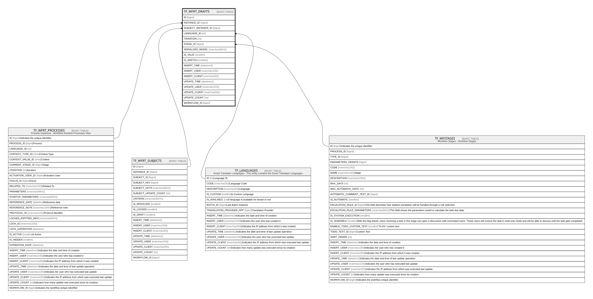

# TF_WFRT_DRAFTS

## Columns

| Name | Type | Default | Nullable | Parents | Comment |
| ---- | ---- | ------- | -------- | ------- | ------- |
| ID | bigint |  | false |  |  |
| INSTANCE_ID | bigint |  | false | [TF_WFRT_PROCESSES](TF_WFRT_PROCESSES.md) |  |
| SUBJECT_INSTANCE_ID | bigint |  | false | [TF_WFRT_SUBJECTS](TF_WFRT_SUBJECTS.md) |  |
| LANGUAGE_ID | int |  | false | [TF_LANGUAGES](TF_LANGUAGES.md) |  |
| ITERATION | int | ((-1)) | false |  |  |
| STAGE_ID | bigint |  | true | [TF_WFSTAGES](TF_WFSTAGES.md) |  |
| SERIALIZED_MODEL | nvarchar(MAX) |  | false |  |  |
| IS_VALID | smallint | ((0)) | false |  |  |
| IS_SKETCH | smallint | ((0)) | false |  |  |
| INSERT_TIME | datetime2 | (sysutcdatetime()) | false |  |  |
| INSERT_USER | nvarchar(100) | (N'MAIN') | false |  |  |
| INSERT_CLIENT | nvarchar(50) | (N'localhost') | false |  |  |
| UPDATE_TIME | datetime2 | (sysutcdatetime()) | false |  |  |
| UPDATE_USER | nvarchar(100) | (N'MAIN') | false |  |  |
| UPDATE_CLIENT | nvarchar(50) | (N'localhost') | false |  |  |
| UPDATE_COUNT | int | ((0)) | false |  |  |
| WORKFLOW_ID | bigint |  | true |  |  |

## Constraints

| Name | Type | Definition |
| ---- | ---- | ---------- |
| PK_WFRT_DRAFTS | PRIMARY KEY | CLUSTERED, unique, part of a PRIMARY KEY constraint, [ ID ] |
| UQ_WFRT_DRAFTS | UNIQUE | NONCLUSTERED, unique, part of a UNIQUE constraint, [ INSTANCE_ID, SUBJECT_INSTANCE_ID, ITERATION ] |
| FK_WFRT_DRAFTS_LANGUAGES | FOREIGN KEY | FOREIGN KEY(LANGUAGE_ID) REFERENCES TF_LANGUAGES(ID) ON UPDATE NO_ACTION ON DELETE NO_ACTION |
| FK_WFRT_DRAFTS_RTPROCESS | FOREIGN KEY | FOREIGN KEY(INSTANCE_ID) REFERENCES TF_WFRT_PROCESSES(ID) ON UPDATE NO_ACTION ON DELETE CASCADE |
| FK_WFRT_DRAFTS_RTSUBJECTS | FOREIGN KEY | FOREIGN KEY(SUBJECT_INSTANCE_ID) REFERENCES TF_WFRT_SUBJECTS(ID) ON UPDATE NO_ACTION ON DELETE NO_ACTION |
| FK_WFRT_DRAFTS_STAGES | FOREIGN KEY | FOREIGN KEY(STAGE_ID) REFERENCES TF_WFSTAGES(ID) ON UPDATE NO_ACTION ON DELETE NO_ACTION |

## Indexes

| Name | Definition |
| ---- | ---------- |
| PK_WFRT_DRAFTS | CLUSTERED, unique, part of a PRIMARY KEY constraint, [ ID ] |
| UQ_WFRT_DRAFTS | NONCLUSTERED, unique, part of a UNIQUE constraint, [ INSTANCE_ID, SUBJECT_INSTANCE_ID, ITERATION ] |
| IDX_WFRT_DRAFTS_INSTANCE_ID | NONCLUSTERED, [ INSTANCE_ID ] |

## Relations

---

> Generated by [tbls](https://github.com/k1LoW/tbls)
