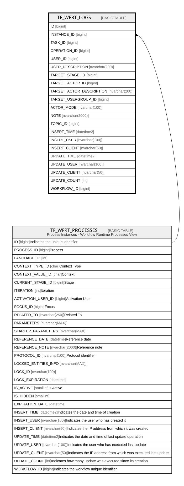

# TF_WFRT_LOGS

## Columns

| Name | Type | Default | Nullable | Parents | Comment |
| ---- | ---- | ------- | -------- | ------- | ------- |
| ID | bigint |  | false |  |  |
| INSTANCE_ID | bigint |  | false | [TF_WFRT_PROCESSES](TF_WFRT_PROCESSES.md) |  |
| TASK_ID | bigint |  | false |  |  |
| OPERATION_ID | bigint |  | false |  |  |
| USER_ID | bigint |  | false |  |  |
| USER_DESCRIPTION | nvarchar(200) |  | true |  |  |
| TARGET_STAGE_ID | bigint |  | true |  |  |
| TARGET_ACTOR_ID | bigint |  | true |  |  |
| TARGET_ACTOR_DESCRIPTION | nvarchar(200) |  | true |  |  |
| TARGET_USERGROUP_ID | bigint |  | true |  |  |
| ACTOR_MODE | nvarchar(100) |  | true |  |  |
| NOTE | nvarchar(2000) |  | true |  |  |
| TOPIC_ID | bigint |  | true |  |  |
| INSERT_TIME | datetime2 | (sysutcdatetime()) | false |  |  |
| INSERT_USER | nvarchar(100) | (N'MAIN') | false |  |  |
| INSERT_CLIENT | nvarchar(50) | (N'localhost') | false |  |  |
| UPDATE_TIME | datetime2 | (sysutcdatetime()) | false |  |  |
| UPDATE_USER | nvarchar(100) | (N'MAIN') | false |  |  |
| UPDATE_CLIENT | nvarchar(50) | (N'localhost') | false |  |  |
| UPDATE_COUNT | int | ((0)) | false |  |  |
| WORKFLOW_ID | bigint |  | true |  |  |

## Constraints

| Name | Type | Definition |
| ---- | ---- | ---------- |
| PK_WFRT_LOGS | PRIMARY KEY | CLUSTERED, unique, part of a PRIMARY KEY constraint, [ ID ] |
| FK_WFRT_LOGS_INSTANCES | FOREIGN KEY | FOREIGN KEY(INSTANCE_ID) REFERENCES TF_WFRT_PROCESSES(ID) ON UPDATE NO_ACTION ON DELETE CASCADE |

## Indexes

| Name | Definition |
| ---- | ---------- |
| PK_WFRT_LOGS | CLUSTERED, unique, part of a PRIMARY KEY constraint, [ ID ] |
| IDX_WFRTLOGS_INSTANCEID | NONCLUSTERED, [ INSTANCE_ID ] |
| IDX_WFRT_LOGS_INSTANCE_ID | NONCLUSTERED, [ INSTANCE_ID ] |

## Relations

---

> Generated by [tbls](https://github.com/k1LoW/tbls)
