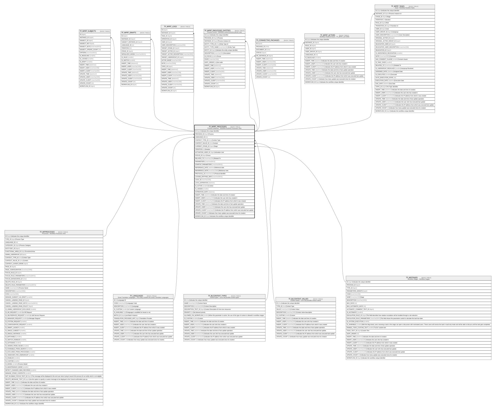

# TF_WFRT_PROCESSES

## Description

Process Instances - Workflow Runtime Processes View  

## Columns

| Name | Type | Default | Nullable | Children | Parents | Comment |
| ---- | ---- | ------- | -------- | -------- | ------- | ------- |
| ID | bigint |  | false | [TF_WFRT_SUBJECTS](TF_WFRT_SUBJECTS.md) [TF_WFRT_DRAFTS](TF_WFRT_DRAFTS.md) [TF_WFRT_LOGS](TF_WFRT_LOGS.md) [TF_WFRT_PROCESSES_ENTITIES](TF_WFRT_PROCESSES_ENTITIES.md) [TF_CONNECTIVE_PACKAGES](TF_CONNECTIVE_PACKAGES.md) [TF_WFRT_ACTORS](TF_WFRT_ACTORS.md) [TF_WFRT_TASKS](TF_WFRT_TASKS.md) |  | Indicates the unique identifier |
| PROCESS_ID | bigint |  | false |  | [TF_WFPROCESSES](TF_WFPROCESSES.md) | Process |
| LANGUAGE_ID | int |  | true |  | [TF_LANGUAGES](TF_LANGUAGES.md) |  |
| CONTEXT_TYPE_ID | char | ('00000000-0000-0000-0000-000000000001') | false |  | [TF_BLCONTEXT_TYPES](TF_BLCONTEXT_TYPES.md) | Context Type |
| CONTEXT_VALUE_ID | char |  | true |  | [TF_BLCONTEXT_VALUES](TF_BLCONTEXT_VALUES.md) | Context |
| CURRENT_STAGE_ID | bigint |  | true |  | [TF_WFSTAGES](TF_WFSTAGES.md) | Stage |
| ITERATION | int | ((-1)) | false |  |  | Iteration |
| ACTIVATION_USER_ID | bigint |  | false |  |  | Activation User |
| FOCUS_ID | bigint |  | false |  |  | Focus |
| RELATED_TO | nvarchar(250) |  | true |  |  | Related To |
| PARAMETERS | nvarchar(MAX) |  | true |  |  |  |
| STARTUP_PARAMETERS | nvarchar(MAX) |  | true |  |  |  |
| REFERENCE_DATE | datetime |  | true |  |  | Reference date |
| REFERENCE_NOTE | nvarchar(2000) |  | true |  |  | Reference note |
| PROTOCOL_ID | nvarchar(100) |  | true |  |  | Protocol identifier |
| LOCKED_ENTITIES_INFO | nvarchar(MAX) |  | true |  |  |  |
| LOCK_ID | nvarchar(100) |  | true |  |  |  |
| LOCK_EXPIRATION | datetime |  | true |  |  |  |
| IS_ACTIVE | smallint | ((1)) | false |  |  | Is Active |
| IS_HIDDEN | smallint | ((0)) | false |  |  |  |
| EXPIRATION_DATE | datetime |  | true |  |  |  |
| INSERT_TIME | datetime2 | (sysutcdatetime()) | false |  |  | Indicates the date and time of creation |
| INSERT_USER | nvarchar(100) | (N'MAIN') | false |  |  | Indicates the user who has created it |
| INSERT_CLIENT | nvarchar(50) | (N'localhost') | false |  |  | Indicates the IP address from which it was created |
| UPDATE_TIME | datetime2 | (sysutcdatetime()) | false |  |  | Indicates the date and time of last update operation |
| UPDATE_USER | nvarchar(100) | (N'MAIN') | false |  |  | Indicates the user who has executed last update |
| UPDATE_CLIENT | nvarchar(50) | (N'localhost') | false |  |  | Indicates the IP address from which was executed last update |
| UPDATE_COUNT | int | ((0)) | false |  |  | Indicates how many update was executed since its creation |
| WORKFLOW_ID | bigint |  | true |  |  | Indicates the workflow unique identifier |

## Constraints

| Name | Type | Definition |
| ---- | ---- | ---------- |
| PK_WFRT_PROCESSES | PRIMARY KEY | CLUSTERED, unique, part of a PRIMARY KEY constraint, [ ID ] |
| FK_WFRT_PROCESS_LANGUAGE | FOREIGN KEY | FOREIGN KEY(LANGUAGE_ID) REFERENCES TF_LANGUAGES(ID) ON UPDATE NO_ACTION ON DELETE NO_ACTION |
| FK_WFRT_PROCESS_PROCESSES | FOREIGN KEY | FOREIGN KEY(PROCESS_ID) REFERENCES TF_WFPROCESSES(ID) ON UPDATE NO_ACTION ON DELETE NO_ACTION |
| FK_WFRT_PROCESS_STAGES | FOREIGN KEY | FOREIGN KEY(CURRENT_STAGE_ID) REFERENCES TF_WFSTAGES(ID) ON UPDATE NO_ACTION ON DELETE NO_ACTION |
| FK_WFRTPROCESSES_CTX_TYPES | FOREIGN KEY | FOREIGN KEY(CONTEXT_TYPE_ID) REFERENCES TF_BLCONTEXT_TYPES(ID) ON UPDATE NO_ACTION ON DELETE NO_ACTION |
| FK_WFRTPROCESSES_CTX_VALUES | FOREIGN KEY | FOREIGN KEY(CONTEXT_VALUE_ID) REFERENCES TF_BLCONTEXT_VALUES(ID) ON UPDATE NO_ACTION ON DELETE NO_ACTION |

## Indexes

| Name | Definition |
| ---- | ---------- |
| PK_WFRT_PROCESSES | CLUSTERED, unique, part of a PRIMARY KEY constraint, [ ID ] |
| IDX_WFRTPROCESS_PROCESS | NONCLUSTERED, [ PROCESS_ID ] |

## Relations

---

> Generated by [tbls](https://github.com/k1LoW/tbls)
