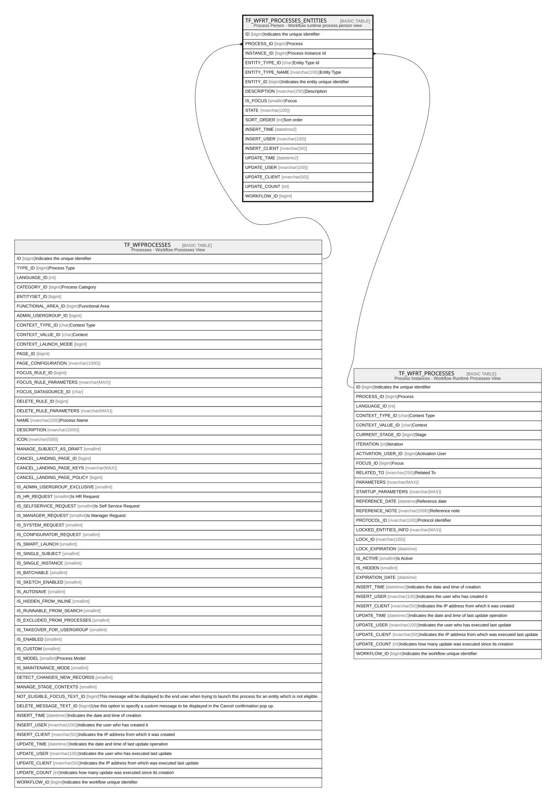

# TF_WFRT_PROCESSES_ENTITIES

## Description

Process Person - Workflow runtime process person view  

## Columns

| Name | Type | Default | Nullable | Parents | Comment |
| ---- | ---- | ------- | -------- | ------- | ------- |
| ID | bigint |  | false |  | Indicates the unique identifier |
| PROCESS_ID | bigint |  | false | [TF_WFPROCESSES](TF_WFPROCESSES.md) | Process |
| INSTANCE_ID | bigint |  | false | [TF_WFRT_PROCESSES](TF_WFRT_PROCESSES.md) | Process Instance Id |
| ENTITY_TYPE_ID | char |  | false |  | Entity Type Id |
| ENTITY_TYPE_NAME | nvarchar(100) |  | false |  | Entity Type |
| ENTITY_ID | bigint |  | false |  | Indicates the entity unique identifier |
| DESCRIPTION | nvarchar(250) |  | true |  | Description |
| IS_FOCUS | smallint | ((0)) | false |  | Focus |
| STATE | nvarchar(100) | (N'None') | false |  |  |
| SORT_ORDER | int | ((0)) | false |  | Sort order |
| INSERT_TIME | datetime2 | (sysutcdatetime()) | false |  |  |
| INSERT_USER | nvarchar(100) | (N'MAIN') | false |  |  |
| INSERT_CLIENT | nvarchar(50) | (N'localhost') | false |  |  |
| UPDATE_TIME | datetime2 | (sysutcdatetime()) | false |  |  |
| UPDATE_USER | nvarchar(100) | (N'MAIN') | false |  |  |
| UPDATE_CLIENT | nvarchar(50) | (N'localhost') | false |  |  |
| UPDATE_COUNT | int | ((0)) | false |  |  |
| WORKFLOW_ID | bigint |  | true |  |  |

## Constraints

| Name | Type | Definition |
| ---- | ---- | ---------- |
| PK_WFRT_PROCESSES_ENTITIES | PRIMARY KEY | CLUSTERED, unique, part of a PRIMARY KEY constraint, [ ID ] |
| UQ_WFRT_PROCESSES_ENTITIES | UNIQUE | NONCLUSTERED, unique, part of a UNIQUE constraint, [ INSTANCE_ID, ENTITY_TYPE_ID, ENTITY_ID ] |
| FK_WFRT_PE_PROCESSES | FOREIGN KEY | FOREIGN KEY(PROCESS_ID) REFERENCES TF_WFPROCESSES(ID) ON UPDATE NO_ACTION ON DELETE NO_ACTION |
| FK_WFRT_PE_RTPROCESSES | FOREIGN KEY | FOREIGN KEY(INSTANCE_ID) REFERENCES TF_WFRT_PROCESSES(ID) ON UPDATE NO_ACTION ON DELETE CASCADE |

## Indexes

| Name | Definition |
| ---- | ---------- |
| PK_WFRT_PROCESSES_ENTITIES | CLUSTERED, unique, part of a PRIMARY KEY constraint, [ ID ] |
| UQ_WFRT_PROCESSES_ENTITIES | NONCLUSTERED, unique, part of a UNIQUE constraint, [ INSTANCE_ID, ENTITY_TYPE_ID, ENTITY_ID ] |
| IDX_WFRT_PROC_ENTI_INSTANCE_ID | NONCLUSTERED, [ INSTANCE_ID ] |

## Relations

---

> Generated by [tbls](https://github.com/k1LoW/tbls)
