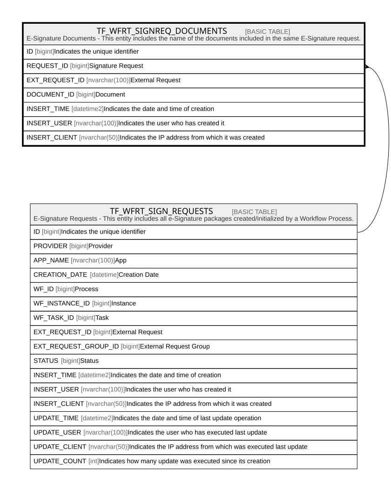

# TF_WFRT_SIGNREQ_DOCUMENTS

## Description

E-Signature Documents - This entity includes the name of the documents included in the same E-Signature request.  

## Columns

| Name | Type | Default | Nullable | Parents | Comment |
| ---- | ---- | ------- | -------- | ------- | ------- |
| ID | bigint |  | false |  | Indicates the unique identifier |
| REQUEST_ID | bigint |  | false | [TF_WFRT_SIGN_REQUESTS](TF_WFRT_SIGN_REQUESTS.md) | Signature Request |
| EXT_REQUEST_ID | nvarchar(100) |  | false |  | External Request |
| DOCUMENT_ID | bigint |  | false |  | Document |
| INSERT_TIME | datetime2 | (sysutcdatetime()) | false |  | Indicates the date and time of creation |
| INSERT_USER | nvarchar(100) | (N'MAIN') | false |  | Indicates the user who has created it |
| INSERT_CLIENT | nvarchar(50) | (N'localhost') | false |  | Indicates the IP address from which it was created |

## Constraints

| Name | Type | Definition |
| ---- | ---- | ---------- |
| PK_WFRT_SIGNREQ_DOCUMENTS | PRIMARY KEY | CLUSTERED, unique, part of a PRIMARY KEY constraint, [ ID ] |
| FK_SIGNREQ_DOCUMENTS_REQ | FOREIGN KEY | FOREIGN KEY(REQUEST_ID) REFERENCES TF_WFRT_SIGN_REQUESTS(ID) ON UPDATE NO_ACTION ON DELETE CASCADE |

## Indexes

| Name | Definition |
| ---- | ---------- |
| PK_WFRT_SIGNREQ_DOCUMENTS | CLUSTERED, unique, part of a PRIMARY KEY constraint, [ ID ] |

## Relations

---

> Generated by [tbls](https://github.com/k1LoW/tbls)
