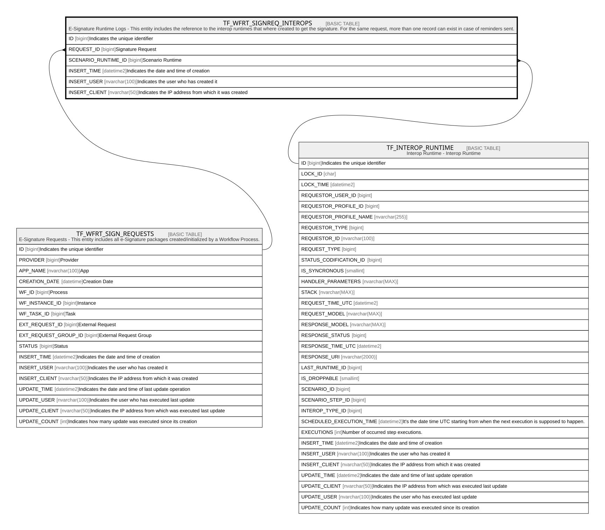

# TF_WFRT_SIGNREQ_INTEROPS

## Description

E-Signature Runtime Logs - This entity includes the reference to the interop runtimes that where created to get the signature. For the same request, more than one record can exist in case of reminders sent.  

## Columns

| Name | Type | Default | Nullable | Parents | Comment |
| ---- | ---- | ------- | -------- | ------- | ------- |
| ID | bigint |  | false |  | Indicates the unique identifier |
| REQUEST_ID | bigint |  | false | [TF_WFRT_SIGN_REQUESTS](TF_WFRT_SIGN_REQUESTS.md) | Signature Request |
| SCENARIO_RUNTIME_ID | bigint |  | false | [TF_INTEROP_RUNTIME](TF_INTEROP_RUNTIME.md) | Scenario Runtime |
| INSERT_TIME | datetime2 | (sysutcdatetime()) | false |  | Indicates the date and time of creation |
| INSERT_USER | nvarchar(100) | (N'MAIN') | false |  | Indicates the user who has created it |
| INSERT_CLIENT | nvarchar(50) | (N'localhost') | false |  | Indicates the IP address from which it was created |

## Constraints

| Name | Type | Definition |
| ---- | ---- | ---------- |
| PK_WFRT_SIGNREQ_INTEROPS | PRIMARY KEY | CLUSTERED, unique, part of a PRIMARY KEY constraint, [ ID ] |
| UQ_WFRT_SIGNREQ_INTEROPS | UNIQUE | NONCLUSTERED, unique, part of a UNIQUE constraint, [ REQUEST_ID, SCENARIO_RUNTIME_ID ] |
| FK_SIGNREQ_INTEROPS_REQ | FOREIGN KEY | FOREIGN KEY(REQUEST_ID) REFERENCES TF_WFRT_SIGN_REQUESTS(ID) ON UPDATE NO_ACTION ON DELETE CASCADE |
| FK_SIGNREQINTEROPS_INTOP | FOREIGN KEY | FOREIGN KEY(SCENARIO_RUNTIME_ID) REFERENCES TF_INTEROP_RUNTIME(ID) ON UPDATE NO_ACTION ON DELETE CASCADE |

## Indexes

| Name | Definition |
| ---- | ---------- |
| PK_WFRT_SIGNREQ_INTEROPS | CLUSTERED, unique, part of a PRIMARY KEY constraint, [ ID ] |
| UQ_WFRT_SIGNREQ_INTEROPS | NONCLUSTERED, unique, part of a UNIQUE constraint, [ REQUEST_ID, SCENARIO_RUNTIME_ID ] |

## Relations

---

> Generated by [tbls](https://github.com/k1LoW/tbls)
