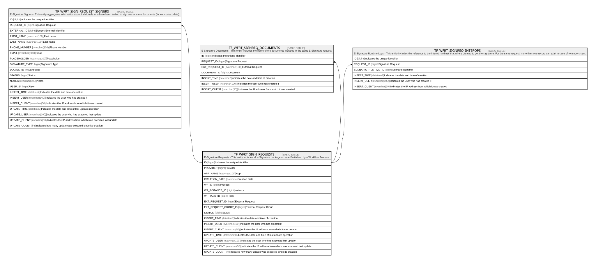

# TF_WFRT_SIGN_REQUESTS

## Description

E-Signature Requests - This entity includes all e-Signature packages created/initialized by a Workflow Process.  

## Columns

| Name | Type | Default | Nullable | Children | Comment |
| ---- | ---- | ------- | -------- | -------- | ------- |
| ID | bigint |  | false | [TF_WFRT_SIGN_REQUEST_SIGNERS](TF_WFRT_SIGN_REQUEST_SIGNERS.md) [TF_WFRT_SIGNREQ_DOCUMENTS](TF_WFRT_SIGNREQ_DOCUMENTS.md) [TF_WFRT_SIGNREQ_INTEROPS](TF_WFRT_SIGNREQ_INTEROPS.md) | Indicates the unique identifier |
| PROVIDER | bigint |  | false |  | Provider |
| APP_NAME | nvarchar(100) |  | false |  | App |
| CREATION_DATE | datetime |  | false |  | Creation Date |
| WF_ID | bigint |  | false |  | Process |
| WF_INSTANCE_ID | bigint |  | false |  | Instance |
| WF_TASK_ID | bigint |  | false |  | Task |
| EXT_REQUEST_ID | bigint |  | false |  | External Request |
| EXT_REQUEST_GROUP_ID | bigint |  | true |  | External Request Group |
| STATUS | bigint | ((0)) | false |  | Status |
| INSERT_TIME | datetime2 | (sysutcdatetime()) | false |  | Indicates the date and time of creation |
| INSERT_USER | nvarchar(100) | (N'MAIN') | false |  | Indicates the user who has created it |
| INSERT_CLIENT | nvarchar(50) | (N'localhost') | false |  | Indicates the IP address from which it was created |
| UPDATE_TIME | datetime2 | (sysutcdatetime()) | false |  | Indicates the date and time of last update operation |
| UPDATE_USER | nvarchar(100) | (N'MAIN') | false |  | Indicates the user who has executed last update |
| UPDATE_CLIENT | nvarchar(50) | (N'localhost') | false |  | Indicates the IP address from which was executed last update |
| UPDATE_COUNT | int | ((0)) | false |  | Indicates how many update was executed since its creation |

## Constraints

| Name | Type | Definition |
| ---- | ---- | ---------- |
| PK_WFRT_SIGN_REQUESTS | PRIMARY KEY | CLUSTERED, unique, part of a PRIMARY KEY constraint, [ ID ] |

## Indexes

| Name | Definition |
| ---- | ---------- |
| PK_WFRT_SIGN_REQUESTS | CLUSTERED, unique, part of a PRIMARY KEY constraint, [ ID ] |

## Relations

---

> Generated by [tbls](https://github.com/k1LoW/tbls)
