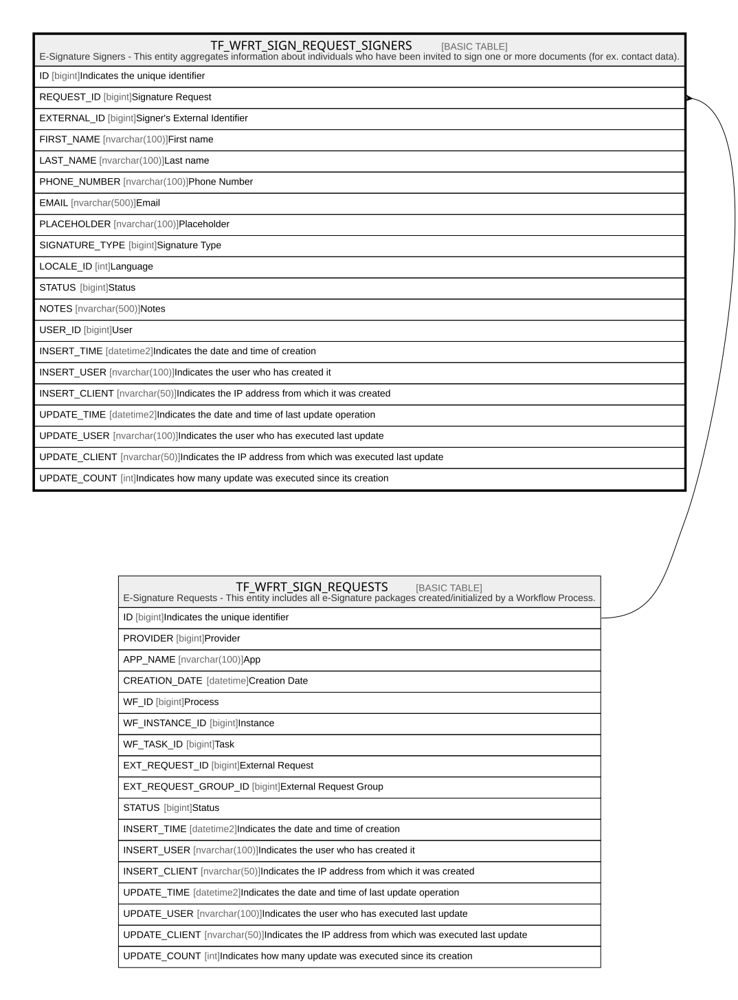

# TF_WFRT_SIGN_REQUEST_SIGNERS

## Description

E-Signature Signers - This entity aggregates information about individuals who have been invited to sign one or more documents (for ex. contact data).  

## Columns

| Name | Type | Default | Nullable | Parents | Comment |
| ---- | ---- | ------- | -------- | ------- | ------- |
| ID | bigint |  | false |  | Indicates the unique identifier |
| REQUEST_ID | bigint |  | false | [TF_WFRT_SIGN_REQUESTS](TF_WFRT_SIGN_REQUESTS.md) | Signature Request |
| EXTERNAL_ID | bigint |  | true |  | Signer's External Identifier |
| FIRST_NAME | nvarchar(100) |  | false |  | First name |
| LAST_NAME | nvarchar(100) |  | false |  | Last name |
| PHONE_NUMBER | nvarchar(100) |  | false |  | Phone Number |
| EMAIL | nvarchar(500) |  | false |  | Email |
| PLACEHOLDER | nvarchar(100) |  | true |  | Placeholder |
| SIGNATURE_TYPE | bigint | ((0)) | false |  | Signature Type |
| LOCALE_ID | int |  | true |  | Language |
| STATUS | bigint | ((0)) | false |  | Status |
| NOTES | nvarchar(500) |  | true |  | Notes |
| USER_ID | bigint |  | true |  | User |
| INSERT_TIME | datetime2 | (sysutcdatetime()) | false |  | Indicates the date and time of creation |
| INSERT_USER | nvarchar(100) | (N'MAIN') | false |  | Indicates the user who has created it |
| INSERT_CLIENT | nvarchar(50) | (N'localhost') | false |  | Indicates the IP address from which it was created |
| UPDATE_TIME | datetime2 | (sysutcdatetime()) | false |  | Indicates the date and time of last update operation |
| UPDATE_USER | nvarchar(100) | (N'MAIN') | false |  | Indicates the user who has executed last update |
| UPDATE_CLIENT | nvarchar(50) | (N'localhost') | false |  | Indicates the IP address from which was executed last update |
| UPDATE_COUNT | int | ((0)) | false |  | Indicates how many update was executed since its creation |

## Constraints

| Name | Type | Definition |
| ---- | ---- | ---------- |
| PK_WFRT_SIGN_REQUEST_SIGNERS | PRIMARY KEY | CLUSTERED, unique, part of a PRIMARY KEY constraint, [ ID ] |
| UQ_WFRT_SIGN_REQUEST_SIGNERS | UNIQUE | NONCLUSTERED, unique, part of a UNIQUE constraint, [ REQUEST_ID, EXTERNAL_ID ] |
| FK_WFRTSIGN_REQSIGNERS_REQ | FOREIGN KEY | FOREIGN KEY(REQUEST_ID) REFERENCES TF_WFRT_SIGN_REQUESTS(ID) ON UPDATE NO_ACTION ON DELETE CASCADE |

## Indexes

| Name | Definition |
| ---- | ---------- |
| PK_WFRT_SIGN_REQUEST_SIGNERS | CLUSTERED, unique, part of a PRIMARY KEY constraint, [ ID ] |
| UQ_WFRT_SIGN_REQUEST_SIGNERS | NONCLUSTERED, unique, part of a UNIQUE constraint, [ REQUEST_ID, EXTERNAL_ID ] |

## Relations

---

> Generated by [tbls](https://github.com/k1LoW/tbls)
