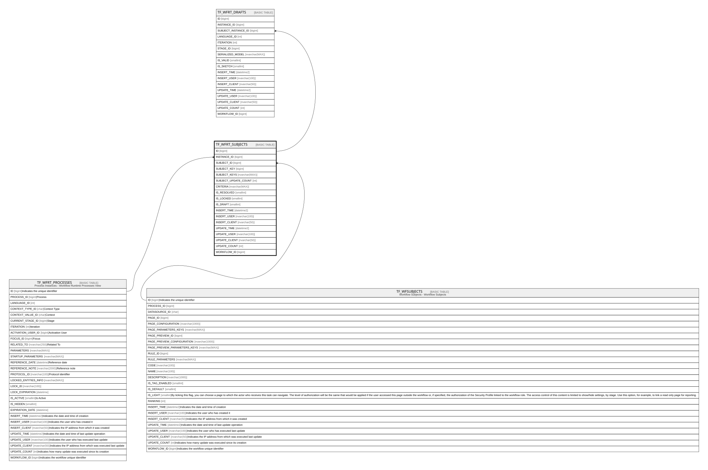

# TF_WFRT_SUBJECTS

## Columns

| Name | Type | Default | Nullable | Children | Parents | Comment |
| ---- | ---- | ------- | -------- | -------- | ------- | ------- |
| ID | bigint |  | false | [TF_WFRT_DRAFTS](TF_WFRT_DRAFTS.md) |  |  |
| INSTANCE_ID | bigint |  | false |  | [TF_WFRT_PROCESSES](TF_WFRT_PROCESSES.md) |  |
| SUBJECT_ID | bigint |  | false |  | [TF_WFSUBJECTS](TF_WFSUBJECTS.md) |  |
| SUBJECT_KEY | bigint |  | true |  |  |  |
| SUBJECT_KEYS | nvarchar(MAX) |  | true |  |  |  |
| SUBJECT_UPDATE_COUNT | int | ((0)) | false |  |  |  |
| CRITERIA | nvarchar(MAX) |  | true |  |  |  |
| IS_RESOLVED | smallint |  | false |  |  |  |
| IS_LOCKED | smallint |  | false |  |  |  |
| IS_DRAFT | smallint |  | false |  |  |  |
| INSERT_TIME | datetime2 | (sysutcdatetime()) | false |  |  |  |
| INSERT_USER | nvarchar(100) | (N'MAIN') | false |  |  |  |
| INSERT_CLIENT | nvarchar(50) | (N'localhost') | false |  |  |  |
| UPDATE_TIME | datetime2 | (sysutcdatetime()) | false |  |  |  |
| UPDATE_USER | nvarchar(100) | (N'MAIN') | false |  |  |  |
| UPDATE_CLIENT | nvarchar(50) | (N'localhost') | false |  |  |  |
| UPDATE_COUNT | int | ((0)) | false |  |  |  |
| WORKFLOW_ID | bigint |  | true |  |  |  |

## Constraints

| Name | Type | Definition |
| ---- | ---- | ---------- |
| PK_WFRT_SUBJECTS | PRIMARY KEY | CLUSTERED, unique, part of a PRIMARY KEY constraint, [ ID ] |
| UQ_WFRT_SUBJECTS | UNIQUE | NONCLUSTERED, unique, part of a UNIQUE constraint, [ INSTANCE_ID, SUBJECT_ID ] |
| FK_WFRT_SUBJECTS_RTPROCESS | FOREIGN KEY | FOREIGN KEY(INSTANCE_ID) REFERENCES TF_WFRT_PROCESSES(ID) ON UPDATE NO_ACTION ON DELETE CASCADE |
| FK_WFRT_SUBJECTS_SUBJECT | FOREIGN KEY | FOREIGN KEY(SUBJECT_ID) REFERENCES TF_WFSUBJECTS(ID) ON UPDATE NO_ACTION ON DELETE CASCADE |

## Indexes

| Name | Definition |
| ---- | ---------- |
| PK_WFRT_SUBJECTS | CLUSTERED, unique, part of a PRIMARY KEY constraint, [ ID ] |
| UQ_WFRT_SUBJECTS | NONCLUSTERED, unique, part of a UNIQUE constraint, [ INSTANCE_ID, SUBJECT_ID ] |
| IDX_WFRT_SUBJECTS_INSTANCE_ID | NONCLUSTERED, [ INSTANCE_ID ] |

## Relations

---

> Generated by [tbls](https://github.com/k1LoW/tbls)
