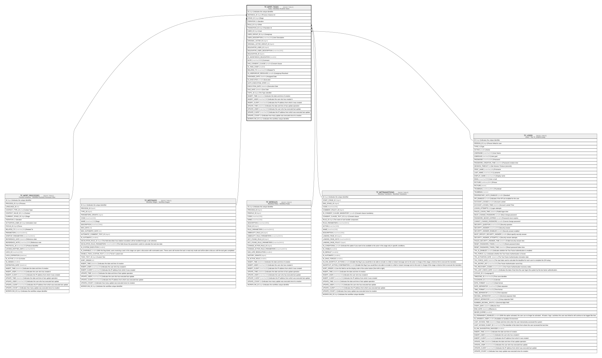

# TF_WFRT_TASKS

## Description

Tasks - Workflow Runtime Tasks  

## Columns

| Name | Type | Default | Nullable | Parents | Comment |
| ---- | ---- | ------- | -------- | ------- | ------- |
| ID | bigint |  | false |  | Indicates the unique identifier |
| INSTANCE_ID | bigint |  | false | [TF_WFRT_PROCESSES](TF_WFRT_PROCESSES.md) | Process Instance Id |
| STAGE_ID | bigint |  | false | [TF_WFSTAGES](TF_WFSTAGES.md) | Stage |
| ITERATION | int | ((0)) | false |  | Iteration |
| ROLE_ID | bigint |  | true | [TF_WFROLES](TF_WFROLES.md) | Role |
| TRANSITION_ID | bigint |  | true | [TF_WFTRANSITIONS](TF_WFTRANSITIONS.md) | Transition Id |
| USER_ID | bigint |  | true | [TF_USERS](TF_USERS.md) | User |
| USER_GROUP_ID | bigint |  | true |  | Usergroup |
| USER_DESCRIPTION | nvarchar(200) |  | true |  | User Description |
| ORIGINAL_ACTOR_ID | bigint |  | true |  |  |
| ORIGINAL_ACTOR_GROUP_ID | bigint |  | true |  |  |
| DELEGATOR_USER_ID | bigint |  | true |  |  |
| DELEGATOR_USER_DESCRIPTION | nvarchar(200) |  | true |  |  |
| DELEGATION_ID | bigint |  | true |  |  |
| IS_ANONYMOUS_DELEGATION | smallint | ((0)) | false |  |  |
| NOTE | nvarchar(2000) |  | true |  | Comment |
| HAS_CONSENT_CLAUSE | smallint | ((0)) | false |  | Consent clause |
| IS_TAKE_OVER | smallint | ((0)) | false |  |  |
| RELATED_TO | nvarchar(250) |  | false |  | Related To |
| IS_USERGROUP_RESOLVED | smallint |  | false |  | Usergroup Resolved |
| ASSIGNED_DATE | datetime |  | false |  | Assigned Date |
| IS_EXECUTED | smallint |  | false |  | Executed |
| AUTO_EXECUTION_STATE | int | ((0)) | false |  |  |
| EXECUTION_DATE | datetime |  | true |  | Execution Date |
| DUE_DATE | datetime |  | true |  | Due Date |
| TOPIC_ID | bigint |  | true |  | The Topic identifier |
| INSERT_TIME | datetime2 | (sysutcdatetime()) | false |  | Indicates the date and time of creation |
| INSERT_USER | nvarchar(100) | (N'MAIN') | false |  | Indicates the user who has created it |
| INSERT_CLIENT | nvarchar(50) | (N'localhost') | false |  | Indicates the IP address from which it was created |
| UPDATE_TIME | datetime2 | (sysutcdatetime()) | false |  | Indicates the date and time of last update operation |
| UPDATE_USER | nvarchar(100) | (N'MAIN') | false |  | Indicates the user who has executed last update |
| UPDATE_CLIENT | nvarchar(50) | (N'localhost') | false |  | Indicates the IP address from which was executed last update |
| UPDATE_COUNT | int | ((0)) | false |  | Indicates how many update was executed since its creation |
| WORKFLOW_ID | bigint |  | true |  | Indicates the workflow unique identifier |

## Constraints

| Name | Type | Definition |
| ---- | ---- | ---------- |
| PK_WFRT_TASKS | PRIMARY KEY | CLUSTERED, unique, part of a PRIMARY KEY constraint, [ ID ] |
| UQ_WFRT_TASKS | UNIQUE | NONCLUSTERED, unique, part of a UNIQUE constraint, [ INSTANCE_ID, STAGE_ID, ITERATION, ROLE_ID ] |
| FK_WFRT_TASKS_INSTANCES | FOREIGN KEY | FOREIGN KEY(INSTANCE_ID) REFERENCES TF_WFRT_PROCESSES(ID) ON UPDATE NO_ACTION ON DELETE CASCADE |
| FK_WFRT_TASKS_ROLES | FOREIGN KEY | FOREIGN KEY(ROLE_ID) REFERENCES TF_WFROLES(ID) ON UPDATE NO_ACTION ON DELETE NO_ACTION |
| FK_WFRT_TASKS_STAGES | FOREIGN KEY | FOREIGN KEY(STAGE_ID) REFERENCES TF_WFSTAGES(ID) ON UPDATE NO_ACTION ON DELETE NO_ACTION |
| FK_WFRT_TASKS_TRANSITIONS | FOREIGN KEY | FOREIGN KEY(TRANSITION_ID) REFERENCES TF_WFTRANSITIONS(ID) ON UPDATE NO_ACTION ON DELETE NO_ACTION |
| FK_WFRT_TASKS_USERS | FOREIGN KEY | FOREIGN KEY(USER_ID) REFERENCES TF_USERS(ID) ON UPDATE NO_ACTION ON DELETE NO_ACTION |

## Indexes

| Name | Definition |
| ---- | ---------- |
| PK_WFRT_TASKS | CLUSTERED, unique, part of a PRIMARY KEY constraint, [ ID ] |
| UQ_WFRT_TASKS | NONCLUSTERED, unique, part of a UNIQUE constraint, [ INSTANCE_ID, STAGE_ID, ITERATION, ROLE_ID ] |
| IDX_WFRTTASKS_DELEGATION | NONCLUSTERED, [ DELEGATION_ID, IS_EXECUTED ] |
| IDX_TF_WFRT_TASKS_INSTANCE_ID | NONCLUSTERED, [ INSTANCE_ID ] |
| IDX_TASKS_STAGE_USER_EXECUTED | NONCLUSTERED, [ INSTANCE_ID, RELATED_TO, STAGE_ID, USER_ID, IS_EXECUTED ] |
| IDX_TASKS_USER_EXECUTED | NONCLUSTERED, [ INSTANCE_ID, STAGE_ID, USER_ID, IS_EXECUTED ] |
| IDX_TASKS_USERGROUP_EXECUTED | NONCLUSTERED, [ INSTANCE_ID, STAGE_ID, USER_GROUP_ID, IS_EXECUTED ] |

## Relations

---

> Generated by [tbls](https://github.com/k1LoW/tbls)
