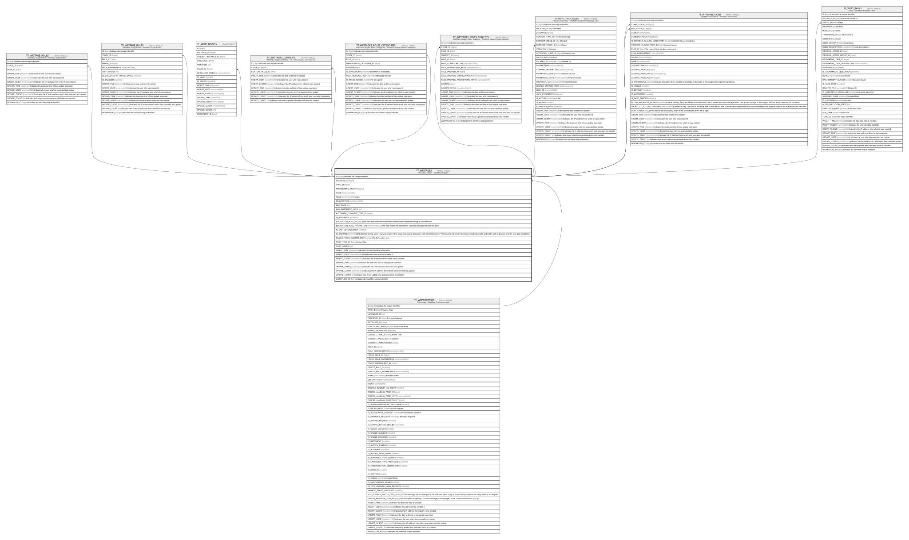

# TF_WFSTAGES

## Description

Workflow Stages - Workflow Stages  

## Columns

| Name | Type | Default | Nullable | Children | Parents | Comment |
| ---- | ---- | ------- | -------- | -------- | ------- | ------- |
| ID | bigint |  | false | [TF_WFSTAGE_ROLES](TF_WFSTAGE_ROLES.md) [TF_WFSTAGE_RULES](TF_WFSTAGE_RULES.md) [TF_WFRT_DRAFTS](TF_WFRT_DRAFTS.md) [TF_WFSTAGES_CONTEXTS](TF_WFSTAGES_CONTEXTS.md) [TF_WFSTAGES_ROLES_CATEGORIES](TF_WFSTAGES_ROLES_CATEGORIES.md) [TF_WFSTAGES_ROLES_SUBJECTS](TF_WFSTAGES_ROLES_SUBJECTS.md) [TF_WFRT_PROCESSES](TF_WFRT_PROCESSES.md) [TF_WFTRANSITIONS](TF_WFTRANSITIONS.md) [TF_WFRT_TASKS](TF_WFRT_TASKS.md) |  | Indicates the unique identifier |
| PROCESS_ID | bigint |  | true |  | [TF_WFPROCESSES](TF_WFPROCESSES.md) |  |
| TYPE_ID | bigint | ((0)) | false |  |  |  |
| PARAMETERS_GRANTS | bigint | ((0)) | false |  |  |  |
| CODE | nvarchar(100) |  | false |  |  |  |
| NAME | nvarchar(100) |  | false |  |  | Stage |
| DESCRIPTION | nvarchar(1000) |  | true |  |  |  |
| MAX_DAYS | int |  | true |  |  |  |
| MAX_AUTOMATIC_DAYS | int | ((0)) | false |  |  |  |
| AUTOMATIC_COMMENT_TEXT_ID | bigint | ((8415)) | false |  |  |  |
| IS_AUTOMATIC | smallint | ((0)) | false |  |  |  |
| ESCALATION_RULE_ID | bigint |  | true |  |  | This field describes how stadium escalation will be handled through a rule selection. |
| ESCALATION_RULE_PARAMETERS | nvarchar(MAX) |  | true |  |  | This field shows the parameters useful to calculate the task due date. |
| IS_SYSTEM_EXECUTION | smallint | ((0)) | false |  |  |  |
| IS_SHARABLE | smallint | ((0)) | false |  |  | With this flag ticked, users receiving a task in this stage can open a discussion with nominated users. These users will receive the task in read only mode and will be able to discuss until the task gets completed. |
| ENABLE_TODO_CUSTOM_TEXT | smallint | ((0)) | false |  |  | “To-Do” custom text |
| TODO_TEXT_ID | bigint |  | true |  |  | Custom Text |
| SORT_ORDER | int | ((0)) | false |  |  |  |
| INSERT_TIME | datetime2 | (sysutcdatetime()) | false |  |  | Indicates the date and time of creation |
| INSERT_USER | nvarchar(100) | (N'MAIN') | false |  |  | Indicates the user who has created it |
| INSERT_CLIENT | nvarchar(50) | (N'localhost') | false |  |  | Indicates the IP address from which it was created |
| UPDATE_TIME | datetime2 | (sysutcdatetime()) | false |  |  | Indicates the date and time of last update operation |
| UPDATE_USER | nvarchar(100) | (N'MAIN') | false |  |  | Indicates the user who has executed last update |
| UPDATE_CLIENT | nvarchar(50) | (N'localhost') | false |  |  | Indicates the IP address from which was executed last update |
| UPDATE_COUNT | int | ((0)) | false |  |  | Indicates how many update was executed since its creation |
| WORKFLOW_ID | bigint |  | true |  |  | Indicates the workflow unique identifier |

## Constraints

| Name | Type | Definition |
| ---- | ---- | ---------- |
| PK_WFSTAGES | PRIMARY KEY | CLUSTERED, unique, part of a PRIMARY KEY constraint, [ ID ] |
| UQ_WFSTAGES | UNIQUE | NONCLUSTERED, unique, part of a UNIQUE constraint, [ PROCESS_ID, CODE ] |
| FK_WFSTAGES_PROCESSES | FOREIGN KEY | FOREIGN KEY(PROCESS_ID) REFERENCES TF_WFPROCESSES(ID) ON UPDATE NO_ACTION ON DELETE CASCADE |

## Indexes

| Name | Definition |
| ---- | ---------- |
| PK_WFSTAGES | CLUSTERED, unique, part of a PRIMARY KEY constraint, [ ID ] |
| UQ_WFSTAGES | NONCLUSTERED, unique, part of a UNIQUE constraint, [ PROCESS_ID, CODE ] |

## Relations

---

> Generated by [tbls](https://github.com/k1LoW/tbls)
