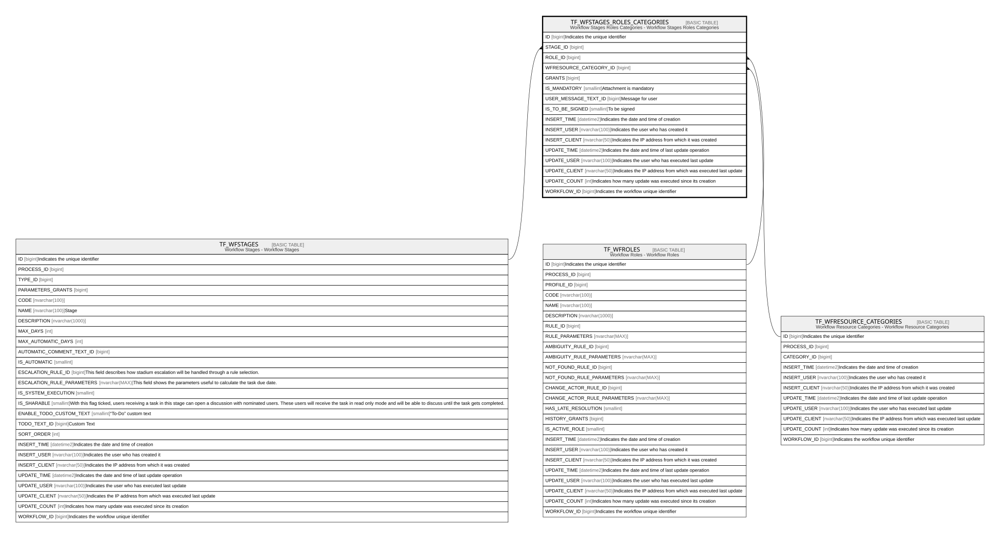

# TF_WFSTAGES_ROLES_CATEGORIES

## Description

Workflow Stages Roles Categories - Workflow Stages Roles Categories  

## Columns

| Name | Type | Default | Nullable | Parents | Comment |
| ---- | ---- | ------- | -------- | ------- | ------- |
| ID | bigint |  | false |  | Indicates the unique identifier |
| STAGE_ID | bigint |  | false | [TF_WFSTAGES](TF_WFSTAGES.md) |  |
| ROLE_ID | bigint |  | false | [TF_WFROLES](TF_WFROLES.md) |  |
| WFRESOURCE_CATEGORY_ID | bigint |  | false | [TF_WFRESOURCE_CATEGORIES](TF_WFRESOURCE_CATEGORIES.md) |  |
| GRANTS | bigint |  | false |  |  |
| IS_MANDATORY | smallint |  | true |  | Attachment is mandatory |
| USER_MESSAGE_TEXT_ID | bigint |  | true |  | Message for user |
| IS_TO_BE_SIGNED | smallint |  | true |  | To be signed |
| INSERT_TIME | datetime2 | (sysutcdatetime()) | false |  | Indicates the date and time of creation |
| INSERT_USER | nvarchar(100) | (N'MAIN') | false |  | Indicates the user who has created it |
| INSERT_CLIENT | nvarchar(50) | (N'localhost') | false |  | Indicates the IP address from which it was created |
| UPDATE_TIME | datetime2 | (sysutcdatetime()) | false |  | Indicates the date and time of last update operation |
| UPDATE_USER | nvarchar(100) | (N'MAIN') | false |  | Indicates the user who has executed last update |
| UPDATE_CLIENT | nvarchar(50) | (N'localhost') | false |  | Indicates the IP address from which was executed last update |
| UPDATE_COUNT | int | ((0)) | false |  | Indicates how many update was executed since its creation |
| WORKFLOW_ID | bigint |  | true |  | Indicates the workflow unique identifier |

## Constraints

| Name | Type | Definition |
| ---- | ---- | ---------- |
| PK_WFSTAGES_ROLES_CATEGORIES | PRIMARY KEY | CLUSTERED, unique, part of a PRIMARY KEY constraint, [ ID ] |
| UQ_WFSTAGES_ROLES_CATEGORIES | UNIQUE | NONCLUSTERED, unique, part of a UNIQUE constraint, [ STAGE_ID, ROLE_ID, WFRESOURCE_CATEGORY_ID ] |
| FK_WFSRC_CATEGORIES | FOREIGN KEY | FOREIGN KEY(WFRESOURCE_CATEGORY_ID) REFERENCES TF_WFRESOURCE_CATEGORIES(ID) ON UPDATE NO_ACTION ON DELETE NO_ACTION |
| FK_WFSRC_ROLES | FOREIGN KEY | FOREIGN KEY(ROLE_ID) REFERENCES TF_WFROLES(ID) ON UPDATE NO_ACTION ON DELETE NO_ACTION |
| FK_WFSRC_STAGES | FOREIGN KEY | FOREIGN KEY(STAGE_ID) REFERENCES TF_WFSTAGES(ID) ON UPDATE NO_ACTION ON DELETE CASCADE |

## Indexes

| Name | Definition |
| ---- | ---------- |
| PK_WFSTAGES_ROLES_CATEGORIES | CLUSTERED, unique, part of a PRIMARY KEY constraint, [ ID ] |
| UQ_WFSTAGES_ROLES_CATEGORIES | NONCLUSTERED, unique, part of a UNIQUE constraint, [ STAGE_ID, ROLE_ID, WFRESOURCE_CATEGORY_ID ] |

## Relations

---

> Generated by [tbls](https://github.com/k1LoW/tbls)
