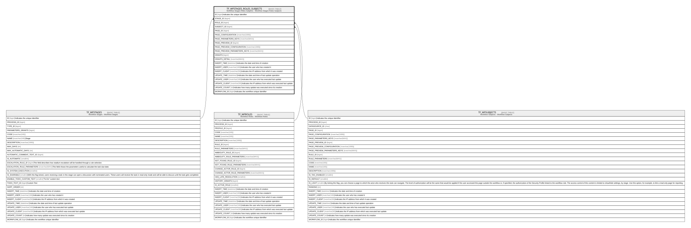

# TF_WFSTAGES_ROLES_SUBJECTS

## Description

Workflow Stages Roles Subjects - Workflow Stages Roles Subjects  

## Columns

| Name | Type | Default | Nullable | Parents | Comment |
| ---- | ---- | ------- | -------- | ------- | ------- |
| ID | bigint |  | false |  | Indicates the unique identifier |
| STAGE_ID | bigint |  | false | [TF_WFSTAGES](TF_WFSTAGES.md) |  |
| ROLE_ID | bigint |  | false | [TF_WFROLES](TF_WFROLES.md) |  |
| SUBJECT_ID | bigint |  | false | [TF_WFSUBJECTS](TF_WFSUBJECTS.md) |  |
| PAGE_ID | bigint |  | true |  |  |
| PAGE_CONFIGURATION | nvarchar(1000) |  | true |  |  |
| PAGE_PARAMETERS_KEYS | nvarchar(MAX) |  | true |  |  |
| PAGE_PREVIEW_ID | bigint |  | true |  |  |
| PAGE_PREVIEW_CONFIGURATION | nvarchar(1000) |  | true |  |  |
| PAGE_PREVIEW_PARAMETERS_KEYS | nvarchar(MAX) |  | true |  |  |
| GRANTS | bigint |  | false |  |  |
| GRANTS_DETAIL | nvarchar(MAX) |  | true |  |  |
| INSERT_TIME | datetime2 | (sysutcdatetime()) | false |  | Indicates the date and time of creation |
| INSERT_USER | nvarchar(100) | (N'MAIN') | false |  | Indicates the user who has created it |
| INSERT_CLIENT | nvarchar(50) | (N'localhost') | false |  | Indicates the IP address from which it was created |
| UPDATE_TIME | datetime2 | (sysutcdatetime()) | false |  | Indicates the date and time of last update operation |
| UPDATE_USER | nvarchar(100) | (N'MAIN') | false |  | Indicates the user who has executed last update |
| UPDATE_CLIENT | nvarchar(50) | (N'localhost') | false |  | Indicates the IP address from which was executed last update |
| UPDATE_COUNT | int | ((0)) | false |  | Indicates how many update was executed since its creation |
| WORKFLOW_ID | bigint |  | true |  | Indicates the workflow unique identifier |

## Constraints

| Name | Type | Definition |
| ---- | ---- | ---------- |
| PK_WFSTAGES_ROLES_SUBJECTS | PRIMARY KEY | CLUSTERED, unique, part of a PRIMARY KEY constraint, [ ID ] |
| UQ_WFSTAGES_ROLES_SUBJECTS | UNIQUE | NONCLUSTERED, unique, part of a UNIQUE constraint, [ STAGE_ID, ROLE_ID, SUBJECT_ID ] |
| FK_WFSRS_ROLES | FOREIGN KEY | FOREIGN KEY(ROLE_ID) REFERENCES TF_WFROLES(ID) ON UPDATE NO_ACTION ON DELETE NO_ACTION |
| FK_WFSRS_STAGES | FOREIGN KEY | FOREIGN KEY(STAGE_ID) REFERENCES TF_WFSTAGES(ID) ON UPDATE NO_ACTION ON DELETE CASCADE |
| FK_WFSRS_SUBJECTS | FOREIGN KEY | FOREIGN KEY(SUBJECT_ID) REFERENCES TF_WFSUBJECTS(ID) ON UPDATE NO_ACTION ON DELETE NO_ACTION |

## Indexes

| Name | Definition |
| ---- | ---------- |
| PK_WFSTAGES_ROLES_SUBJECTS | CLUSTERED, unique, part of a PRIMARY KEY constraint, [ ID ] |
| UQ_WFSTAGES_ROLES_SUBJECTS | NONCLUSTERED, unique, part of a UNIQUE constraint, [ STAGE_ID, ROLE_ID, SUBJECT_ID ] |

## Relations

---

> Generated by [tbls](https://github.com/k1LoW/tbls)
