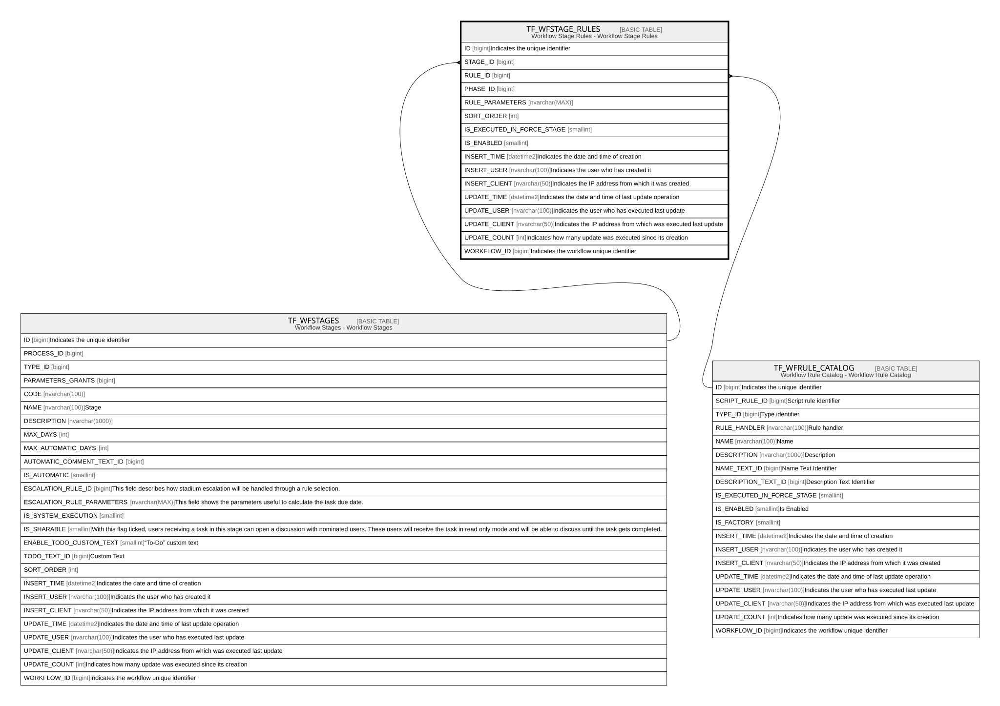

# TF_WFSTAGE_RULES

## Description

Workflow Stage Rules - Workflow Stage Rules  

## Columns

| Name | Type | Default | Nullable | Parents | Comment |
| ---- | ---- | ------- | -------- | ------- | ------- |
| ID | bigint |  | false |  | Indicates the unique identifier |
| STAGE_ID | bigint |  | false | [TF_WFSTAGES](TF_WFSTAGES.md) |  |
| RULE_ID | bigint |  | false | [TF_WFRULE_CATALOG](TF_WFRULE_CATALOG.md) |  |
| PHASE_ID | bigint | ((0)) | false |  |  |
| RULE_PARAMETERS | nvarchar(MAX) |  | true |  |  |
| SORT_ORDER | int | ((0)) | false |  |  |
| IS_EXECUTED_IN_FORCE_STAGE | smallint | ((0)) | false |  |  |
| IS_ENABLED | smallint | ((1)) | false |  |  |
| INSERT_TIME | datetime2 | (sysutcdatetime()) | false |  | Indicates the date and time of creation |
| INSERT_USER | nvarchar(100) | (N'MAIN') | false |  | Indicates the user who has created it |
| INSERT_CLIENT | nvarchar(50) | (N'localhost') | false |  | Indicates the IP address from which it was created |
| UPDATE_TIME | datetime2 | (sysutcdatetime()) | false |  | Indicates the date and time of last update operation |
| UPDATE_USER | nvarchar(100) | (N'MAIN') | false |  | Indicates the user who has executed last update |
| UPDATE_CLIENT | nvarchar(50) | (N'localhost') | false |  | Indicates the IP address from which was executed last update |
| UPDATE_COUNT | int | ((0)) | false |  | Indicates how many update was executed since its creation |
| WORKFLOW_ID | bigint |  | true |  | Indicates the workflow unique identifier |

## Constraints

| Name | Type | Definition |
| ---- | ---- | ---------- |
| PK_WFRULES | PRIMARY KEY | CLUSTERED, unique, part of a PRIMARY KEY constraint, [ ID ] |
| FK_WFSTAGE_RULES_RULES | FOREIGN KEY | FOREIGN KEY(RULE_ID) REFERENCES TF_WFRULE_CATALOG(ID) ON UPDATE NO_ACTION ON DELETE CASCADE |
| FK_WFSTAGE_RULES_STAGES | FOREIGN KEY | FOREIGN KEY(STAGE_ID) REFERENCES TF_WFSTAGES(ID) ON UPDATE NO_ACTION ON DELETE CASCADE |

## Indexes

| Name | Definition |
| ---- | ---------- |
| PK_WFRULES | CLUSTERED, unique, part of a PRIMARY KEY constraint, [ ID ] |
| IDX_STAGERULES_STAGEID | NONCLUSTERED, [ RULE_ID, PHASE_ID, RULE_PARAMETERS, SORT_ORDER, IS_ENABLED, IS_EXECUTED_IN_FORCE_STAGE, STAGE_ID ] |

## Relations

---

> Generated by [tbls](https://github.com/k1LoW/tbls)
