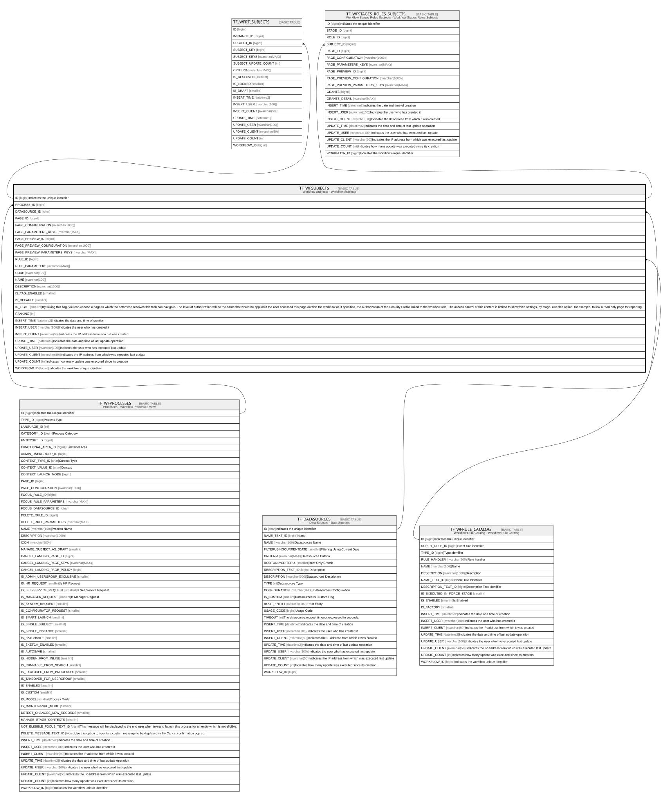

# TF_WFSUBJECTS

## Description

Workflow Subjects - Workflow Subjects  

## Columns

| Name | Type | Default | Nullable | Children | Parents | Comment |
| ---- | ---- | ------- | -------- | -------- | ------- | ------- |
| ID | bigint |  | false | [TF_WFRT_SUBJECTS](TF_WFRT_SUBJECTS.md) [TF_WFSTAGES_ROLES_SUBJECTS](TF_WFSTAGES_ROLES_SUBJECTS.md) |  | Indicates the unique identifier |
| PROCESS_ID | bigint |  | false |  | [TF_WFPROCESSES](TF_WFPROCESSES.md) |  |
| DATASOURCE_ID | char |  | false |  | [TF_DATASOURCES](TF_DATASOURCES.md) |  |
| PAGE_ID | bigint |  | true |  |  |  |
| PAGE_CONFIGURATION | nvarchar(1000) |  | true |  |  |  |
| PAGE_PARAMETERS_KEYS | nvarchar(MAX) |  | true |  |  |  |
| PAGE_PREVIEW_ID | bigint |  | true |  |  |  |
| PAGE_PREVIEW_CONFIGURATION | nvarchar(1000) |  | true |  |  |  |
| PAGE_PREVIEW_PARAMETERS_KEYS | nvarchar(MAX) |  | true |  |  |  |
| RULE_ID | bigint |  | false |  | [TF_WFRULE_CATALOG](TF_WFRULE_CATALOG.md) |  |
| RULE_PARAMETERS | nvarchar(MAX) |  | true |  |  |  |
| CODE | nvarchar(100) |  | false |  |  |  |
| NAME | nvarchar(100) |  | false |  |  |  |
| DESCRIPTION | nvarchar(1000) |  | true |  |  |  |
| IS_TAG_ENABLED | smallint | ((0)) | false |  |  |  |
| IS_DEFAULT | smallint | ((1)) | false |  |  |  |
| IS_LIGHT | smallint |  | true |  |  | By ticking this flag, you can choose a page to which the actor who receives this task can navigate. The level of authorization will be the same that would be applied if the user accessed this page outside the workflow or, if specified, the authorization of the Security Profile linked to the workflow role. The access control of this content is limited to show/hide settings, by stage. Use this option, for example, to link a read only page for reporting. |
| RANKING | int | ((0)) | false |  |  |  |
| INSERT_TIME | datetime2 | (sysutcdatetime()) | false |  |  | Indicates the date and time of creation |
| INSERT_USER | nvarchar(100) | (N'MAIN') | false |  |  | Indicates the user who has created it |
| INSERT_CLIENT | nvarchar(50) | (N'localhost') | false |  |  | Indicates the IP address from which it was created |
| UPDATE_TIME | datetime2 | (sysutcdatetime()) | false |  |  | Indicates the date and time of last update operation |
| UPDATE_USER | nvarchar(100) | (N'MAIN') | false |  |  | Indicates the user who has executed last update |
| UPDATE_CLIENT | nvarchar(50) | (N'localhost') | false |  |  | Indicates the IP address from which was executed last update |
| UPDATE_COUNT | int | ((0)) | false |  |  | Indicates how many update was executed since its creation |
| WORKFLOW_ID | bigint |  | true |  |  | Indicates the workflow unique identifier |

## Constraints

| Name | Type | Definition |
| ---- | ---- | ---------- |
| PK_WFSUBJECTS | PRIMARY KEY | CLUSTERED, unique, part of a PRIMARY KEY constraint, [ ID ] |
| UQ_WFSUBJECTS | UNIQUE | NONCLUSTERED, unique, part of a UNIQUE constraint, [ PROCESS_ID, CODE ] |
| FK_WFSUBJECTS_DATASOURCES | FOREIGN KEY | FOREIGN KEY(DATASOURCE_ID) REFERENCES TF_DATASOURCES(ID) ON UPDATE NO_ACTION ON DELETE NO_ACTION |
| FK_WFSUBJECTS_PROCESSES | FOREIGN KEY | FOREIGN KEY(PROCESS_ID) REFERENCES TF_WFPROCESSES(ID) ON UPDATE NO_ACTION ON DELETE CASCADE |
| FK_WFSUBJECTS_RULES | FOREIGN KEY | FOREIGN KEY(RULE_ID) REFERENCES TF_WFRULE_CATALOG(ID) ON UPDATE NO_ACTION ON DELETE NO_ACTION |

## Indexes

| Name | Definition |
| ---- | ---------- |
| PK_WFSUBJECTS | CLUSTERED, unique, part of a PRIMARY KEY constraint, [ ID ] |
| UQ_WFSUBJECTS | NONCLUSTERED, unique, part of a UNIQUE constraint, [ PROCESS_ID, CODE ] |

## Relations

---

> Generated by [tbls](https://github.com/k1LoW/tbls)
