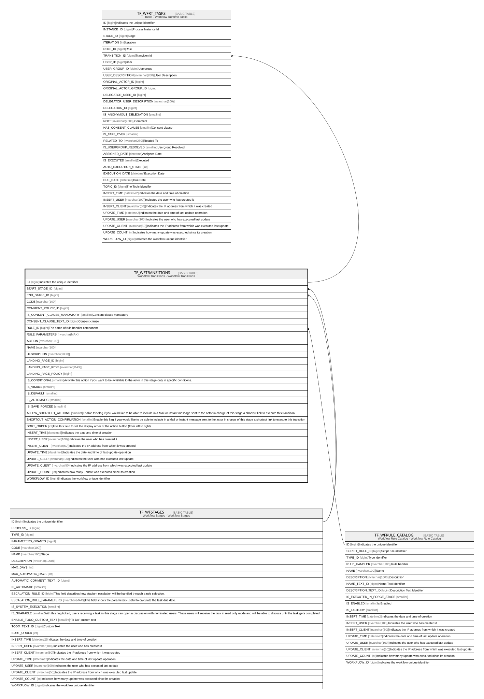

# TF_WFTRANSITIONS

## Description

Workflow Transitions - Workflow Transitions  

## Columns

| Name | Type | Default | Nullable | Children | Parents | Comment |
| ---- | ---- | ------- | -------- | -------- | ------- | ------- |
| ID | bigint |  | false | [TF_WFRT_TASKS](TF_WFRT_TASKS.md) |  | Indicates the unique identifier |
| START_STAGE_ID | bigint |  | false |  | [TF_WFSTAGES](TF_WFSTAGES.md) |  |
| END_STAGE_ID | bigint |  | false |  | [TF_WFSTAGES](TF_WFSTAGES.md) |  |
| CODE | nvarchar(100) |  | true |  |  |  |
| COMMENT_POLICY_ID | bigint | ((0)) | false |  |  |  |
| IS_CONSENT_CLAUSE_MANDATORY | smallint | ((0)) | false |  |  | Consent clause mandatory |
| CONSENT_CLAUSE_TEXT_ID | bigint |  | true |  |  | Consent clause |
| RULE_ID | bigint |  | true |  | [TF_WFRULE_CATALOG](TF_WFRULE_CATALOG.md) | The name of rule handler component. |
| RULE_PARAMETERS | nvarchar(MAX) |  | true |  |  |  |
| ACTION | nvarchar(100) |  | false |  |  |  |
| NAME | nvarchar(100) |  | false |  |  |  |
| DESCRIPTION | nvarchar(1000) |  | true |  |  |  |
| LANDING_PAGE_ID | bigint |  | true |  |  |  |
| LANDING_PAGE_KEYS | nvarchar(MAX) |  | true |  |  |  |
| LANDING_PAGE_POLICY | bigint | ((1)) | false |  |  |  |
| IS_CONDITIONAL | smallint | ((0)) | false |  |  | Activate this option if you want to be available to the actor in this stage only in specific conditions. |
| IS_VISIBLE | smallint | ((1)) | false |  |  |  |
| IS_DEFAULT | smallint | ((0)) | false |  |  |  |
| IS_AUTOMATIC | smallint | ((0)) | false |  |  |  |
| IS_SAVE_FORCED | smallint | ((0)) | false |  |  |  |
| ALLOW_SHORTCUT_ACTIONS | smallint | ((0)) | false |  |  | Enable this flag if you would like to be able to include in a Mail or instant message sent to the actor in charge of this stage a shortcut link to execute this transition |
| SHORTCUT_ACTION_CONFIRMATION | smallint | ((0)) | false |  |  | Enable this flag if you would like to be able to include in a Mail or instant message sent to the actor in charge of this stage a shortcut link to execute this transition |
| SORT_ORDER | int | ((0)) | false |  |  | Use this field to set the display order of the action button (from left to right) |
| INSERT_TIME | datetime2 | (sysutcdatetime()) | false |  |  | Indicates the date and time of creation |
| INSERT_USER | nvarchar(100) | (N'MAIN') | false |  |  | Indicates the user who has created it |
| INSERT_CLIENT | nvarchar(50) | (N'localhost') | false |  |  | Indicates the IP address from which it was created |
| UPDATE_TIME | datetime2 | (sysutcdatetime()) | false |  |  | Indicates the date and time of last update operation |
| UPDATE_USER | nvarchar(100) | (N'MAIN') | false |  |  | Indicates the user who has executed last update |
| UPDATE_CLIENT | nvarchar(50) | (N'localhost') | false |  |  | Indicates the IP address from which was executed last update |
| UPDATE_COUNT | int | ((0)) | false |  |  | Indicates how many update was executed since its creation |
| WORKFLOW_ID | bigint |  | true |  |  | Indicates the workflow unique identifier |

## Constraints

| Name | Type | Definition |
| ---- | ---- | ---------- |
| PK_WFTRANSITIONS | PRIMARY KEY | CLUSTERED, unique, part of a PRIMARY KEY constraint, [ ID ] |
| FK_WFTRANSITIONS_END_STAGES | FOREIGN KEY | FOREIGN KEY(END_STAGE_ID) REFERENCES TF_WFSTAGES(ID) ON UPDATE NO_ACTION ON DELETE NO_ACTION |
| FK_WFTRANSITIONS_RULES | FOREIGN KEY | FOREIGN KEY(RULE_ID) REFERENCES TF_WFRULE_CATALOG(ID) ON UPDATE NO_ACTION ON DELETE NO_ACTION |
| FK_WFTRANSITIONS_START_STAGES | FOREIGN KEY | FOREIGN KEY(START_STAGE_ID) REFERENCES TF_WFSTAGES(ID) ON UPDATE NO_ACTION ON DELETE NO_ACTION |

## Indexes

| Name | Definition |
| ---- | ---------- |
| PK_WFTRANSITIONS | CLUSTERED, unique, part of a PRIMARY KEY constraint, [ ID ] |
| IDX_WFTRANSITIONS_STARTSTAGEID | NONCLUSTERED, [ COMMENT_POLICY_ID, IS_CONSENT_CLAUSE_MANDATORY, CONSENT_CLAUSE_TEXT_ID, ACTION, IS_VISIBLE, IS_CONDITIONAL, LANDING_PAGE_ID, LANDING_PAGE_KEYS, LANDING_PAGE_POLICY, IS_SAVE_FORCED, START_STAGE_ID ] |

## Relations

---

> Generated by [tbls](https://github.com/k1LoW/tbls)
