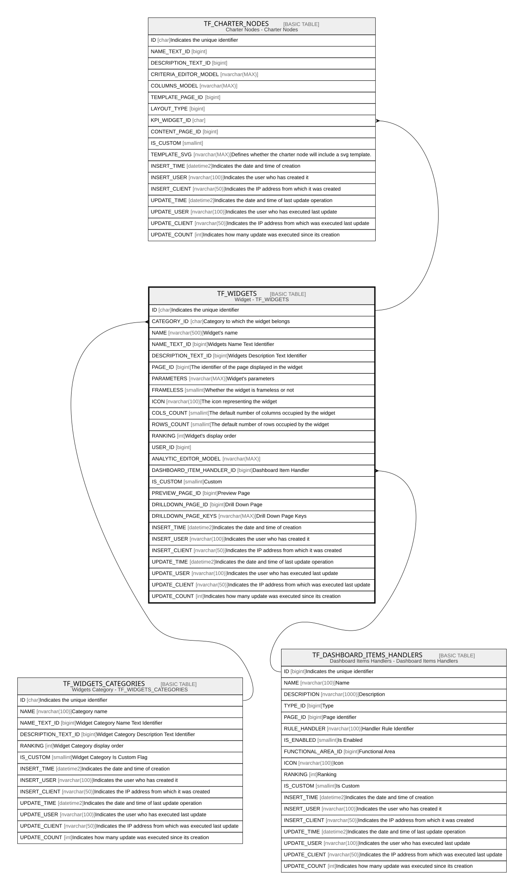

# TF_WIDGETS

## Description

Widget - TF_WIDGETS  

## Columns

| Name | Type | Default | Nullable | Children | Parents | Comment |
| ---- | ---- | ------- | -------- | -------- | ------- | ------- |
| ID | char |  | false | [TF_CHARTER_NODES](TF_CHARTER_NODES.md) |  | Indicates the unique identifier |
| CATEGORY_ID | char |  | true |  | [TF_WIDGETS_CATEGORIES](TF_WIDGETS_CATEGORIES.md) | Category to which the widget belongs |
| NAME | nvarchar(500) |  | false |  |  | Widget's name |
| NAME_TEXT_ID | bigint |  | false |  |  | Widgets Name Text Identifier |
| DESCRIPTION_TEXT_ID | bigint |  | false |  |  | Widgets Description Text Identifier |
| PAGE_ID | bigint |  | false |  |  | The identifier of the page displayed in the widget |
| PARAMETERS | nvarchar(MAX) |  | true |  |  | Widget's parameters |
| FRAMELESS | smallint |  | true |  |  | Whether the widget is frameless or not |
| ICON | nvarchar(100) |  | false |  |  | The icon representing the widget |
| COLS_COUNT | smallint |  | true |  |  | The default number of columns occupied by the widget |
| ROWS_COUNT | smallint |  | true |  |  | The default number of rows occupied by the widget |
| RANKING | int |  | false |  |  | Widget's display order |
| USER_ID | bigint |  | true |  |  |  |
| ANALYTIC_EDITOR_MODEL | nvarchar(MAX) |  | true |  |  |  |
| DASHBOARD_ITEM_HANDLER_ID | bigint |  | true |  | [TF_DASHBOARD_ITEMS_HANDLERS](TF_DASHBOARD_ITEMS_HANDLERS.md) | Dashboard Item Handler |
| IS_CUSTOM | smallint |  | false |  |  | Custom |
| PREVIEW_PAGE_ID | bigint |  | true |  |  | Preview Page |
| DRILLDOWN_PAGE_ID | bigint |  | true |  |  | Drill Down Page |
| DRILLDOWN_PAGE_KEYS | nvarchar(MAX) |  | true |  |  | Drill Down Page Keys |
| INSERT_TIME | datetime2 | (sysutcdatetime()) | false |  |  | Indicates the date and time of creation |
| INSERT_USER | nvarchar(100) | (N'MAIN') | false |  |  | Indicates the user who has created it |
| INSERT_CLIENT | nvarchar(50) | (N'localhost') | false |  |  | Indicates the IP address from which it was created |
| UPDATE_TIME | datetime2 | (sysutcdatetime()) | false |  |  | Indicates the date and time of last update operation |
| UPDATE_USER | nvarchar(100) | (N'MAIN') | false |  |  | Indicates the user who has executed last update |
| UPDATE_CLIENT | nvarchar(50) | (N'localhost') | false |  |  | Indicates the IP address from which was executed last update |
| UPDATE_COUNT | int | ((0)) | false |  |  | Indicates how many update was executed since its creation |

## Constraints

| Name | Type | Definition |
| ---- | ---- | ---------- |
| PK_TF_WIDGETS | PRIMARY KEY | CLUSTERED, unique, part of a PRIMARY KEY constraint, [ ID ] |
| UQ_WIDGETSNAME | UNIQUE | NONCLUSTERED, unique, part of a UNIQUE constraint, [ NAME, IS_CUSTOM ] |
| FK_WIDGETS_CATEGORIES | FOREIGN KEY | FOREIGN KEY(CATEGORY_ID) REFERENCES TF_WIDGETS_CATEGORIES(ID) ON UPDATE NO_ACTION ON DELETE NO_ACTION |
| FK_WIDGETS_DASHBOARD_ITEM_HND | FOREIGN KEY | FOREIGN KEY(DASHBOARD_ITEM_HANDLER_ID) REFERENCES TF_DASHBOARD_ITEMS_HANDLERS(ID) ON UPDATE NO_ACTION ON DELETE NO_ACTION |

## Indexes

| Name | Definition |
| ---- | ---------- |
| PK_TF_WIDGETS | CLUSTERED, unique, part of a PRIMARY KEY constraint, [ ID ] |
| UQ_WIDGETSNAME | NONCLUSTERED, unique, part of a UNIQUE constraint, [ NAME, IS_CUSTOM ] |

## Relations

---

> Generated by [tbls](https://github.com/k1LoW/tbls)
