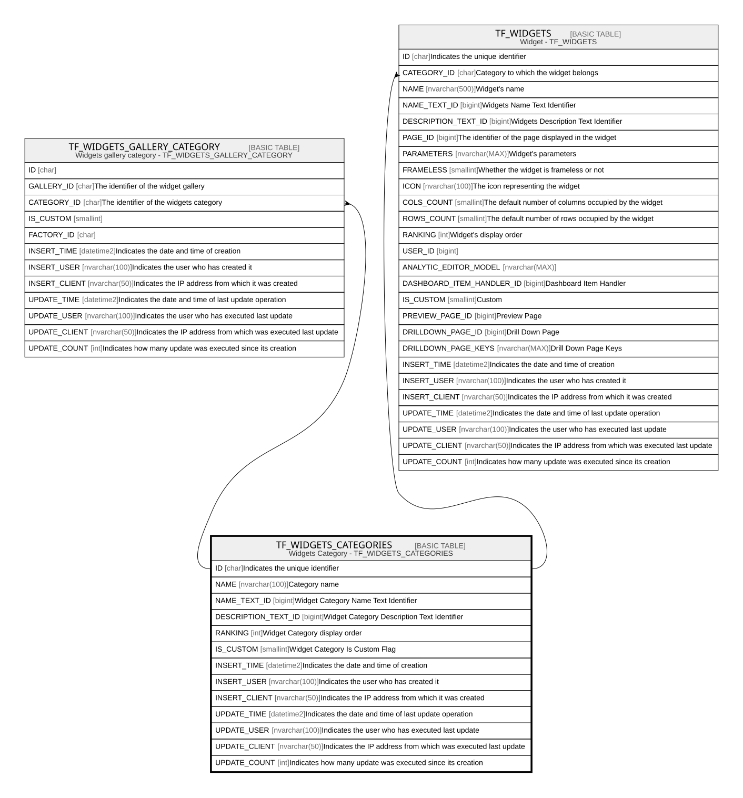

# TF_WIDGETS_CATEGORIES

## Description

Widgets Category - TF_WIDGETS_CATEGORIES  

## Columns

| Name | Type | Default | Nullable | Children | Comment |
| ---- | ---- | ------- | -------- | -------- | ------- |
| ID | char |  | false | [TF_WIDGETS_GALLERY_CATEGORY](TF_WIDGETS_GALLERY_CATEGORY.md) [TF_WIDGETS](TF_WIDGETS.md) | Indicates the unique identifier |
| NAME | nvarchar(100) |  | false |  | Category name |
| NAME_TEXT_ID | bigint |  | false |  | Widget Category Name Text Identifier |
| DESCRIPTION_TEXT_ID | bigint |  | false |  | Widget Category Description Text Identifier |
| RANKING | int |  | false |  | Widget Category display order |
| IS_CUSTOM | smallint |  | false |  | Widget Category Is Custom Flag |
| INSERT_TIME | datetime2 | (sysutcdatetime()) | false |  | Indicates the date and time of creation |
| INSERT_USER | nvarchar(100) | (N'MAIN') | false |  | Indicates the user who has created it |
| INSERT_CLIENT | nvarchar(50) | (N'localhost') | false |  | Indicates the IP address from which it was created |
| UPDATE_TIME | datetime2 | (sysutcdatetime()) | false |  | Indicates the date and time of last update operation |
| UPDATE_USER | nvarchar(100) | (N'MAIN') | false |  | Indicates the user who has executed last update |
| UPDATE_CLIENT | nvarchar(50) | (N'localhost') | false |  | Indicates the IP address from which was executed last update |
| UPDATE_COUNT | int | ((0)) | false |  | Indicates how many update was executed since its creation |

## Constraints

| Name | Type | Definition |
| ---- | ---- | ---------- |
| PK_TF_WIDGETS_CATEGORIES | PRIMARY KEY | CLUSTERED, unique, part of a PRIMARY KEY constraint, [ ID ] |
| UQ_CATEGORIESNAME | UNIQUE | NONCLUSTERED, unique, part of a UNIQUE constraint, [ NAME, IS_CUSTOM ] |

## Indexes

| Name | Definition |
| ---- | ---------- |
| PK_TF_WIDGETS_CATEGORIES | CLUSTERED, unique, part of a PRIMARY KEY constraint, [ ID ] |
| UQ_CATEGORIESNAME | NONCLUSTERED, unique, part of a UNIQUE constraint, [ NAME, IS_CUSTOM ] |

## Relations

---

> Generated by [tbls](https://github.com/k1LoW/tbls)
